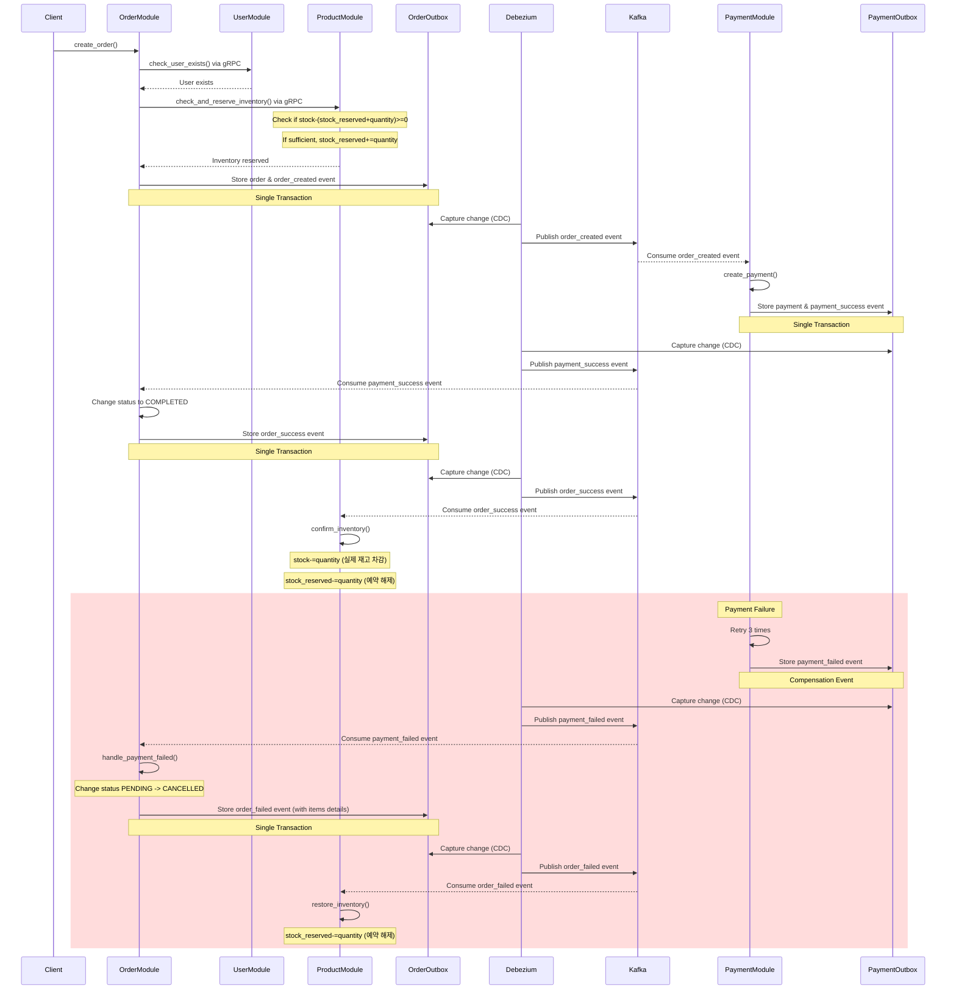

# A. what

basic ecommerce MSA

## a. architecture


## b.tech stacks

- 통신
  - Nginx Ingress (API Gateway)
  - K8s DNS (Service Discovery)
  - gRPC (communication between containers, async but 즉시 update)
  - kafka (event queue, async but eventual consistency)
  - debezium (CDC)
  - Istio + Envoy proxy(sidecar)
- database
  - MongoDB (users, product_catalog)
    - 비동기 connector: motor
  - MySQL (categories, order, inventory, failed_events)
    - 비동기 connector: aiomysql & sqlalchemy[asyncio]
  - elastic search (logs, products_catalog)
- devops
    - terraform
    - argo CD
- sre
    - opentelemetry(표준)
        - logging
          - logstash
          - elastic search
          - kibana
        - monitoring
          - prometheus
          - grafana
        - tracing
          - jaeger (distributed tracing)


## c. ERD


# B. Index

1. Q. 데이터를 어떻게 저장하지?
2. Q. MSA 환경에서 컨테이너들이 어떻게 통신하지?
3. Q. 동기? 비동기?
4. Q. kafka로 이벤트 담아 처리할 때 유실되지 않고 확실하게 처리하는 방법은?
5. Q. 분산 시스템에서 트랜젝션 방법은?
6. Q. 상품재고의 overselling 문제를 어떻게 해결하지?
7. Q. ecommerce에서 상품의 read optimization? (yet)


# C. 데이터를 어떻게 저장하지?

## a-1. 제약사항

- a. 상품 데이터
  1. nike같이 신발만 파는게 아닌, 아마존처럼 다양한 종류의 상품을 판매 (= 상품 카테고리 종류가 많음)
  2. 100만개 이상 대규모 상품 데이터
  3. read:write (for product) 비율이 9.9:0.1 이상인 read heavy app
  4. 트래픽이 갑작스럽게 몰렸을 때 scale up or out 가능해야 한다.
  5. 검색에 유리해야 한다.
  6. 추천시스템의 input으로 상품 데이터가 활용될 수 있음
- b. 고객 데이터
  1. 추천시스템의 input으로 유저 데이터가 활용될 수 있음
  2. 6개월 이상 미접속시 휴면 계정으로 전환
  3. 트래픽이 갑작스럽게 몰렸을 때 scale up or out 가능해야 한다.

## a-2. RDB vs NOSQL

Q. 데이터가 어떨 때 RDB가 더 유리하고 NOSQL이 더 유리할까?

- case1) RDB이 더 유리한 경우
  - 데이터를 정형화 하고 싶은 경우
  - transaction 걸어서 정확도 맞춰야 하는 데이터
- case2) NOSQL이 더 유리한 경우
  - 데이터가 비정형 데이터인 경우
    - 사실 일상생활 속에는 정형화된 데이터보다 비정형화인 데이터가 많다.
    - ex. 추천시스템에서 고객의 행동패턴이 인풋으로 들어가는데, 고객의 행동패턴이 워낙 다양해서 몇가지 RDB table의 attribute로 정형화 하기 매우 어렵다.
  - 앱 특성상 트래픽이 갑자기 몰려서 다운타임 없이 무중단으로 스케일 업 or 아웃 해야하는 경우
    - ecommerce는 서비스 중지되는 순간 깨지는 돈이 어마어마해서 무중단인게 매우 중요하다. (잘못해서 서버 꺼져서 판매자들의 매출 타격오면 소송 맞을 수도 있다.)
    - RDB는 read replica는 aws-RDS기준, 6개까지 무중단으로 추가 가능한데, 이 이상은 끄고 스케일업 해야 한다.
    - 유저가 갑자기 몰려서 회원가입이 폭주해 write heavy가 되는 경우엔, write node(master node)가 1개뿐이기에, 무중단으로 scale out이 불가능하다.
    - 그래서 기존에 RDB 쓰는 곳들은 트래픽 몰릴걸 미리 예측해서 미리 과도하게 스케일 업 해놓고 끝나면 다시 내리는 식으로 대응했는데, nosql을 쓰면 무중단으로 스케일 아웃 가능하다.
  - 대규모 데이터인 경우, sharding을 해야할 때가 오는데, 이 때, nosql이 RDB보다 더 유리하다.

## a-3. if NOSQL, mongodb vs elastic search 성능 비교

| **기준**             | **Elasticsearch**                            | **MongoDB**                          |
| -------------------- | -------------------------------------------- | ------------------------------------ |
| **검색 유형**        | 전문 검색(Full-Text), 유사도 검색, 다중 필터 | 단순 키-값, 범위 쿼리                |
| **평균 응답 시간**   | 10~50ms (100만 건 기준)                      | 50~200ms (동일 데이터)               |
| **고급 기능**        | 오타 보정, 동의어 확장, 유사도 순위 결정     | 기본 텍스트 검색 (Atlas Search 제외) |
| **인덱스 구조**      | 역인덱스(Inverted Index)                     | B-Tree 인덱스                        |
| **동시 검색 처리량** | 초당 10,000+ 쿼리                            | 초당 1,000~5,000 쿼리                |

Q. elastic search가 더 빠르면 왜 굳이 mongodb에 상품데이터 저장할까? 그냥 elastic search에 하지.

A. elastic search는 transaction 지원을 안함. 따라서 메인 DB로는 부적합하다.

## a-4. mongodb & elastic search를 어떻게 써야할까?

read:write가 9:1 이상인 ecommerce 도메인의 상품데이터는,\
원본데이터는 mongodb에 저장하고,\
검색용 or 추천용 필드만 뽑아서 elatic search에 sync 맞추자. (eventual consistency)

## a-5. DB를 도메인 별로 쪼개서 저장해야 할까?

데이터 규모에 따라 달라진다.

1. 소규모 데이터면 DB하나로 쓴다.
2. 중규모 데이터면 상황에 따라 다르다.
  1. DB scale up을 할 수록 점점 더 비용 대비 효과가 비효율적인 시점이 온다,
  2. 따라서 비싸고 좋은 DB 1개 vs 저렴한 DB N개의 비용대비 효과를 측정해야 한다.
3. 대용량 데이터라면 RDB scale up에는 한계가 있으니까 쪼개야 하는게 유리한 경우가 많다.
  1. 그러나 order & user 처럼 join 필요한 경우라면 왠만하면 하나의 DB에서 쓰는게 유리할 수 있다.


## a-6. update 즉시 적용 vs eventual consistency

정보가 모든 모듈에 대하여 consistent 해야하고, up-to-date해야 하는 경우가 있다. (예를들면, 돈과 관련된 정보들)\
쪼개진 여러 backend-server들이 같은 db에 같은 테이블을 참조하게 하거나,\
로직 내부에 grpc통신으로 즉시 다른 도메인 모듈을 통해 update하고, 실패하면 로직 전체를 실패 처리 해버리는 방식이 있다.\
성능을 약간 포기하고서라도, 정확도가 필요하면 이 방법을 쓴다.

정보 업테이트가 반드시 up-to-date 안해도 되고, 좀 나중에 여유날 때 업데이트 되도 되는 데이터가 있다.\
이런 데이터들은 consistency를 약간 포기하고 응답성(availability)를 확보할 수 있다.\
예를들어 ecommerce에서 상품 카탈로그의 원본 정보는 mongodb에 저장하고, elastic search에 캐싱하는 경우,\
데이터를 2곳에 나눠서 저장하기 때문에, 두 데이터의 정합성이 안맞을 때도 있을 수 있지만,\
elastic search 서버가 다운되도 mongodb에서 가져올 수 있기 때문에, consistency가 떨어져도 availability을 높힐 수 있다.


## a-7. 상품 데이터는 어느 DB에 어느 데이터 구조로 저장하지?

보통 RDB에 상품데이터를 넣고 관리한다고 생각하는데,\
파는 상품 종류가 몇개 안되면, 테이블 컬럼 정의하기가 용이하지만,\
쿠팡같이 상품종류가 매우 다양하면 nosql에 밀어넣고 파싱해서 쓰는게 낫다.

예를들어, 신발 전문 쇼핑몰의 경우 테이블 컬럼 종류가 아무리 다양해봤자 몇십개 이내로 특정지을 수 있다.

하지만 쇼핑몰에서 신발, 스마트폰, 채소를 판다고 할 경우,\
이 3종류 상품에 모두 해당되는 컬럼을 만들면,\
null값이 들어가는 컬럼이 너무 많이 생겨서,\
메모리 용량 낭비가 너무 심해진다.

이럴 때 도메인을 잘 나누는 노하우가 필요해지고,\
어설프게 나누면 ecommerce에서 다뤄지는 모든 상품을 정확히 분류할 때 문제가 생긴다.

---

상품을 추가할 때, 새로운 필드를 하나 추가해야 하는 상황이라 치자.

RDB면 스키마 변경해야 하고 migration 해야하는게 부담스러울 수 있는 반면,\
Nosql은 비교적 자유롭다.

---

쿠팡같은 대규모 쇼핑몰은 등록된 상품 갯수만 100만개 이상이라고 하면,\
데이터를 쪼개서 여러 DB에 나눠서 저장하는 샤딩을 선택하는 경우가 있는데,\
RDB보다 nosql이 샤딩에 더 유리하다.

## a-8. 상품 카테고리 정보는 어디에 저장하는게 좋을까?

상품 카탈로그 데이터를 nosql에 저장한다면 이런식으로 저장한다.

```sql
my_db> db.products.find()
[
  {
    _id: ObjectId('680c7168ddb3337802d8cea7'),
    title: 'Apple 2027 MacBook Pro',
    description: '최신 Apple MacBook Pro, M3 Max 칩, 16인치 Liquid Retina XDR 디스플레이',
    brand: 'Apple',
    model: 'MUW73LL/A',
    sku: 'MBP-16-M3-MAX',
    upc: '195949185694',
    color: 'Space Gray',
    category_ids: [ 1, 2, 4 ],
    primary_category_id: 4,
    category_breadcrumbs: [ '전자제품', '컴퓨터', '노트북' ],
    price: { amount: 3499.99, currency: 'USD' },
    weight: { value: 4.8, unit: 'POUND' },
    dimensions: { length: 14.01, width: 9.77, height: 0.66, unit: 'INCH' },
    attributes: {
      processor: 'M3 Max',
      ram: '32GB',
      storage: '1TB SSD',
      screen_size: '16 inch',
      resolution: '3456 x 2234'
    },
    variants: [
      {
        id: 'variant1',
        sku: 'MBP-16-M3-MAX-SG-32GB-1TB',
        color: 'Space Gray',
        storage: '1TB',
        price: { amount: 3499.99, currency: 'USD' },
        attributes: { processor: 'M3 Max', ram: '32GB' },
        inventory: 50
      },
      {
        id: 'variant2',
        sku: 'MBP-16-M3-MAX-SIL-32GB-1TB',
        color: 'Silver',
        storage: '1TB',
        price: { amount: 3499.99, currency: 'USD' },
        attributes: { processor: 'M3 Max', ram: '32GB' },
        inventory: 35
      }
    ],
    images: [
      { url: 'https://example.com/macbook-pro-1.jpg', main: true },
      { url: 'https://example.com/macbook-pro-2.jpg', main: false }
    ],
    product_id: 'P680c7168ddb3337802d8cea5',
    created_at: '2025-04-26T05:38:48.142424'
  }
]
```

이렇게 저장하면 문제는 category 데이터가 중복이 많아진다는 것이다.

제약사항에서 100만 상품 이상을 가정했으니, 낭비되는 메모리가 엄청 많아질 것이다.

그리고 카테고리별로 찾는것도 비효율적이다.


---

그러면 저 카테고리 부분만 따로 collection으로 빼서 이런식으로 만들면,

```sql
{
  "_id": "cat42",
  "name": "전자제품",
  "parent_id": null,
  "level": 0,
  "path": "cat42",
  "product_ids": ["P123", "P456", "P789", ...]
}
```

중복데이터는 감소하는데, 문제가 mongodb기준, 단일 문서 크기가 16MB로 제한되는데, 인기 있는 카테고리의 경우 product_ids 배열이 매우 커질 수 있고, 이 제한에 도달할 수 있다.

또한 product write/update할 때마다, 이 카테고리에 저 긴 product_ids 배열을 업데이트 해야하는데, 이 때 동시성 문제가 발생하거나 lock contention 때문에 느려질 수 있다.

또한 카테고리 갯수가 몇백개 이상되는 경우, 따로 path컬럼을 써서 최적화를 쓰는데, "1/4/13/" 이런식으로 되있는데,

MySQL에서는 WHERE path LIKE '1/4/%' 이런 쿼리 날리면 path 컬럼에 인덱스 걸어놓으면 효율적으로 인덱스 타고 찾아주는데,

mongodb는 기본적으로 regex로 단어찾는데, 이게 인덱스도 안타서 느림.


## a-9. 상품 카테고리 정보는 어떻게 저장하지?

```sql
CREATE TABLE categories (
  category_id INT PRIMARY KEY AUTO_INCREMENT,
  name VARCHAR(100) NOT NULL,
  parent_id INT NULL,
  level INT NOT NULL DEFAULT 0,
  path VARCHAR(255) NOT NULL,
  INDEX idx_parent (parent_id),
  INDEX idx_path (path),
  FOREIGN KEY (parent_id) REFERENCES categories(category_id) ON DELETE CASCADE
);

CREATE TABLE product_categories (
  product_id VARCHAR(24) NOT NULL,
  category_id INT NOT NULL,
  is_primary BOOLEAN DEFAULT FALSE,
  PRIMARY KEY (product_id, category_id),
  INDEX idx_category (category_id),
  INDEX idx_product (product_id),
  INDEX idx_primary (is_primary)
);

CREATE TABLE PRODUCTS
(
  product_id      NOT NULL,
  sku             NULL    ,
  created_at      NULL    ,
  stock           NULL    ,
  stock_reserved  NULL     COMMENT '예약재고량. SAGA rollback때 씀',
  PRIMARY KEY (product_id)
);
```

상품별 sku당 이런식으로 카테고리를 매핑해서 저장한다.\
category table에 성능 최적화 포인트는 다음과 같다.

1. `categories` 테이블에 `path` 컬럼 추가: 전체 경로를 저장(예: "1/4/28")하여 계층 구조 쿼리 최적화
  1. **path** 컬럼은 카테고리의 전체 경로를 저장한다.
  2. 예를 들어 "1/4/28"과 같은 형태로 최상위 카테고리부터 현재 카테고리까지의 ID를 경로 형태로 저장한다.
  3. 이를 통해 계층 구조 쿼리를 최적화할 수 있으며, 특정 카테고리의 모든 상위 카테고리나 하위 카테고리를 빠르게 찾을 수 있다.
2. `level` 컬럼: 카테고리 깊이 저장하여 특정 레벨 카테고리 빠르게 조회
  1. **level** 컬럼은 카테고리의 계층 깊이를 나타낸다.
  2. 최상위 카테고리는 0, 그 하위 카테고리는 1, 그 다음 하위는 2와 같이 카테고리 트리에서의 깊이를 저장한다.
  3. 이를 통해 특정 깊이의 카테고리만 빠르게 조회할 수 있습니다.
3. `is_primary` 플래그: 상품의 주 카테고리 표시로 필터링 최적화


level 컬럼의 예시)
- "전자제품" -> level 0 (최상위)
- "컴퓨터" -> level 1 (전자제품의 하위)
- "노트북" -> level 2 (컴퓨터의 하위)
- "게이밍 노트북" -> level 3 (노트북의 하위)

이렇게 하면 "level = 1인 모든 카테고리 가져와" 같은 쿼리 날릴 때 개빨리 가져올 수 있다.

path 컬럼의 예시)
- "전자제품" -> ID: 1, path: "1"
- "컴퓨터" -> ID: 4, path: "1/4"
- "노트북" -> ID: 28, path: "1/4/28"
- "게이밍 노트북" -> ID: 56, path: "1/4/28/56"

이렇게 하면 "path LIKE '1/4/%'" 같은 쿼리로 컴퓨터 카테고리 아래 모든 하위 카테고리를 한방에 가져올 수 있다. 재귀 쿼리 안 써도 된다.

또 "노트북"의 모든 상위 카테고리 찾으려면 path("1/4/28")를 '/'로 쪼개서 ID 1, 4를 바로 알 수 있다.


# D. MSA에서 컨테이너끼리 어떻게 통신하지?

create_order()을 하면, user_validation() 해야해서 유저 모듈과 통신해야 한다.

## a. MSA 컨테이너 간 통신 프로토콜 비교 (JSON vs HTTPx vs gRPC)

| **기능**          | **JSON (HTTP/1.1)**                             | **HTTPx (HTTP/2)**                     | **gRPC**                                            |
| ----------------- | ----------------------------------------------- | -------------------------------------- | --------------------------------------------------- |
| **데이터 포맷**   | 텍스트 기반 (JSON)                              | 텍스트 기반 (JSON)                     | 바이너리 기반 (Protocol Buffers)                    |
| **프로토콜**      | HTTP/1.1                                        | HTTP/2                                 | HTTP/2                                              |
| **성능**          | 낮음: 텍스트 파싱 오버헤드                      | 중간: HTTP/2 멀티플렉싱 지원           | 높음: 바이너리 직렬화 + HTTP/2 최적화               |
| **확장성**        | 제한적: 연결당 단일 요청                        | 개선됨: 멀티플렉싱 지원                | 우수: 스트리밍 및 병렬 처리                         |
| **사용 편의성**   | 쉬움: RESTful API 표준                          | 쉬움: JSON 기반 + HTTP/2               | 복잡함: Proto 파일 정의 필요                        |
| **언어 지원**     | 모든 언어                                       | 모든 언어                              | 다중 언어 (공식 10+ 언어 지원)                      |
| **브라우저 지원** | 완전 지원                                       | 완전 지원                              | 제한적 (gRPC-Web 필요)                              |
| **실시간 통신**   | 불가능                                          | 제한적                                 | 지원: 단방향/양방향 스트리밍                        |
| **주요 장점**     | - 인간 친화적<br>- 디버깅 용이<br>- 널리 사용됨 | - HTTP/2 성능 개선<br>- 기존 JSON 호환 | - 고성능<br>- 강력한 타입 시스템<br>- 스트리밍 지원 |
| **주요 단점**     | - 높은 지연 시간<br>- 데이터 크기 큼            | - 여전히 JSON 오버헤드 존재            | - 학습 곡선 높음<br>- 브라우저 지원 제한            |
| **적합한 사례**   | - 외부 API<br>- 간단한 내부 통신                | - 성능 개선이 필요한 REST API          | - 고부하 서버 간 통신<br>- 실시간 데이터 처리       |

## b. **결론**

- **JSON (HTTP/1.1)**:
  외부 클라이언트 노출, 간단한 통신, 빠른 개발이 필요할 때 선택.
- **HTTPx (HTTP/2)**:
  기존 JSON API를 유지하면서 성능을 개선하려는 경우 사용.
- **gRPC**:
  서버 간 고성능 통신, 실시간 스트리밍, 다중 언어 환경에서 권장.

# E. MSA에서 동기? 비동기?

## a. 결론
- fastapi가 single main thread가 main loop에서 비동기로 처리하면서, 무거운 작업은 별도 쓰레드풀에게 할당하는 식으로 동작한다.
- ecommerce는 요청이 1초 내 빠르게 처리해야하는 OLTP 특성을 가졌기 때문에, 가벼운 대부분 요청은 비동기로 처리하고 무거운 작업만 별도로 빼서 쓰레드풀에게 할당하여 처리한다.
- MSA는 각 모듈간 분리 시키고, 하나의 모듈에서 에러 터진게 다른 모듈로 전파되면 안되기 때문에, 비동기 방식으로 통신해서 서로 분리시킨다.

## b. 전체 흐름 파악

이게 order_module에서 create_order()의 실행 흐름이다.(약식)

```
1. order_module.create_order()
2. await validate_user()
3. user_server.py가 요청 받음
4. user_service.validate_user() 호출
5. DB I/O 실행
```

Q. 여기서 어느 부분이 동기여야 하고 어느부분을 비동기로 처리해야 좋을까?

## c. 선행지식) 동기 vs 비동기 차이는?

1. 동기: 스레드가 작업 끝날 때 까지 기다림(다른 작업 수행 불가능)
2. 비동기: 스레드가 작업을 시작하고 기다리지 않고 딴일하러 감

이 설명만 보면 무조건 비동기가 더 좋아보이는데 항상 그런건 아니다.

1. task생성하고 다른일하러 갈 때 task 전환 일어나니까 context switching cost가 있고,
2. 이 task들도
3. queue 대기열에 넣고,
4. 우선순위 관리해서 스케쥴링 하고
5. 상태추적 하고

....하면 CPU 오버헤드가 늘어난다.\
그래서 task가 ms단위로 너무 빨리 끝나는 일이면,\
이런거 다 해야하는 비동기보다 그냥 심플하게 기다리는 동기가 더 빠를 수 있다.

비동기 I/O는

1. MSA같은 환경에서 컨테이너끼리 분리되어있는데, 네트워크 지연시간이 상대적으로 길거나,
2. 동시에 엄청 많은 요청(스레드풀의 스레드 숫자 이상)을 처리해야 할 때,

동기보다 어 유리할 수 있다.

## d. 돌아와서, grpc 통신 부분은 동기? 비동기?

grpc는 동기, 비동기 2종류가 있는데, 보통 MSA에서는 비동기로 쓴다.

왜냐면 컨테이너끼리 통신하는데, 네트워크 장애 상황이 발생할 수 있다.

동기로 grpc 통신을 하면, 네트워크 장애, 지연, 상대 컨테이너가 죽었을 때, 무기한으로 기다려야 한다.

MSA를 쓰는 이유 중 하나가, 모듈간의 장애 격리인데,\
컨테이너 하나 터진다고 해서 다른 모듈에 영향을 주면 안되기 때문에,\
grpc는 비동기로 구현한다.

## e. 선행지식) fastapi에서 동기/비동기 처리 메커니즘

### d-1. 비동기 함수 (async def)

- FastAPI는 Uvicorn/Starlette 기반으로, 이들은 비동기 이벤트 루프를 사용합니다
- async def 함수는 메인 이벤트 루프에서 직접 실행됩니다
- I/O 작업에서 await 만나면 제어권을 이벤트 루프에 반환하고 다른 태스크를 처리합니다
- 이벤트 루프는 기본적으로 단일 스레드에서 실행됩니다

### d-2. 동기 함수 (def)

- FastAPI는 동기 함수를 만나면 자동으로 별도의 스레드풀로 오프로드합니다
- 이 작업은 메인 이벤트 루프를 차단하지 않도록 합니다
- 기본 스레드풀 크기는 CPU 코어 개수에 기반합니다
- 동기 함수가 완료되면 결과는 다시 이벤트 루프로 전달됩니다

## f. grpc 이후에 DB i/o 부분은 동기? 비동기?

### f-1. case1) 동기로 구현하는 경우

```python
def validate_user(self, user_id):
    # 동기 DB 쿼리
    user = self.db_connection.find_one({"_id": user_id})
    return user is not None
```

실행 흐름:

1. gRPC 서버(비동기)가 이 함수 호출
2. 중요: FastAPI는 이 동기 함수를 스레드풀의 워커 스레드에 할당
3. 메인 이벤트 루프는 계속해서 다른 요청 처리 가능
4. 워커 스레드가 DB 쿼리 수행하며 I/O 동안 차단됨
5. 쿼리 완료 후 결과를 이벤트 루프(메인 스레드)로 반환
6. 이벤트 루프는 gRPC 응답 생성하여 반환

여기서 2번 부분에서,\
메인 스레드가 스레드풀한테 task할당할 때 context switching cost가 생긴다.

### f-2. case2) 비동기로 구현하는 경우

```python
async def validate_user(self, user_id):
    # 비동기 DB 쿼리
    user = await self.db_connection.find_one({"_id": user_id})
    return user is not None
```

실행 흐름:

1. gRPC 서버(비동기)가 이 함수 호출
2. 함수가 메인 이벤트 루프에서 직접 실행됨
3. DB 쿼리 시작하고 await에서 제어권 반환
4. 이벤트 루프는 다른 태스크 처리
5. DB 쿼리 완료 시 이벤트 루프가 함수 실행 재개
6. 결과를 gRPC 응답으로 반환

그래서 비동기는 동기와는 다르게

1. 별도 스레드 할당이 필요 없음
2. 컨텍스트 스위칭 오버헤드 없음
3. 단일 스레드가 여러 요청 효율적으로 처리

### f-3. Q. fastapi에서 동기 / 비동기 성능차이는?

1. 워커 스레드 오버헤드

- 동기 함수는 스레드풀에 오프로드되어 스레드 전환 비용 발생
- 비동기 함수는 메인 이벤트 루프에 머물러 이 오버헤드 없음

2. 리소스 사용량:

- 동기 함수는 수행 중인 요청마다 별도 스레드 필요
- 비동기 함수는 단일 스레드에서 많은 요청 처리 가능

3. 확장성:

- 동기: 요청 수가 스레드풀 크기를 초과하면 큐잉 발생
- 비동기: 메모리 제약 내에서 훨씬 많은 동시 요청 처리 가능

### f-4. 결론

OLTP 환경에 CRUD app은 비동기가 더 유리

1. 대부분의 작업이 I/O 바운드 (DB 쿼리)
2. 많은 동시 요청 처리 필요
3. 각 요청의 처리 시간이 상대적으로 짧음

게다가 MSA에는 네트워크 통신도 중간에 껴있어서 비동기가 더 유리

### f-5. 기타

```
1. order_module.create_order() [?]
2. await validate_user() [비동기]
3. user_server.py가 요청 받음 [비동기]
4. user_service.validate_user() 호출 [비동기]
5. DB I/O 실행 [비동기]
```

Q. 2~5가 비동기인게 도출됬는데, 그러면 1은 동기로 만들어야 할까? 비동기로 해야할까?

A. 비동기로 해야한다.

2번에 비동기 함수 호출할 때, 결과값 반환을 기다려야 하니까 await 써야하는데,\
동기 함수 내부에서는 await를 못쓰고, 반드시 async def로 선언해주어야 한다고 한다.

# F. kafka로 이벤트 담아 처리할 때 유실되지 않고 확실하게 처리하는 방법은?

## a. 비동기 통신과 kafka에 티켓넣고 구독하는 통신과 뭐가 다른거지?

1. 비동기 통신은 await로 기다린 다음에, 에러났으면 즉각적으로 rollback 가능하지만, (즉시성이 좋음)
2. kafka에 티켓넣고 구독하는 방식은 결과적 일관성(eventual consistency)만 보장해서 즉시성이 부족함. 따라서 복구 메커니즘까지 구현 해야 함.

그럼에도 불구하고 pubsub 모델을 쓰는 이유는 MSA에서 각 모듈들을 격리화 해서 에러 전파도 막고 모듈별로 분리해서 개발할 수 있기 때문

## b. 로직을 끝내고 이벤트를 produce 했는데 로직은 commit이 끝났는데 product(event)에러 에러났으면?

### b-1. 일단 재시도 처리를 한다.

그런데, create_order() 중간에 재시도 처리한다고, 1초씩 3번 기다리고 있으면 다른 요청들을 막잖아?

fastapi는 이벤트큐에 메인스레드 하나가 async def에서 온 요청들 하나씩 처리하는식으로 작동한다는데,\
retry한다고 몇초동안 메인스레드를 잡고있으면 안되니까,\
retry 로직만 따로 빼서 처리한다.

ex)

```python
from fastapi import BackgroundTasks

background_tasks.add_task(
  self._publish_kafka_event,
  ORDER_CREATED_TOPIC,
  order_created_event
)

async def _publish_kafka_event(self, topic: str, event: dict) -> None:
    """Publish event to Kafka in background"""
    try:
        self.kafka_producer.send(topic, event)
        self.kafka_producer.flush()
        logger.info(f"Successfully published event to Kafka topic: {topic}")
    except KafkaError as e:
        logger.error(f"Failed to publish event to Kafka: {str(e)}")
        # Here you could implement a dead letter queue or other error handling
        # For example, store failed events in a database for later processing
```

### b-2. 재시도마저 실패한다면? -> DLQ

- dead letter queue란, 메시지 처리하다 에러나면, 버리지 말고, 다르토픽에 저장해 두는 것.
- 나중에 관리자나 별도 프로세스가 다시 확인해서 재처리함.
- 실서비스에서 필수라고 한다.

### b-3. 그런데 만약 DLQ도 실패한다면? 어떻게 에러핸들링 해야하지?

- 최후에 보루로 db에 저장함.
- 실패한 이벤트만 들어있는 테이블에 저장함.
- 그런데 이건 매우 심각한 상황이므로, `logger.critical()`로 에러에 대한 정보까지 같이 기입한다.

### b-4. 백그라운드 스레드가 1시간에 5번씩 실패한 요청들 재시도한다.

- 실패한 이벤트는 최대 5번까지 재시도
- 각 재시도는 1시간 간격으로 수행
- 5번 재시도 후에도 실패하면 'failed' 상태로 마킹되어 더 이상 재시도하지 않음

`fastapi_order/app/services/event_retry_service.py` 참조

## c. produce(event)가 중복으로 들어갔다면?

```python
# order_id를 키로 사용해서 보내기
self.kafka_producer.send(
    topic,
    key=str(event['order_id']).encode('utf-8'),  # 키로 order_id 사용
    value=event
)
```

- 이런식으로 order_id를 키 삼아서 넣으면, 같은 order_id를 가진 메시지는 같은 파티션으로 가게 됨
- Consumer에서 order_id로 중복 체크하기 쉬워짐
- 메시지 순서도 보장됨 (같은 키는 같은 파티션으로 가니까)
- 근데 이건 완벽한 중복 방지는 아님 (네트워크 문제로 재시도하면 여전히 중복 가능)

그러니까, kafka 설정에서 중복 방지 설정 몇가지를 추가한다.

- KAFKA_ENABLE_IDEMPOTENCE: "true": 중복 메시지 방지 기능 활성화
- KAFKA_ACKS: "all": 모든 브로커가 메시지를 받았는지 확인
- KAFKA_MAX_IN_FLIGHT_REQUESTS_PER_CONNECTION: "1": 한 번에 하나의 메시지만 전송
- KAFKA_TRANSACTIONAL_ID: "order-service-producer": 트랜잭션 ID 설정

`enable.idempotence=true` 설정하면...

- 프로듀서가 PID(Producer ID)와 시퀀스 넘버를 메시지에 자동으로 추가
- 브로커가 PID + 파티션 + 시퀀스 넘버를 키로 **O(1) 시간복잡도**로 중복 체크
- 예시: 100번 재전송해도 브로커에서 1번만 저장

중복방지 하는 대신 조금 느려질 수 있다...

---

```bash
KAFKA_ACKS: "all" # 모든 브로커가 메시지 받았는지 확인
Producer가 메시지 보낼 때:
  Leader 브로커한테 먼저 보내짐
  Leader가 Follower들한테도 복제 요청 보냄
  모든 Follower들이 "나 받았어!"라고 ACK 보내면
  Leader가 Producer한테 "성공!"이라고 알려줌
만약 Follower 중 하나라도 ACK 못 보내면?
  Producer는 재시도함 (retry)
  이 과정에서 KAFKA_ENABLE_IDEMPOTENCE가 중요해짐
KAFKA_ENABLE_IDEMPOTENCE: "true" # 중복 메시지 방지 기능 활성화. 이거 설정하면 Producer가 보내는 메시지마다 시퀀스 번호가 붙음

Producer가 메시지 보낼 때:
- 1.각 메시지마다 (PID, 시퀀스번호) 페어가 붙음
  + PID: Producer ID (고유 번호)
  + 시퀀스번호: 1, 2, 3... 이렇게 증가
- 2.브로커는 이 번호들을 기억하고 있음
- 3.같은 (PID, 시퀀스번호)가 오면?
  - "아, 이건 이미 처리한 메시지네" 하고 무시함
- 4.시퀀스 번호가 순서대로 안 오면?
  - "이상하다? 메시지가 유실됐나?" 하고 에러 뱉음


ACKS: "all"의 실제 동작방식
- 1.Producer -> Leader: 메시지1 보냄
- 2.Leader -> Follower들: 메시지1 복제 요청
- 3.Leader: 메시지1 ACK 기다리는 동안
  - Producer -> Leader: 메시지2, 3, 4... 계속 받음
  - 다른 Follower들한테도 계속 복제 요청 보냄
- 4.Follower들: 각자 속도대로 ACK 보냄
- 5.Leader: ACK 다 모이면 Producer한테 알려줌

성능 최적화 팁:
acks=1로 설정하면 Leader만 받으면 됨 (더 빠름)
...하지만 Follower들이 받기 전에 Leader가 죽으면 메시지 유실 가능
acks=0로 설정하면 ACK 기다리지도 않음 (제일 빠름)
...하지만 메시지 유실 가능성 높음

보통은:
1. 중요도 높은 메시지: acks=all (안전성 우선)
2. 중요도 낮은 메시지: acks=1 (성능 우선)
3. 로그 같은 거: acks=0 (속도 우선)
```

## d. kafka.send()가 실패했다면?
A. outbox 패턴을 쓰면 해결된다.

Q. outbox 패턴이 뭐지?
1. mysql에 'outbox' table에 쓰면,
2. debezium이 'outbox table'이 update될 때마다 kafka에 메시지 보냄.

근데 create_order()랑 outbox.write()을 같은 트랜젝션에 묶어서,\
둘 중 하나가 에러나면 둘 다 mysql 차원에서 롤백시키는 것

```python
transaction.begin()
  order.create()
  order_items.create()
  outbox.create()
transaction.end()
```

일단 DB에 쓰여지면, outbox table의 변화를 감지해서 CDC framework인 debezium이 kafka로 메시지를 보낸다.

보낼 떼 에러나서 retry하는 로직은 debezium이 내부적으로 핸들링한다.

debezium-config 파일에 설정 추가하면 내부적으로 retry해준다.
```bash
"errors.tolerance": "all",
"errors.log.enable": true,
"errors.log.include.messages": true,
"errors.deadletterqueue.topic.name": "outbox-dlq",
"errors.deadletterqueue.context.headers.enable": true,

# 재시도 관련 설정
"max.retries": 3,
"retry.backoff.ms": 1000
```

1. 에러 허용 정책 설정:
  - errors.tolerance: all로 설정하면 모든 에러가 발생해도 계속 진행합니다.
  - none으로 설정하면 에러 발생 시 즉시 중단합니다.
2. 에러 로깅:
  - errors.log.enable: 에러를 로그에 기록합니다.
  - errors.log.include.messages: 에러 발생 시 메시지 내용도 함께 로깅합니다.
3. DLQ(Dead Letter Queue) 설정:
  - errors.deadletterqueue.topic.name: 실패한 메시지를 보낼 DLQ 토픽 이름
  - errors.deadletterqueue.context.headers.enable: 에러 컨텍스트를 헤더에 포함
4. 재시도 설정:
  - max.retries: 최대 재시도 횟수
  - retry.backoff.ms: 재시도 간격(밀리초)


# G. 분산시스템에서의 트랜젝션: kafka편

## a. 분산 시스템에서 transaction & rollback을 어떻게 처리하지?
monolith에서는 재고차감, 주문등록, 결제처리를 하나의 트랜젝션안에 묶고, 실패시 롤백하면 된다.\
MSA환경에서는 상품,주문,결제 모듈이 쪼개져있는데, 실패시 어떻게 롤백처리 할까?

2pc(2 phase commit protocol)이라고, 상품,주문,결제 모듈에 준비됬어? 하고 ok사인 받으면 거대한 트랜젝션 걸어서 처리하는 방법이 존재는 하나, 비효율적이여서 안쓴다.

대신 module A -> module B -> module C -> ... 이런식으로 비즈니스 로직이 진행될 때,\
module C에서 에러나면, 에러났다고 kafka message를 남기면, module B가 그걸 subscribe해서 rollback 처리하고,\
module B가 rollback 하고, 그걸 kafka에 메시지를 남기면, module A가 그걸 subscribe해서 rollback 처리하는 식으로 처리한다.

중간에 rollback 실패 시, 디버깅 편의성을 위해 retry, DLQ 같은 방식을 섞는다.

## b. 결과 
상품주문의 비즈니스 플로우와 실패시 SAGA 패턴으로 rollback처리 로직은 다음과 같다.

```
주문 → 결제 → 재고감소 → 배송 ✓
      ↑       ↑       ↑
      실패하면 보상 트랜잭션 역으로 실행
```




# H. 상품재고의 overselling 문제를 어떻게 해결하지?

## a. overselling 문제
상품구매는 이런 식으로 진행된다.

```
주문 → 결제 → 재고감소 → 배송 ✓
      ↑       ↑       ↑
      실패하면 보상 트랜잭션 역으로 실행
```

Q. 그런데 만약 남은 재고량(stock)이 1인데, 유저1,2,3이 동시에 1개를 주문하고 결제했다면?

만약 (재고 - 주문량)을 주문하는 시점에서 하게 처리했다면, overselling 문제가 발생한다.

이런 문제는 ecommerce 도메인에서 자주 발생할 수 있는 문제이다.\
갑작스럽게 많은 유저가 동일상품을 구입하려고 하는 경우(바겐세일, 블랙 프라이데이 세일, 크리스마스 세일 등..)


이 문제를 어떻게 해결할까?


## b. solution: 예약 재고 수량 트래킹
```
주문(예약 재고 수량 기입) → 결제 → 예약한 재고수량 만큼 감소 → 배송 ✓
      ↑                ↑       ↑                   ↑
      실패하면 보상 트랜잭션 역으로 실행
```

stock(재고수량) 필드 외에, stock_reserved(예약재고수량) 필드를 넣어서,\
주문하는 시점에 예약 재고수량을 잡아버리고,\
다른 사람이 같은 상품을 주문하는데, 현재 남아있는 재고량 + 예약된 재고량 이상 주문하려고 하면 주문을 못하게 하는 것이다.


## c. 재고량 & 예약재고량을 nosql에서 트래킹하는게 맞을까?

ecommerce는 read:write 비율이 9:1 이상인 read heavy app이고,\
대부분 상품 카탈로그 정보 read이다.

상품 카탈로그 정보를 read하는 mongodb는 안그래도 매우 바쁜데,\
거기에 재고수량 & 예약재고량까지 트래킹 시키는 부담을 주어야 할까?

상황에 따라 다르겠지만, 요구사항에서 대규모 데이터를 가정한다고 하면,\
실시간 재고관리 같은 write-heavy, transaction-heavy 같은 작업은 redis에 맡기는게 더 유리한 것으로 보인다.

redis vs mongodb 성능비교를 했을 때, 대략적으로 다음과 같다고 한다.

1. 일단 기본적으로 redis는 RAM 위에서 작동하고 redis는 disk i/o라 redis가 더 빠르다.
2. transaction 속도가 대략적으로 mongodb는 ms단위, redis는 ns단위라고 한다.
3. Redis 사용 시: 동시 10만 TPS(초당 트랜잭션) 처리 가능한데, MongdoDB는 5000 TPS로 성능차이가 많이 난다고 한다. (기계 스펙, 상황에 따라 천차만별이지만, redis가 더 빠른건 사실)


## d. 도입
현 프로젝트에서는 간소화 목적으로,\
재고파악은 별도의 inventory-module + redis에서 하는게 아닌,\
product-module에서 mysql에서 한다.

왜?

redis로 데이터 캐싱해서 최적화 하는 작업은 [여기](https://github.com/Doohwancho/ecommerce?tab=readme-ov-file#b-db-%EB%B6%80%ED%95%98%EB%A5%BC-%EB%82%AE%EC%B6%94%EA%B8%B0-%EC%9C%84%ED%95%9C-cache-%EB%8F%84%EC%9E%85%EA%B8%B0)에서 이미 했기 때문.

