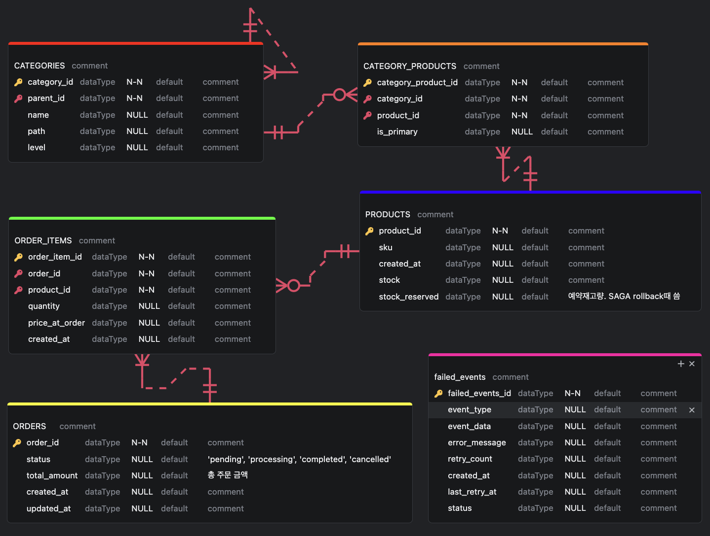

# A. what

basic ecommerce msa experiment


## a. architecture 


## b.tech stacks
- 통신
  - Nginx Ingress (API Gateway)
  - K8s DNS (Service Discovery)
  - gRPC (communication between containers)
  - kafka (event queue)
  - Istio + Envoy (service mesh for traffic 제어)
- database
  - MongoDB (users, products)
    - 비동기 connector: motor
  - MySQL (categories, order)
    - 비동기 connector: aiomysql & sqlalchemy[asyncio]
  - elastic search
- logging
  - logstash
  - elastic search
  - kibana
- monitoring
  - prometheus
  - grafana
- error-handling
  - circuit breaker (단순 retry 아닌 circuit breaker 패턴 적용)
  - jaeger (distributed tracing)

## c. ERD



## d. TODOs
1. ELK 붙이고 logging한게 elastic search에 저장되고 kibana에 visualize 되는지 확인 :white_check_mark:
2. 각 모듈 개별 통신 :white_check_mark:
3. api gateway와 각 모듈 통신 :white_check_mark:
4. 각 모듈간 통신 되는지 확인 :white_check_mark:
5. 각 모듈간 통신을 httpx - > grpc migrate :white_check_mark:
6. kafka로 publish & subscribe 방식으로 통신 (outbox pattern)
7. transaction on distributed system
8. elastic search에 product sync(eventual consistency) & 인덱싱 for read optimization in read heavy app
9. istio & envoy proxy
10. circuit breaker: 에러발생시, 다른 값으로 대체해서 보냄 
11. jaeger: 분산 트레이싱 
12. 추천시스템 


# B. Index

- Q. 데이터를 어떻게 저장하지? 
  - 대규모 데이터를 다룰 때, 데이터의 특성과 DB의 장단점을 고려한 domain 나누기 
- Q. MSA 환경에서 컨테이너들이 어떻게 통신하지? 
  - httpx(http 1.1)
  - grpc(http 2.0, multiplexing + types)
- Q. 동기? 비동기?
  - msa에서 grpc는 비동기
  - async def 안에서 무조건 await를 써야함. 안쓰면 동기처럼 작동함
  - fastapi에서 동기 & 비동기, 코루틴, 메인루프?


# C. 데이터를 어떻게 저장하지?

## a-1. 제약사항
- a. 상품 데이터 
  1. nike같이 신발만 파는게 아닌, 아마존처럼 다양한 종류의 상품을 판매 (= 상품 카테고리 종류가 많음)
  2. 100만개 이상 대규모 상품 데이터
  3. read:write (for product) 비율이 9.9:0.1 이상인 read heavy app
  4. 트래픽이 갑작스럽게 몰렸을 때 scale up or out 가능해야 한다.
  5. 검색에 유리해야 한다. 
  6. 추천시스템의 input으로 상품 데이터가 활용될 수 있음 
- b. 고객 데이터
  1. 추천시스템의 input으로 유저 데이터가 활용될 수 있음 
  2. 6개월 이상 미접속시 휴면 계정으로 전환
  3. 트래픽이 갑작스럽게 몰렸을 때 scale up or out 가능해야 한다.


## a-2. RDB vs NOSQL 

Q. 데이터가 어떨 때 RDB가 더 유리하고 NOSQL이 더 유리할까?

- case1) RDB이 더 유리한 경우 
  - 데이터를 정형화 하고 싶은 경우
  - transaction 걸어서 정확도 맞춰야 하는 데이터
- case2) NOSQL이 더 유리한 경우
  - 데이터가 비정형 데이터인 경우
    - 사실 일상생활 속에는 정형화된 데이터보다 비정형화인 데이터가 많다.
    - ex. 추천시스템에서 고객의 행동패턴이 인풋으로 들어가는데, 고객의 행동패턴이 워낙 다양해서 몇가지 RDB table의 attribute로 정형화 하기 매우 어렵다. 
  - 앱 특성상 트래픽이 갑자기 몰려서 다운타임 없이 무중단으로 스케일 업 or 아웃 해야하는 경우
    - ecommerce는 서비스 중지되는 순간 깨지는 돈이 어마어마해서 무중단인게 매우 중요하다. (잘못해서 서버 꺼져서 판매자들의 매출 타격오면 소송 맞을 수도 있다.)
    - RDB는 read replica는 aws-RDS기준, 6개까지 무중단으로 추가 가능한데, 이 이상은 끄고 스케일업 해야 한다.
    - 유저가 갑자기 몰려서 회원가입이 폭주해 write heavy가 되는 경우엔, write node(master node)가 1개뿐이기에, 무중단으로 scale out이 불가능하다.
    - 그래서 기존에 RDB 쓰는 곳들은 트래픽 몰릴걸 미리 예측해서 미리 과도하게 스케일 업 해놓고 끝나면 다시 내리는 식으로 대응했는데, nosql을 쓰면 무중단으로 스케일 아웃 가능하다.
  - 대규모 데이터인 경우, sharding을 해야할 때가 오는데, 이 때, nosql이 RDB보다 더 유리하다.


## a-3. if NOSQL, mongodb vs elastic search 성능 비교

| **기준**                | **Elasticsearch**                          | **MongoDB**                            |
|-------------------------|--------------------------------------------|----------------------------------------|
| **검색 유형**            | 전문 검색(Full-Text), 유사도 검색, 다중 필터 | 단순 키-값, 범위 쿼리                   |
| **평균 응답 시간**       | 10~50ms (100만 건 기준)                     | 50~200ms (동일 데이터)                  |
| **고급 기능**            | 오타 보정, 동의어 확장, 유사도 순위 결정     | 기본 텍스트 검색 (Atlas Search 제외)     |
| **인덱스 구조**          | 역인덱스(Inverted Index)                    | B-Tree 인덱스                           |
| **동시 검색 처리량**      | 초당 10,000+ 쿼리                          | 초당 1,000~5,000 쿼리                   |


Q1. elastic search가 더 빠르면 왜 굳이 mongodb에 상품데이터 저장할까? 그냥 elastic search에 하지

A. elastic search는 transaction 지원을 안함. 따라서 메인 DB로는 부적합하다.

---
Q2. 그러면 elastic search를 어떻게 써야할까?

A. read:write가 9:1 이상인 ecommerce 도메인의 상품데이터는,\
원본데이터는 mongodb에 저장하고,\
검색용 or 추천용 필드만 뽑아서 elatic search에 sync 맞추자. (eventual consistency)


## a-4. DB를 도메인 별로 쪼개서 저장해야 할까?
대용량 데이터라면 RDB scale up에는 한계가 있으니까 쪼개야 하는 시점이 오긴 하나,\
order & user 처럼 join 필요한 경우라면 왠만하면 하나의 DB에서 쓴다.


## a-5. update 즉시 적용 vs eventual consistency
즉시 적용되야 하는거면 같은 db를 여러 도메인 모듈들이 참조하게 하고,\
정합성이 그렇게 정교하게 필요한게 아니라면, DB를 두개로 분리시키고 (write & read일 수도 있고, 유저 & 주문 일 수도 있고) event로 sync 맞춘다.(eventual consistency)


## a-6. 상품 데이터는 어느 DB에 어느 데이터 구조로 저장하지?

보통 RDB에 상품데이터를 넣고 관리한다고 생각하는데,\
파는 상품 종류가 몇개 안되면, 테이블 컬럼 정의하기가 용이하지만,\
쿠팡같이 상품종류가 매우 다양하면 nosql에 밀어넣고 파싱해서 쓰는게 낫다.

예를들어, 신발 전문 쇼핑몰의 경우 테이블 컬럼 종류가 아무리 다양해봤자 몇십개 이내로 특정지을 수 있다.

하지만 쇼핑몰에서 신발, 스마트폰, 채소를 판다고 할 경우,\
이 3종류 상품에 모두 해당되는 컬럼을 만들면,\
null값이 들어가는 컬럼이 너무 많이 생겨서,\
메모리 용량 낭비가 너무 심해진다.

이럴 때 도메인을 잘 나누는 노하우가 필요해지고,\
어설프게 나누면 ecommerce에서 다뤄지는 모든 상품을 정확히 분류할 때 문제가 생긴다.

---

상품을 추가할 때, 새로운 필드를 하나 추가해야 하는 상황이라 치자.

RDB면 스키마 변경해야 하고 migration 해야하는게 부담스러울 수 있는 반면,\
Nosql은 비교적 자유롭다.

---

쿠팡같은 대규모 쇼핑몰은 등록된 상품 갯수만 100만개 이상이라고 하면,\
데이터를 쪼개서 여러 DB에 나눠서 저장하는 샤딩을 선택하는 경우가 있는데,\
RDB보다 nosql이 샤딩에 더 유리하다.

## a-7. 상품 카테고리 정보는 어디에 저장하는게 좋을까?

만약, 모든 상품 카탈로그 + 카테고리 데이터를 nosql에 저장한다면,

```sql
{
  "_id": "P123456",
  "name": "스마트폰 XYZ 모델",
  "description": "최신 스마트폰...",
  "price": 799.99,
  "attributes": { "color": "블랙", "storage": "128GB" },
  "variants": [...],
  "categories": [
    { "id": 42, "name": "전자제품", "level": 0, "path": "42" },
    { "id": 56, "name": "스마트폰", "level": 1, "path": "42/56" },
    { "id": 78, "name": "프리미엄 폰", "level": 2, "path": "42/56/78" }
  ],
  "primary_category_id": 56
}
```

이런식으로 저장되는데, 문제는 category 데이터가 중복이 많아진다는 것이다.

제약사항에서 100만 상품 이상을 가정했으니, 낭비되는 메모리가 엄청 많아질 것이다.

그러면 저 카테고리 부분만 따로 collection으로 빼서 이런식으로 만들면,

```sql
{
  "_id": "cat42",
  "name": "전자제품",
  "parent_id": null,
  "level": 0,
  "path": "cat42",
  "product_ids": ["P123", "P456", "P789", ...]
}
```

중복데이터는 감소하는데, 문제가 mongodb기준, 단일 문서 크기가 16MB로 제한되는데, 인기 있는 카테고리의 경우 product_ids 배열이 매우 커질 수 있고, 이 제한에 도달할 수 있다.

또한 product write/update할 때마다, 이 카테고리에 저 긴 product_ids 배열을 업데이트 해야하는데, 이 때 동시성 문제가 발생하거나 lock contention 때문에 느려질 수 있다.

또한 카테고리 갯수가 몇백개 이상되는 경우, 따로 path컬럼을 써서 최적화를 쓰는데, "1/4/13/" 이런식으로 되있는데,

MySQL에서는 WHERE path LIKE '1/4/%' 이런 쿼리 날리면 path 컬럼에 인덱스 걸어놓으면 효율적으로 인덱스 타고 찾아주는데,

mongodb는 기본적으로 regex로 단어찾는데, 이게 인덱스도 안타서 느림.


## a-8. 상품 검색은 어떻게 하지?
ecommerce에서 매우 중요한 부분이 상품 검색 기능.

그런데 mongodb에서 full text search가 느리다.

| **기준**                | **Elasticsearch**                          | **MongoDB**                            |
|-------------------------|--------------------------------------------|----------------------------------------|
| **검색 유형**            | 전문 검색(Full-Text), 유사도 검색, 다중 필터 | 단순 키-값, 범위 쿼리                   |
| **평균 응답 시간**       | 10~50ms (100만 건 기준)                     | 50~200ms (동일 데이터)                  |
| **고급 기능**            | 오타 보정, 동의어 확장, 유사도 순위 결정     | 기본 텍스트 검색 (Atlas Search 제외)     |
| **인덱스 구조**          | 역인덱스(Inverted Index)                    | B-Tree 인덱스                           |
| **동시 검색 처리량**      | 초당 10,000+ 쿼리                          | 초당 1,000~5,000 쿼리                   |

검색을 빠르게 해야 하니까, 검색에 걸릴 부분만 떼서 elastic search에 캐싱해두고 인덱싱도 해둔다.

elastic search에 상품 정보 저장해놓으면,\
추후에 상품 추천을 elastic search로 구현할 수도 있고,\
머신러닝 적용해서 커스텀으로 구현할 수도 있다.


## a-9. 고객 데이터는 어느 디비에 어떻게 저장하지?
기존에는 RDB에 저장했었는데,\
ecommerce domain에 경우에는, 고객마다 특성이 다르고, 그 다른 특색 데이터를 인풋삼아서 추천시스템이 돌아가기 때문에,\
일반적인 RDB에 고객 데이터를 저장하면, 데이블 만들 때, 테이블 attribute를 미리 정형화 시켜놔야 함.

그런데 이게 사실상 별로인 것이,\
추천 시스템 만드는 분석가분이 이번주에는 고객의 이런 데이터가 필요해요~ 할 때마다,\
RDB게 고객 테이블에 컬럼 몇개씩 추가하는 식으로 업데이트 한다는건데,\
굉장히 어렵다.

요즘 트렌드인 hyper-personalization 하기 위해서는,\
고객마다 다른 특성값을 그때그때 입력해서 mongodb에 비정형 데이터로 쌓아두는게 개발하기 더 편하다.


# D. 컨테이너끼리 어떻게 통신하지?
create_order()을 하면, user_validation() 해야해서 유저 모듈과 통신해야 한다.

## a. MSA 컨테이너 간 통신 프로토콜 비교 (JSON vs HTTPx vs gRPC)

| **기능**                | **JSON (HTTP/1.1)**                                                                 | **HTTPx (HTTP/2)**                                                                 | **gRPC**                                                                           |
|-------------------------|-------------------------------------------------------------------------------------|-----------------------------------------------------------------------------------|-----------------------------------------------------------------------------------|
| **데이터 포맷**         | 텍스트 기반 (JSON)                                                                  | 텍스트 기반 (JSON)                                                                | 바이너리 기반 (Protocol Buffers)                                                  |
| **프로토콜**            | HTTP/1.1                                                                           | HTTP/2                                                                            | HTTP/2                                                                            |
| **성능**                | 낮음: 텍스트 파싱 오버헤드                                                          | 중간: HTTP/2 멀티플렉싱 지원                                                     | 높음: 바이너리 직렬화 + HTTP/2 최적화                                             |
| **확장성**              | 제한적: 연결당 단일 요청                                                            | 개선됨: 멀티플렉싱 지원                                                          | 우수: 스트리밍 및 병렬 처리                                                       |
| **사용 편의성**          | 쉬움: RESTful API 표준                                                              | 쉬움: JSON 기반 + HTTP/2                                                         | 복잡함: Proto 파일 정의 필요                                                     |
| **언어 지원**           | 모든 언어                                                                          | 모든 언어                                                                        | 다중 언어 (공식 10+ 언어 지원)                                                   |
| **브라우저 지원**        | 완전 지원                                                                          | 완전 지원                                                                        | 제한적 (gRPC-Web 필요)                                                           |
| **실시간 통신**          | 불가능                                                                             | 제한적                                                                           | 지원: 단방향/양방향 스트리밍                                                     |
| **주요 장점**            | - 인간 친화적<br>- 디버깅 용이<br>- 널리 사용됨                                     | - HTTP/2 성능 개선<br>- 기존 JSON 호환                                           | - 고성능<br>- 강력한 타입 시스템<br>- 스트리밍 지원                              |
| **주요 단점**            | - 높은 지연 시간<br>- 데이터 크기 큼                                               | - 여전히 JSON 오버헤드 존재                                                      | - 학습 곡선 높음<br>- 브라우저 지원 제한                                         |
| **적합한 사례**          | - 외부 API<br>- 간단한 내부 통신                                                   | - 성능 개선이 필요한 REST API                                                    | - 고부하 서버 간 통신<br>- 실시간 데이터 처리                                    |


## b. **결론**
- **JSON (HTTP/1.1)**:  
  외부 클라이언트 노출, 간단한 통신, 빠른 개발이 필요할 때 선택.
- **HTTPx (HTTP/2)**:  
  기존 JSON API를 유지하면서 성능을 개선하려는 경우 사용.
- **gRPC**:  
  서버 간 고성능 통신, 실시간 스트리밍, 다중 언어 환경에서 권장.


# E. MSA에서 동기? 비동기?

## a. 전체 흐름 파악
이게 order_module에서 create_order()의 실행 흐름이다.(약식)
```
1. order_module.create_order() 
2. await validate_user() 
3. user_server.py가 요청 받음
4. user_service.validate_user() 호출 
5. DB I/O 실행 
```

Q. 여기서 어느 부분이 동기여야 하고 어느부분을 비동기로 처리해야 좋을까?


## b. 선행지식) 동기 vs 비동기 차이는?

1. 동기: 스레드가 작업 끝날 때 까지 기다림(다른 작업 수행 불가능)
2. 비동기: 스레드가 작업을 시작하고 기다리지 않고 딴일하러 감 

이 설명만 보면 무조건 비동기가 더 좋아보이는데 항상 그런건 아니다.

1. task생성하고 다른일하러 갈 때 task 전환 일어나니까 context switching cost가 있고,
2. 이 task들도 
3. queue 대기열에 넣고,
4. 우선순위 관리해서 스케쥴링 하고
5. 상태추적 하고 

....하면 CPU 오버헤드가 늘어난다.\
그래서 task가 ms단위로 너무 빨리 끝나는 일이면,\
이런거 다 해야하는 비동기보다 그냥 심플하게 기다리는 동기가 더 빠를 수 있다.

비동기 I/O는 
1. MSA같은 환경에서 컨테이너끼리 분리되어있는데, 네트워크 지연시간이 상대적으로 길거나,
2. 동시에 엄청 많은 요청(스레드풀의 스레드 숫자 이상)을 처리해야 할 때, 

동기보다 어 유리할 수 있다.


## c. 돌아와서, grpc 통신 부분은 동기? 비동기?
grpc는 동기, 비동기 2종류가 있는데, 보통 MSA에서는 비동기로 쓴다.

왜냐면 컨테이너끼리 통신하는데, 네트워크 장애 상황이 발생할 수 있다.

동기로 grpc 통신을 하면, 네트워크 장애, 지연, 상대 컨테이너가 죽었을 때, 무기한으로 기다려야 한다.

MSA를 쓰는 이유 중 하나가, 모듈간의 장애 격리인데,\
컨테이너 하나 터진다고 해서 다른 모듈에 영향을 주면 안되기 때문에,\
grpc는 비동기로 구현한다.


## d. 선행지식) fastapi에서 동기/비동기 처리 메커니즘

### d-1. 비동기 함수 (async def)

- FastAPI는 Uvicorn/Starlette 기반으로, 이들은 비동기 이벤트 루프를 사용합니다
- async def 함수는 메인 이벤트 루프에서 직접 실행됩니다
- I/O 작업에서 await 만나면 제어권을 이벤트 루프에 반환하고 다른 태스크를 처리합니다
- 이벤트 루프는 기본적으로 단일 스레드에서 실행됩니다

### d-2. 동기 함수 (def)

- FastAPI는 동기 함수를 만나면 자동으로 별도의 스레드풀로 오프로드합니다
- 이 작업은 메인 이벤트 루프를 차단하지 않도록 합니다
- 기본 스레드풀 크기는 CPU 코어 개수에 기반합니다
- 동기 함수가 완료되면 결과는 다시 이벤트 루프로 전달됩니다


## e. grpc 이후에 DB i/o 부분은 동기? 비동기?

### e-1. case1) 동기로 구현하는 경우 
```python
def validate_user(self, user_id):
    # 동기 DB 쿼리
    user = self.db_connection.find_one({"_id": user_id})
    return user is not None
```
실행 흐름:

1. gRPC 서버(비동기)가 이 함수 호출
2. 중요: FastAPI는 이 동기 함수를 스레드풀의 워커 스레드에 할당
3. 메인 이벤트 루프는 계속해서 다른 요청 처리 가능
4. 워커 스레드가 DB 쿼리 수행하며 I/O 동안 차단됨
5. 쿼리 완료 후 결과를 이벤트 루프(메인 스레드)로 반환
6. 이벤트 루프는 gRPC 응답 생성하여 반환

여기서 2번 부분에서,\
메인 스레드가 스레드풀한테 task할당할 때 context switching cost가 생긴다.


### e-2. case2) 비동기로 구현하는 경우
```python
async def validate_user(self, user_id):
    # 비동기 DB 쿼리
    user = await self.db_connection.find_one({"_id": user_id})
    return user is not None
```

실행 흐름:

1. gRPC 서버(비동기)가 이 함수 호출
2. 함수가 메인 이벤트 루프에서 직접 실행됨
3. DB 쿼리 시작하고 await에서 제어권 반환
4. 이벤트 루프는 다른 태스크 처리
5. DB 쿼리 완료 시 이벤트 루프가 함수 실행 재개
6. 결과를 gRPC 응답으로 반환

그래서 비동기는 동기와는 다르게
1. 별도 스레드 할당이 필요 없음
2. 컨텍스트 스위칭 오버헤드 없음
3. 단일 스레드가 여러 요청 효율적으로 처리


### e-3. Q. fastapi에서 동기 / 비동기 성능차이는?

1. 워커 스레드 오버헤드
  - 동기 함수는 스레드풀에 오프로드되어 스레드 전환 비용 발생
  - 비동기 함수는 메인 이벤트 루프에 머물러 이 오버헤드 없음
2. 리소스 사용량:
  - 동기 함수는 수행 중인 요청마다 별도 스레드 필요
  - 비동기 함수는 단일 스레드에서 많은 요청 처리 가능
3. 확장성:
  - 동기: 요청 수가 스레드풀 크기를 초과하면 큐잉 발생
  - 비동기: 메모리 제약 내에서 훨씬 많은 동시 요청 처리 가능


### e-4. 결론
OLTP 환경에 CRUD app은 비동기가 더 유리 
1. 대부분의 작업이 I/O 바운드 (DB 쿼리)
2. 많은 동시 요청 처리 필요
3. 각 요청의 처리 시간이 상대적으로 짧음

게다가 MSA에는 네트워크 통신도 중간에 껴있어서 비동기가 더 유리


### e-5. 기타
```
1. order_module.create_order() [?]
2. await validate_user() [비동기]
3. user_server.py가 요청 받음 [비동기]
4. user_service.validate_user() 호출 [비동기]
5. DB I/O 실행 [비동기]
```

Q. 2~5가 비동기인게 도출됬는데, 그러면 1은 동기로 만들어야 할까? 비동기로 해야할까?

A. 비동기로 해야한다.

2번에 비동기 함수 호출할 때, 결과값 반환을 기다려야 하니까 await 써야하는데,\
동기 함수 내부에서는 await를 못쓰고, 반드시 async def로 선언해주어야 한다고 한다.


# F. kafka로 이벤트 담아 처리할 때 유실되지 않고 확실하게 처리하는 방법은?

## a. 비동기 통신과 kafka에 티켓넣고 구독하는 통신과 뭐가 다른거지?
1. 비동기 통신은 await로 기다린 다음에, 에러났으면 즉각적으로 rollback 가능하지만, (즉시성이 좋음)
2. kafka에 티켓넣고 구독하는 방식은 결과적 일관성만 보장해서 즉시성이 부족함. 따라서 복구 메커니즘까지 구현 해야 함.


## b. ???
근데 이건 order module에서 주로 처리하는게 맞지 않아? 만약 msa환경에서 주문 모듈과 사용자 모듈이 분리되어있다면? ```구매 내역 저장:
사용자의 주문 이력을 DB에 추가합니다.

python
@kafka_consumer.subscribe("order_success")
async def update_order_history(event: OrderEvent):
    user = user_repo.get(event.user_id)
    user.order_history.append(event.order_id)
    user_repo.save(user) ```


# G. transaction in 분산시스템 

## a. create_order()에서 overselling 문제를 어떻게 해결할 것인가? 
```python
# 주문 생성 예시 (Hybrid 아키텍처)
async def create_order():
  # (1) gRPC로 즉시 검증
  await grpc.validate_user()
  await grpc.check_stock()

  # (2) 주문 생성 (DB 커밋)
  order_repo.save(order)

  # (3) Kafka로 후속 작업 분리
  kafka.send("order_created", order)

  return {"status": "success"}
```

그런데 이렇게 짜면, 동시 주문시 재고 이상 overselling 문제가 일어날 수 있다.

동기면, mysql이든, redis든, 원자적 단위로 쓰기를 할 수 있는데,\
MSA는 모듈도 쪼개져있고 비동기라, 이런 문제가 일어날 수 있다.

Kafka는 결과적 일관성을 제공하지만, 재고 차감은 즉시성이 요구됩니다.\
주문 생성 후 재고 부족이 발견되면 주문을 취소할 수 없어 데이터 불일치가 발생합니다.

어떻게 분리된 환경에서 transaction 을 보장하지?

분산환경 트랜젝션이 
1. 2 phase commit protocol
2. saga pattern

분산환경 트랜젝션 패턴 안쓰고,
1. 그냥 grpc 비동기로 create_order() 마지막 부분에 stock_decrease(); 하는 경우
2. 마지막에 kafka로 메시지 남긴 후, 그걸 구독하던 product 모듈이 받아서 재고 감소시키는 경우 


### 1. gRPC 비동기 호출로 재고 차감
```python
async def create_order():
    # 검증
    user = await grpc.validate_user()
    stock_available = await grpc.check_stock()
    if not stock_available: 
        return {"error": "Out of stock"}
    
    # 주문 생성
    order = order_repo.save(order)
    
    # 재고 차감
    success = await grpc.decrease_stock()
    if not success:
        order_repo.cancel(order)
        return {"error": "Failed to update stock"}
    
    return {"status": "success"}
```

- 장점:
  - 간단한 구현
  - 즉시 일관성 유지
- 단점:
  - 동시 주문 시 race condition 발생 가능
  - Product 서비스가 다운되면 전체 주문 프로세스 실패 
  - 롤백 로직이 복잡해짐


### 2. Kafka 이벤트 기반 재고 차감
```python
async def create_order():
    # 검증
    await grpc.validate_user()
    stock_available = await grpc.check_stock()
    if not stock_available:
        return {"error": "Out of stock"}
    
    # 주문 생성
    order = order_repo.save(order)
    
    # 이벤트 발행
    kafka.send("order_created", order)
    
    return {"status": "processing"}
```
- 장점:
  - 느슨한 결합
  - Product 서비스 일시적 장애에 강함
  - 높은 확장성
- 단점:
  - 결과적 일관성만 제공 (즉시성 부족)
  - 오버셀링 가능성 높음
  - 실패 시 복구 메커니즘 구현 필요 

### 3. 2단계 커밋 프로토콜 (2PC)

2 phase는
1. 준비단계
2. commit 단계

transaction manager가 있어서,\
모든 서비스들한테 준비됬냐? 물어보고 ok 사인 받으면,\
그제서야 commit하는 방식. 


```python
async def create_order():
    # 준비 단계
    tx_id = transaction_coordinator.begin()
    
    user_prepared = await grpc.prepare_user_validation(tx_id)
    stock_prepared = await grpc.prepare_stock_update(tx_id)
    order_prepared = order_repo.prepare_order(tx_id)
    
    # 모두 준비되었는지 확인
    if user_prepared and stock_prepared and order_prepared:
        # 커밋 단계
        transaction_coordinator.commit(tx_id)
        return {"status": "success"}
    else:
        # 롤백
        transaction_coordinator.rollback(tx_id)
        return {"error": "Transaction failed"}
```

- 장점:
  - 원자성 보장
  - 강한 일관성
  - 오버셀링 방지
- 단점:
  - 성능 저하 (블로킹)
  - 구현 복잡도 매우 높음
  - 코디네이터(transaction manager)가 단일 장애점이 될 수 있음
  - 확장성 제한


### 4. SAGA 패턴
```
주문 → 결제 → 재고감소 → 배송 ✓
      ↑       ↑       ↑
      실패하면 보상 트랜잭션 역으로 실행
```
일단 각 스텝마다 commit하고, 배송에서 실패했다?\
뒤로 돌아가면서 rollback함


```python
async def create_order():
    # 주문 생성 시작
    order = order_repo.save({status: "PENDING"})
    
    try:
        # 사용자 검증
        await grpc.validate_user()
        order_repo.update_status(order.id, "USER_VALIDATED")
        
        # 재고 차감 시도
        stock_updated = await grpc.try_update_stock()
        if not stock_updated:
            raise Exception("Stock update failed")
            
        order_repo.update_status(order.id, "COMPLETED")
        return {"status": "success"}
        
    except Exception as e:
        # 보상 트랜잭션
        if order.status == "USER_VALIDATED":
            await grpc.revert_stock()
            
        order_repo.update_status(order.id, "FAILED")
        return {"error": str(e)}
```

- 장점:
  - 각 서비스가 로컬 트랜잭션 유지
  - 비차단 방식으로 더 나은 성능
  - 확장성 좋음
  - 중간에 서비스 하나 죽어도 복구 가능 
- 단점:
  - 일시적 불일치 발생 가능(ex. 순간적으로 결제는 됬는데 배송은 안됬다던가..)
  - 구현 복잡도 중간~높음(각 스텝마다 rollback 로직 일일히 다 구현해야 함)
  - 디버깅 어려움
- 예시) 은행 이체
  1. A 계좌에서 돈 빼고 → B 계좌에 돈 넣고
  2. 실패하면 A 계좌에 돈 다시 넣고


### 5. 실용적인 하이브리드 접근법
```python
async def create_order():
    # 1. 낙관적 락으로 재고 확보
    reservation = await grpc.reserve_stock(product_id, quantity, TTL=5min)
    if not reservation:
        return {"error": "Out of stock"}
    
    # 2. 주문 생성
    try:
        # 사용자 검증
        await grpc.validate_user()
        
        # 주문 정보 저장
        order = order_repo.save({
            "items": items,
            "reservation_id": reservation.id,
            "status": "CREATED"
        })
        
        # 3. 실제 재고 차감 (확정)
        await grpc.confirm_reservation(reservation.id)
        
        # 4. 비동기 후속 작업
        kafka.send("order_completed", order)
        
        return {"status": "success", "order_id": order.id}
        
    except Exception as e:
        # 예약 취소
        await grpc.cancel_reservation(reservation.id)
        return {"error": str(e)}
```
1. 낙관적 락: 재고를 짧은 시간 동안 예약하여 오버셀링 방지
2. 단순성: 완전한 2PC나 SAGA보다 구현이 간단함
3. 견고성: 서비스 장애에도 불완전한 상태로 남지 않음
4. 성능: 필수적인 부분만 동기식으로 처리

