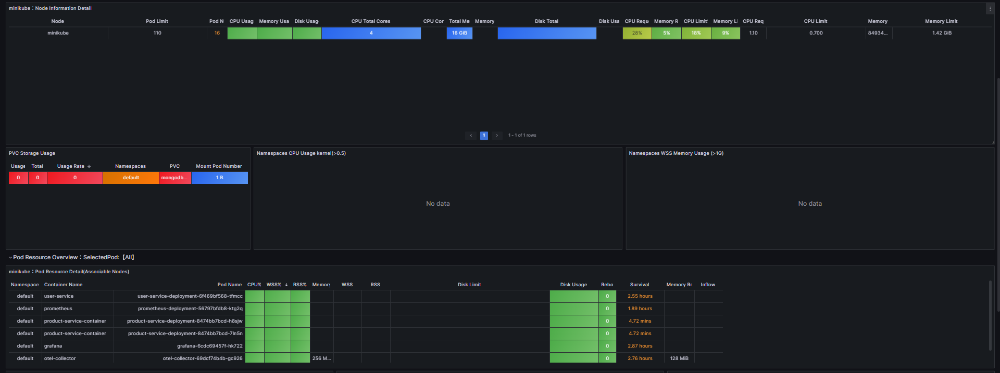

# E-commerce MSA Platform

확장 가능하고 안정적인 이커머스 MSA의 프로토타입

## a. architecture


## b. 핵심 설계 결정 (Key Design Decisions)

| 구분        | 주제                                                                                     | 적용 기술 및 해결책                                                                         |
| :---------- | :--------------------------------------------------------------------------------------- | :------------------------------------------------------------------------------------------ |
| **데이터**  | [대용량 데이터 저장 및 검색 전략](#a-데이터-저장-전략)                                   | **Polyglot Persistence**: MongoDB (원본), Elasticsearch (검색/분석)                         |
| **일관성**  | [분산 트랜잭션 처리](#c-분산-트랜잭션-saga--outbox-패턴)                                 | **SAGA 패턴** with Kafka & Debezium                                                         |
| ️**성능**   | [실시간 재고 관리 (Overselling 방지)](#c-분산-트랜잭션-saga--outbox-패턴)                | **예약 재고 (Reserved Stock)** 패턴 적용                                                    |
| **통신**    | [서비스 간 효율적인 통신](#b-msa-통신-방식)                                              | **gRPC** (내부 동기 통신), **Kafka** (비동기 이벤트)                                        |
| **검색**    | [한국어 검색 품질 향상](#d-읽기검색-성능-최적화)                                         | **Elasticsearch**, Nori 형태소 분석기, 동의어/유의어 사전                                   |
| ️**안정성** | [시스템 안정성 및 자동 복구](#e-시스템-안정성-및-관측-가능성-reliability--observability) | **K8s 기반 HA 구성**, **Jaeger** (분산 추적), **Resilience** 패턴, **APM**과 **alert** 적용 |

## c. tech stacks

- 통신
  - Nginx Ingress (API Gateway)
  - K8s DNS (Service Discovery)
  - gRPC (communication between containers, async but 즉시 update)
  - kafka (event queue, async but eventual consistency)
  - debezium (CDC)
- database
  - MongoDB (users, product_catalog)
    - 비동기 connector: motor
  - MySQL (categories, order, inventory, failed_events)
    - 비동기 connector: aiomysql & sqlalchemy[asyncio]
  - elastic search (logs, products_catalog)
    - 비동기 connector w/ mongodb: monstache
- SRE
  - logging
    - opentelemetry
    - elastic search
    - kibana
  - distributed tracing
    - opentelemetry
    - jaeger
  - APM
    - kube-state-metrics
    - prometheus
    - grafana
  - alert
    - alert-manager
    - slack

## d. ERD


# A. 데이터 저장 전략

> Q. 왜 Polyglot Persistence를 선택했는가?

이커머스 플랫폼의 데이터는 하나의 데이터베이스로 모든 요구사항을 만족시키기 어렵습니다.

각기 다른 성격의 데이터를 효율적으로 처리하기 위해, **'각 목적에 가장 적합한 데이터베이스를 조합하여 사용하는' Polyglot Persistence(폴리글랏 퍼시스턴스)** 전략을 채택했습니다.

### 1. 문제 정의: 상충하는 데이터 요구사항

이커머스 서비스는 다음과 같이 서로 다른, 때로는 상충하는 데이터 요구사항을 동시에 가집니다.

- **정합성 vs 유연성**
  - '주문/재고' 데이터는 단 1원의 오차도 허용하지 않는 **트랜잭션 기반의 강력한 정합성(ACID)** 이 필수적입니다.
  - 반면, '상품' 데이터는 의류, 전자제품, 식품 등 종류마다 속성이 천차만별이므로 **유연한 스키마** 가 필요합니다.
- **저장 vs 검색**
  - 데이터를 안정적으로 저장하는 것과, 사용자가 원하는 상품을 '똑똑하게' 검색하는 것은 완전히 다른 영역의 기술을 요구합니다.
  - "가볍고 예쁜 노트북"과 같은 **자연어 검색(Full-text Search)**, 오타 보정, 실시간 분석 기능은 범용 데이터베이스만으로 구현하기 매우 어렵습니다.
- **안정성 vs 확장성**
  - 트래픽이 폭증할 때 유연하게 **수평적으로 확장(Scale-out)** 할 수 있는 능력 또한 중요합니다.
  - 특히 Read-Heavy한 상품 카탈로그 같은 데이터는 빠른 응답성을 위해 수평 확장이 필수적입니다.

### 2. 해결 전략: 역할과 책임에 따른 데이터베이스 분리

이러한 복합적인 문제를 해결하기 위해, 각 데이터의 성격에 맞춰 데이터베이스의 역할을 명확히 분리했습니다.

| 역할                               | 데이터베이스                      | 담당 데이터              | 선택 이유                                                                                            |
| :--------------------------------- | :-------------------------------- | :----------------------- | :--------------------------------------------------------------------------------------------------- |
| **데이터 무결성 및 트랜잭션 관리** | **MySQL** (RDB)                   | 주문, 재고, 결제         | **트랜잭션**을 통한 데이터 무결성 보장. 돈과 관련된 가장 신뢰도 높은 데이터 처리에 집중.             |
| **비정형 데이터 저장 및 관리**     | **MongoDB** (Document DB)         | 상품 원본, 사용자 정보   | **유연한 스키마**로 비정형 상품 정보를 쉽게 저장 및 관리. 손쉬운 **수평 확장**에 용이.               |
| **검색 및 분석**                   | **Elasticsearch** (Search Engine) | 검색용 상품 데이터, 로그 | **역색인(Inverted Index)** 기반의 압도적으로 빠른 검색 속도. 한국어 형태소 분석 등 고품질 검색 제공. |

### 3. 아키텍처


# B. MSA 통신 방식

## a. 목적에 따른 통신 프로토콜 선택

서비스 간의 통신은 목적에 따라 프로토콜을 다르게 선택했습니다.

1. **gRPC (동기/비동기 요청-응답)**: 다른 서비스의 기능이 **즉시** 필요할 때 사용합니다. (e.g., 주문 생성 시 사용자 유효성 검사)
2. **Kafka (이벤트 기반 비동기)**: 트랜잭션이 여러 서비스에 걸쳐 일어나며, 각 서비스가 **느슨하게 결합(Loosely Coupled)** 되어야 할 때 사용합니다. (e.g., 주문 생성 후 결제, 재고 차감 이벤트 전파)

## b. 통신 흐름 시각화

주문 생성 시, 동기(gRPC)와 비동기(Kafka) 통신이 어떻게 함께 사용되는지 보여줍니다.


`create_order()` 흐름 예시

## c. 기술적 결정: 왜 비동기 방식을 채택했는가?

이커머스는 수많은 동시 요청을 빠르고 효율적으로 처리해야 하는 I/O Bound 작업(OLTP)이 대부분입니다. FastAPI의 비동기(async/await) 처리 모델을 적극적으로 활용하여 다음과 같은 이점을 얻었습니다.

1. 성능 및 확장성: 단일 스레드 이벤트 루프 기반으로 동작하여, 적은 리소스로 높은 동시성 처리가 가능합니다. 스레드 생성 및 컨텍스트 스위칭 비용이 없어 I/O 대기 시간을 효율적으로 활용합니다.
2. 장애 격리 (Fault Isolation): MSA 환경에서 특정 서비스의 응답 지연이나 장애가 발생했을 때, 동기 방식으로 무한정 기다리면 요청 스레드가 고갈되어 전체 시스템 장애로 번질 수 있습니다. 비동기 통신은 이러한 블로킹(Blocking)을 방지하여 서비스 간 장애 전파를 최소화하고 시스템 전체의 안정성을 높입니다.

따라서 내부 서비스 간의 직접 통신은 비동기 gRPC를, 서비스 간의 데이터 전파는 Kafka를 사용하는 것이 이 프로젝트의 요구사항에 가장 적합한 설계라고 판단했습니다.

# C. 분산 트랜잭션: SAGA & Outbox 패턴

여러 서비스에 걸친 데이터의 최종적 일관성을 보장하기 위해 **SAGA 패턴**과 **Outbox 패턴**을 도입했습니다.

## a. Outbox 패턴 with Debezium

DB 트랜잭션과 메시지 발행을 원자적으로 묶어, 이벤트 유실을 방지합니다.


## b. SAGA 패턴: 주문 실패 시 보상 트랜잭션

```
주문 → 결제 → 재고감소 → 배송 ✓
      ↑       ↑       ↑
      실패하면 보상 트랜잭션 역으로 실행
```


_주문 생성 성공 및 결제 실패 시 롤백 흐름_

## c. Overselling 문제 해결

동시 주문 시 재고가 음수가 되는 문제를 해결하기 위해, **'예약 재고(Reserved Stock)'** 개념을 도입했습니다.


#### 결제 성공 후, 예약한 재고수량 만큼 재고 감소처리

```
주문(예약 재고 수량 기입) → 결제 → 예약한 재고수량 만큼 감소 → 배송 ✓
      ↑                ↑       ↑                   ↑
      실패하면 보상 트랜잭션 역으로 실행
```

- 요약

1. stock(재고수량) 필드 외에, stock_reserved(예약재고수량) 필드를 넣어서,
2. 주문하는 시점에 예약 재고수량을 잡아버리고,
3. 다른 사람이 같은 상품을 주문하는데, 현재 남아있는 재고량 + 예약된 재고량 이상 주문하려고 하면 주문을 못하게 막는다.
4. 결제 완료되는 시점에 실제 재고수량 - 예약 재고수량 처리한다.

## d. 개선점

### d-1. 재고량 트래킹은 nosql이 아닌 redis에서 하는게 유리!

ecommerce는 read:write 비율이 9:1 이상인 read heavy app이고,\
대부분 상품 카탈로그 정보 read이다.

상품 카탈로그 정보를 read하는 mongodb는 안그래도 매우 바쁜데,\
거기에 재고수량 & 예약재고량까지 트래킹 시키는 부담을 주어야 할까?

상황에 따라 다르겠지만, 대규모 요청을 가정한다고 하면,\
실시간 재고관리 같은 write-heavy, transaction-heavy 같은 작업은\
redis에 맡기는게 더 유리한 것으로 보인다.

---

### d-2. redis vs mongodb 성능비교

1. 일단 기본적으로 RAM 위에서 작동하는 redis가 disk i/o기반 데이터베이스보다 i/o가 더 빠르다.
2. Redis 사용 시 동시 10만 TPS(초당 트랜잭션) 처리 가능한데, MongdoDB는 5000 TPS로 성능차이가 많이 난다고 한다. (기계 스펙, 상황에 따라 천차만별이지만, redis가 더 빠른건 사실)
3. transaction 속도가 대략적으로 mongodb는 ms단위, redis는 ns단위라고 한다.

---

### d-3. 결론

현 프로젝트에서는 재고파악은 별도의 inventory-module + redis에서 하는게 아닌,\
product-module에서 mysql에서 한다.

왜?

redis로 데이터 캐싱해서 최적화 하는 작업은 [여기](https://github.com/Doohwancho/ecommerce?tab=readme-ov-file#b-db-%EB%B6%80%ED%95%98%EB%A5%BC-%EB%82%AE%EC%B6%94%EA%B8%B0-%EC%9C%84%ED%95%9C-cache-%EB%8F%84%EC%9E%85%EA%B8%B0)에서 이미 했기 때문.

# D. 읽기/검색 성능 최적화

## a. 문제정의

이커머스는 단순한 id기반 상품데이터 조회가 아닌, 사용자의 복잡하고 다양한 검색 요구사항을 처리해야 합니다.

mongodb같은 범용 데이터베이스는 이런 '검색'기능에 특화된 DB는 아닙니다.

예를들어 사용자가 "가볍고 빠른 삼성 노트북"과 같이 여러 키워드로 검색할 때, MongoDB는 title, description, brand 등 여러 필드에 걸쳐 LIKE 연산과 유사한 비효율적인 텍스트 검색을 수행해야 합니다. B-Tree 인덱스는 이런 종류의 비정형 텍스트 검색을 위해 설계되지 않았기 때문에, 데이터가 많아질수록 쿼리 속도가 급격히 저하됩니다.

그렇다고 여러 필드에 다 인덱스 걸면, 상당한 메모리 낭비 + 서버비가 증가합니다.

## b. 해결책: 검색을 위한 전문 엔진, Elasticsearch 도입

이 문제의 해결책은 '업무 분리', 즉 각자 가장 잘하는 일에 데이터베이스를 사용하는 Polyglot Persistence 아키텍처를 도입하는 것입니다.

이 구조를 선택한 이유를 명확히 이해하기 위해, "왜 처음부터 모든 데이터를 Elasticsearch에 저장하지 않는가?"라는 질문에 먼저 답해야 합니다.

---

> Q. 그렇다면 상품 데이터를 처음부터 Elasticsearch에 저장하면 되지 않나?

> A. 아니요, Elasticsearch는 트랜잭션(Transaction)을 보장하지 않아 데이터의 정합성과 안정성이 무엇보다 중요한 원본 데이터 저장소로는 부적합합니다.

이커머스에서는 '재고 차감', '주문 생성', '결제 완료' 등 여러 단계의 데이터 변경이 **원자적(Atomic)** 으로 일어나야 합니다. 만약 데이터 업데이트가 중간에 실패했을 때 이전 상태로 되돌리는 롤백(Rollback)이 보장되지 않으면, '결제는 됐는데 주문은 안 된 상태' 또는 '재고가 없는데 판매가 계속되는' 등 심각한 문제를 야기할 수 있습니다.

Elasticsearch는 이런 데이터 정합성 보장보다는 검색 속도와 가용성에 모든 역량을 집중한 검색 엔진입니다. 반면, MongoDB와 같은 범용 데이터베이스는 트랜잭션을 지원하여 데이터의 무결성을 보장하는 역할을 수행합니다.

---

> Q. 그러면 mongodb와 elastic search의 데이터를 어떻게 sync하지?

> A. monstache라는 오픈소스 툴을 썼습니다.

## c. architecture


## d. Stress Test 결과 (VUser 300)

상품 검색은 이커머스의 핵심 기능입니다. \
100만 건의 상품 데이터를 기준으로, MongoDB와 Elasticsearch의 ID 기반 단일 조회 성능을 K6로 비교 테스트했습니다.

| 지표                | MongoDB   | Elasticsearch           |
| :------------------ | :-------- | :---------------------- |
| **평균 응답 시간**  | **2.39s** | **45ms** (약 53배 빠름) |
| **p(95) 응답 시간** | 4.45s     | 187ms                   |
| **1초 내 응답률**   | 20%       | **100%**                |

- _(로컬 pc에서 minikube로 여러 pod 돌리는거라 latency가 느리다. latency의 절댓값보다 상대적으로 개선됨에 주목)_
- _(stress_test 세부 데이터는 `/documents/시행착오/elastic_search.md`에 기록함)_

## e. 한국어 검색 품질 개선

Elasticsearch의 **Nori 형태소 분석기**를 기반으로 다음과 같은 최적화를 진행했습니다.

- **분석기(Analyzer) 커스텀**: `n-gram`, `edge n-gram`을 활용해 자동완성 및 부분 일치 검색 구현
- **동의어/유의어 사전**: "노트북", "랩탑" 등 동의어를 묶어 검색 정확도 향상
- **가중치 부여**: `title` 필드에 높은 가중치를 부여해 검색 결과의 정확성 증대

# E. 시스템 안정성 및 관측 가능성 (Reliability & Observability)

장애는 언제든 발생할 수 있습니다. 중요한 것은 장애를 빠르게 감지하고, 자동으로 복구하며, 다른 서비스로 전파되지 않도록 막는 것입니다.

## a. 고가용성(HA) 및 자동 Failover

- **MySQL, MongoDB**: 모두 3대 이상의 홀수 노드로 클러스터를 구성하여 **Quorum 기반의 자동 Failover**를 구현했습니다. 노드 장애 시 자동으로 새로운 Master(Primary)가 선출됩니다.


## b. 분산 추적 (Distributed Tracing)

**OpenTelemetry** 표준을 도입하고 **Jaeger**를 활용하여 MSA 환경에서의 요청 흐름을 추적하고 병목 지점을 분석했습니다.


`create_order()`안에 payment부분과 product 부분의 트레이스도 확인 가능하다.
_그림 1: `create_order` 요청의 전체 흐름. PaymentService에서 지연 발생 확인_


_그림 2: 트레이스를 열어보면 세부정보도 확인할 수 있다._


에러 트레이스를 읽는 장면이다.
_그림 3: 에러 발생 시(빨간색), 해당 Span의 상세 로그 및 스택 트레이스 확인_

## c. 장애 전파 방지 (Resilience)

- **Health Check**: K8s의 `livenessProbe`, `readinessProbe`를 구현하여 비정상 Pod를 자동으로 재시작하고 트래픽을 차단합니다.
- **Resilience Patterns**: 코드 레벨에서 `Retry`, `Timeout`, `Circuit Breaker` 패턴을 적용하여 특정 서비스의 장애가 전체 시스템의 장애로 확산되는 것을 방지합니다. (Istio/Envoy를 활용한 인프라 레벨 구현도 고려)

## d.️ 중앙화된 로깅 (Centralized Logging)

- **ELK Stack (Otel -> Elasticsearch -> Kibana)**: 모든 마이크로서비스의 로그를 한곳에서 수집하고 분석하여, 장애 발생 시 신속하게 원인을 파악할 수 있도록 구성했습니다.


- _로그를 opentelemetry를 통해 elastic search에 쌓은걸 kibana로 시각화한 모습이다._
- _elastic search로 대량의 로그를 검색하기 때문에 로그 검색 query한번에 15분+ 걸리지 않아 에러대처를 빠르게 할 수있다._

## e. k8s APM




- _1달 목표 99.9%의 availability, 평균 latency 200ms 이하 목표 지표를 커스텀하여 만듬_
- _여러 pod들의 APM을 prometheus + grafana를 이용하여 한화면에 모니터링하게 세팅한 모습이다._

## f. alert-manager


- _장애가 터진 후에 즉시 알람을 받아 빠르게 조치하는것도 중요하지만, 전조상황을 보고 선제대응하는 것 또한 SRE 필수 요소 중 하나이다._
