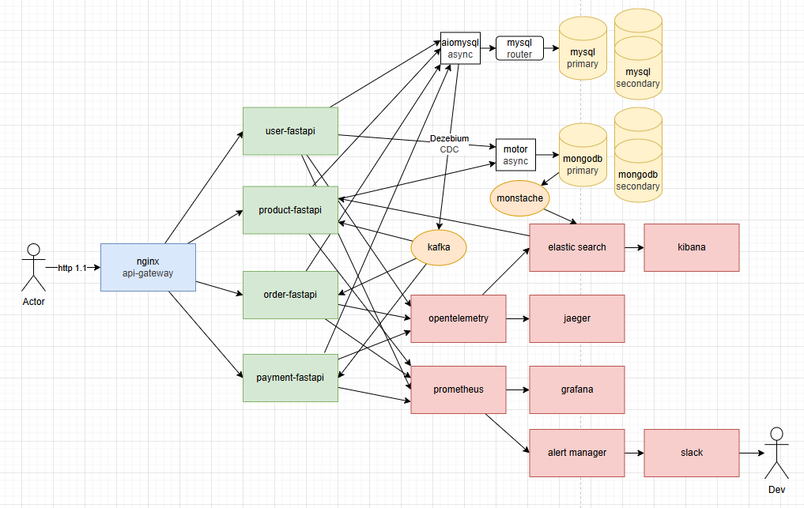

# A. what


basic ecommerce MSA

## a. Index

1. [Q. 데이터를 어떻게 저장하지?](#b-데이터를-어떻게-저장하지)
    1. 요구사항
    2. 데이터가 어떨 때 RDB가 더 유리하고 NOSQL이 더 유리할까?
    3. if NOSQL, mongodb vs elastic search 성능 비교
    4. mongodb & elastic search를 어떻게 써야할까?
    5. DB를 도메인 별로 쪼개서 저장해야 할까?
    6. update 즉시 적용 vs eventual consistency
    7. 상품 데이터는 어느 DB에 어느 데이터 구조로 저장하지?
    8. 계층화된 상품 카테고리 정보는 어디에 저장하는게 좋을까?
2. [Q. MSA 환경에서 컨테이너들이 어떻게 통신하지?](#c-msa에서-컨테이너끼리-어떻게-통신하지)
    1. MSA 컨테이너 간 통신 프로토콜 비교 (JSON vs HTTPx vs gRPC)
3. [Q. 동기? 비동기?](#d-msa에서-동기-비동기)
    1. create_order()에 전체 흐름 파악
    2. 선행지식) 동기 vs 비동기 차이는?
    3. 돌아와서, grpc 통신 부분은 동기? 비동기?
    4. 선행지식) fastapi에서 동기/비동기 처리 메커니즘
    5. grpc 이후에 DB i/o 부분은 동기? 비동기?
4. [Q. kafka로 이벤트 담아 처리할 때 유실되지 않고 확실하게 처리하는 방법은?](#e-kafka로-이벤트-담아-처리할-때-유실되지-않고-확실하게-처리하는-방법은)
    1. 비동기 통신과 kafka에 티켓넣고 구독하는 통신과 뭐가 다른거지?
    2. 로직을 끝내고 이벤트를 produce 했는데 로직은 commit이 끝났는데 product(event)에러 에러났으면?
    3. produce(event)가 중복으로 들어갔다면?
    4. kafka.send()가 실패했다면?
5. [Q. 분산 시스템에서 트랜젝션 방법은?](#f-분산시스템에서의-트랜젝션r-kafka편)
    1. 분산 시스템에서 transaction & rollback을 어떻게 처리하지?
    2. 결과 (mermaid flowchart)
6. [Q. 상품재고의 overselling 문제를 어떻게 해결하지?](#g-상품재고의-overselling-문제를-어떻게-해결하지)
    1. overselling 문제
    2. solution: 예약 재고 수량 트래킹
    3. 재고량 & 예약재고량을 nosql에서 트래킹하는게 맞을까?
    4. 도입
7. [Q. ecommerce에서 상품의 read optimization?](#h-ecommerce에서-상품의-read-optimization)
    1. mongodb에 100만 데이터 넣고 stress test
    2. elastic search에 100만 데이터 넣고 stress test 후 결과 비교
    3. monstache로 mongodb replica set과 elastic search 실시간 sync
8. [Q. 상품 검색 방법?](#i-상품-검색-방법)
    1. tokenizers 비교
    2. 형태소 분석기 비교
    3. all_text로 검색 걸리는 필드 합치기
    4. 다양한 검색방법론
    5. 동의어사전 & 유의어사전
9. [Q. k8s container의 안정성을 높히는 방법은?](#j-k8s-container의-안정성을-높히는-방법은)
    1. mysql HA
    2. mongodb HA
    3. opentelemetry
    4. jaeger
    5. resilience
    6. logging


## b.tech stacks

- 통신
  - Nginx Ingress (API Gateway)
  - K8s DNS (Service Discovery)
  - gRPC (communication between containers, async but 즉시 update)
  - kafka (event queue, async but eventual consistency)
  - debezium (CDC)
- database
  - MongoDB (users, product_catalog)
    - 비동기 connector: motor
  - MySQL (categories, order, inventory, failed_events)
    - 비동기 connector: aiomysql & sqlalchemy[asyncio]
  - elastic search (logs, products_catalog)
    - 비동기 connector w/ mongodb: monstache
- sre
    - opentelemetry
        - logging
          - elastic search
          - kibana
        - tracing
          - jaeger (distributed tracing)

## c. ERD


# B. 데이터를 어떻게 저장하지?

## b-1. 요구사항

- a. 상품 데이터
  1. nike같이 신발만 파는게 아닌, 아마존처럼 다양한 종류의 상품을 판매 (= 상품 카테고리 종류가 많음)
  2. 100만개 이상 대규모 상품 데이터
  3. read:write (for product) 비율이 9.9:0.1 이상인 read heavy app
  4. 트래픽이 갑작스럽게 몰렸을 때 scale up or out 가능해야 한다.
  5. 검색에 유리해야 한다.
  6. 추천시스템의 input으로 상품 데이터가 활용될 수 있음
- b. 고객 데이터
  1. 추천시스템의 input으로 유저 데이터가 활용될 수 있음
  2. 6개월 이상 미접속시 휴면 계정으로 전환
  3. 트래픽이 갑작스럽게 몰렸을 때 scale up or out 가능해야 한다.

## b-2. RDB vs NOSQL

Q. 데이터가 어떨 때 RDB가 더 유리하고 NOSQL이 더 유리할까?

- case1) RDB이 더 유리한 경우
  - 데이터를 정형화 하고 싶은 경우
  - transaction 걸어서 정확도 맞춰야 하는 데이터
- case2) NOSQL이 더 유리한 경우
  - 데이터가 비정형 데이터인 경우
    - 사실 일상생활 속에는 정형화된 데이터보다 비정형화인 데이터가 많다.
    - ex. 추천시스템에서 고객의 행동패턴이 인풋으로 들어가는데, 고객의 행동패턴이 워낙 다양해서 몇가지 RDB table의 attribute로 정형화 하기 매우 어렵다.
  - 앱 특성상 트래픽이 갑자기 몰려서 다운타임 없이 무중단으로 스케일 업 or 아웃 해야하는 경우
    - ecommerce는 서비스 중지되는 순간 깨지는 돈이 어마어마해서 무중단인게 매우 중요하다. (잘못해서 서버 꺼져서 판매자들의 매출 타격오면 소송 맞을 수도 있다.)
    - RDB는 read replica는 aws-RDS기준, 6개까지 무중단으로 추가 가능한데, 이 이상은 끄고 스케일업 해야 한다.
    - 유저가 갑자기 몰려서 회원가입이 폭주해 write heavy가 되는 경우엔, write node(master node)가 1개뿐이기에, 무중단으로 scale out이 불가능하다.
    - 그래서 기존에 RDB 쓰는 곳들은 트래픽 몰릴걸 미리 예측해서 미리 과도하게 스케일 업 해놓고 끝나면 다시 내리는 식으로 대응했는데, nosql을 쓰면 무중단으로 스케일 아웃 가능하다.
  - 대규모 데이터인 경우, sharding을 해야할 때가 오는데, 이 때, nosql이 RDB보다 더 유리하다.

## b-3. if NOSQL, mongodb vs elastic search 성능 비교

| **기준**             | **Elasticsearch**                            | **MongoDB**                          |
| -------------------- | -------------------------------------------- | ------------------------------------ |
| **검색 유형**        | 전문 검색(Full-Text), 유사도 검색, 다중 필터 | 단순 키-값, 범위 쿼리                |
| **평균 응답 시간**   | 10~50ms (100만 건 기준)                      | 50~200ms (동일 데이터)               |
| **고급 기능**        | 오타 보정, 동의어 확장, 유사도 순위 결정     | 기본 텍스트 검색 (Atlas Search 제외) |
| **인덱스 구조**      | 역인덱스(Inverted Index)                     | B-Tree 인덱스                        |
| **동시 검색 처리량** | 초당 10,000+ 쿼리                            | 초당 1,000~5,000 쿼리                |

Q. elastic search가 더 빠르면 왜 굳이 mongodb에 상품데이터 저장할까? 그냥 elastic search에 하지.

A. elastic search는 transaction 지원을 안함. 따라서 메인 DB로는 부적합하다.

## b-4. mongodb & elastic search를 어떻게 써야할까?

read:write가 9:1 이상인 ecommerce 도메인의 상품데이터는,\
원본데이터는 mongodb에 저장하고,\
검색용 or 추천용 필드만 뽑아서 elatic search에 sync 맞추자. (eventual consistency)

## b-5. DB를 도메인 별로 쪼개서 저장해야 할까?

데이터 규모에 따라 달라진다.

1. 소규모 데이터면 DB하나로 쓴다.
2. 중규모 데이터면 상황에 따라 다르다.
  1. DB scale up을 할 수록 점점 더 비용 대비 효과가 비효율적인 시점이 온다,
  2. 따라서 비싸고 좋은 DB 1개 vs 저렴한 DB N개의 비용대비 효과를 측정해야 한다.
3. 대용량 데이터라면 RDB scale up에는 한계가 있으니까 쪼개야 하는게 유리한 경우가 많다.
  1. 그러나 order & user 처럼 join 필요한 경우라면 왠만하면 하나의 DB에서 쓰는게 유리할 수 있다.


## b-6. update 즉시 적용 vs eventual consistency

정보가 모든 모듈에 대하여 consistent 해야하고, up-to-date해야 하는 경우가 있다. (예를들면, 돈과 관련된 정보들)\
쪼개진 여러 backend-server들이 같은 db에 같은 테이블을 참조하게 하거나,\
로직 내부에 grpc통신으로 즉시 다른 도메인 모듈을 통해 update하고, 실패하면 로직 전체를 실패 처리 해버리는 방식이 있다.\
성능을 약간 포기하고서라도, 정확도가 필요하면 이 방법을 쓴다.

정보 업테이트가 반드시 up-to-date 안해도 되고, 좀 나중에 여유날 때 업데이트 되도 되는 데이터가 있다.\
이런 데이터들은 consistency를 약간 포기하고 응답성(availability)를 확보할 수 있다.\
예를들어 ecommerce에서 상품 카탈로그의 원본 정보는 mongodb에 저장하고, elastic search에 캐싱하는 경우,\
데이터를 2곳에 나눠서 저장하기 때문에, 두 데이터의 정합성이 안맞을 때도 있을 수 있지만,\
elastic search 서버가 다운되도 mongodb에서 가져올 수 있기 때문에, consistency가 떨어져도 availability을 높힐 수 있다.


## b-7. 상품 데이터는 어느 DB에 어느 데이터 구조로 저장하지?

보통 RDB에 상품데이터를 넣고 관리한다고 생각하는데,\
파는 상품 종류가 몇개 안되면, 테이블 컬럼 정의하기가 용이하지만,\
쿠팡같이 상품종류가 매우 다양하면 nosql에 밀어넣고 파싱해서 쓰는게 낫다.

예를들어, 신발 전문 쇼핑몰의 경우 테이블 컬럼 종류가 아무리 다양해봤자 몇십개 이내로 특정지을 수 있다.

하지만 쇼핑몰에서 신발, 스마트폰, 채소를 판다고 할 경우,\
이 3종류 상품에 모두 해당되는 컬럼을 만들면,\
null값이 들어가는 컬럼이 너무 많이 생겨서,\
메모리 용량 낭비가 너무 심해진다.

이럴 때 도메인을 잘 나누는 노하우가 필요해지고,\
어설프게 나누면 ecommerce에서 다뤄지는 모든 상품을 정확히 분류할 때 문제가 생긴다.

---

상품을 추가할 때, 새로운 필드를 하나 추가해야 하는 상황이라 치자.

RDB면 스키마 변경해야 하고 migration 해야하는게 부담스러울 수 있는 반면,\
Nosql은 비교적 자유롭다.

---

쿠팡같은 대규모 쇼핑몰은 등록된 상품 갯수만 100만개 이상이라고 하면,\
데이터를 쪼개서 여러 DB에 나눠서 저장하는 샤딩을 선택하는 경우가 있는데,\
RDB보다 nosql이 샤딩에 더 유리하다.

## b-8. 계층화된 상품 카테고리 정보는 어디에 저장하는게 좋을까?
계층화된 카테고리는 이런 뜻이다.

path 컬럼의 예시)
- "전자제품" -> ID: 1, path: "1"
- "컴퓨터" -> ID: 4, path: "1/4"
- "노트북" -> ID: 28, path: "1/4/28"
- "게이밍 노트북" -> ID: 56, path: "1/4/28/56"

이렇게 하면 "path LIKE '1/4/%'" 같은 쿼리로 컴퓨터 카테고리 아래 모든 하위 카테고리를 한방에 가져올 수 있다. 재귀 쿼리 안 써도 된다.

또 "노트북"의 모든 상위 카테고리 찾으려면 path("1/4/28")를 '/'로 쪼개서 ID 1, 4를 바로 알 수 있다.

nosql에 계층화된 상품 카테고리 정보는 이런식으로 저장된다.
```sql
// 카테고리 컬렉션
db.categories.insertMany([
  { _id: 1, name: "전자제품", path: "1", level: 0 },
  { _id: 4, name: "컴퓨터", path: "1/4", level: 1 },
  { _id: 28, name: "노트북", path: "1/4/28", level: 2 }
]);

// 상품 컬렉션
db.products.insertOne({
  _id: "P123",
  name: "게이밍 노트북",
  category_ids: [1, 4, 28],  // 모든 상위 카테고리 ID 배열
  category_paths: ["1", "1/4", "1/4/28"] // 계층 경로 저장
});

// 인덱스 생성
db.products.createIndex({ "category_paths": 1 });

// 쿼리
// '컴퓨터(4)'와 모든 하위 카테고리 상품 조회
db.products.find({
  category_paths: { $regex: /^1\/4/ }
});
```

주의할 점은, regex 패턴이 고정이냐, 부분고정이냐, 비고정이냐에 따라서 인덱스를 타고 안타고가 정해진다는 것이다.

1. `/^1\/4/` 은 고정 패턴이라 인덱스 탄다.
  - `1/4`로 시작하는 모든 경로를 범위스캔 한다. (IXSCAN)
  - 추가 필터링 없이 1/4 시작점을 찾고, 거기에 연결된 모든 leaf node들을 반환한다.
  - 예: 1/4, 1/4/28, 1/4/28/56 등
  - MySQL의 LIKE '1/4%'와 유사
2. `/^1\/4(\/|$)/` 은 부분 고정 패턴이라 인덱스를 부분적으로만 탄다.
  - 1/4까지 고정이었다가 그 이후로는 조건식이 붙은 부분 고정 패턴은 인덱스를 부분적으로만 활용해서 효율이 떨어진다고 한다.
  - 인덱스에서 1/4로 시작하는 모든 경로 검색 (IXSCAN)한 후, 메모리에서 `(\/|$)` 조건을 추가로 필터링.
  - 따라서 regex짤 때 조금 신경써야 한다.
3. `/1\/4/` 은 비고정 패턴이라 인덱스를 안타서 느리다.
  - 1/4가 문자열 중간에 위치할 수 있음
  - 따라서 앞에 ^을 붙여서 왼쪽부터 시작한다는걸 고정시켜놔야 인덱스를 탄다.


그러면 실제 데이터는 어떻게 보일까?

```sql
// 카테고리 컬렉션 예시
[
  {
    "_id": 1,
    "name": "전자제품",
    "parent_id": null,
    "path": "1",
    "level": 0
  },
  {
    "_id": 2,
    "name": "컴퓨터",
    "parent_id": 1,
    "path": "1/2",
    "level": 1
  },
  {
    "_id": 4,
    "name": "노트북",
    "parent_id": 2,
    "path": "1/2/4",
    "level": 2
  },
  {
    "_id": 56,
    "name": "게이밍 노트북",
    "parent_id": 4,
    "path": "1/2/4/56",
    "level": 3
  }
]

// categories 컬렉션 인덱스
db.categories.createIndex({ "path": 1 });
db.categories.createIndex({ "level": 1 });
db.categories.createIndex({ "parent_id": 1 });
```

```sql
// 상품 컬렉션 예시
{
  "_id": ObjectId("65c3e7a1d8f5e11a2b3c4d5e"),
  "title": "Apple 2025 MacBook Pro",
  "description": "최신 Apple MacBook Pro, M3 Max 칩, 16인치 Liquid Retina XDR 디스플레이",
  "brand": "Apple",
  "model": "MUW73LL/A",
  "sku": "MBP-16-M3-MAX",
  "upc": "195949185694",
  "color": "Space Gray",

  "category_ids": [1, 2, 4],
  "primary_category_id": 4,
  "category_breadcrumbs": ["전자제품", "컴퓨터", "노트북"],
  "category_path", "1/4/7",
  "category_level" 3,

  "price": {
    "amount": 3499.99,
    "currency": "USD"
  },
  "stock": 100,
  "stock_reserved": 0,  // SAGA rollback을 위한 예약 재고량
  "weight": {
    "value": 4.8,
    "unit": "POUND"
  },
  "dimensions": {
    "length": 14.01,
    "width": 9.77,
    "height": 0.66,
    "unit": "INCH"
  },
  "attributes": {
    "processor": "M3 Max",
    "ram": "32GB",
    "storage": "1TB SSD",
    "screen_size": "16 inch",
    "resolution": "3456 x 2234"
  },
  "variants": [
    {
      "id": "variant1",
      "sku": "MBP-16-M3-MAX-SG-32GB-1TB",
      "color": "Space Gray",
      "storage": "1TB",
      "price": {
        "amount": 3499.99,
        "currency": "USD"
      },
      "attributes": {
        "processor": "M3 Max",
        "ram": "32GB"
      },
      "inventory": 50
    },
    {
      "id": "variant2",
      "sku": "MBP-16-M3-MAX-SIL-32GB-1TB",
      "color": "Silver",
      "storage": "1TB",
      "price": {
        "amount": 3499.99,
        "currency": "USD"
      },
      "attributes": {
        "processor": "M3 Max",
        "ram": "32GB"
      },
      "inventory": 35
    }
  ],
  "images": [
    {
      "url": "https://example.com/macbook-pro-1.jpg",
      "main": true
    },
    {
      "url": "https://example.com/macbook-pro-2.jpg",
      "main": false
    }
  ],
  "created_at": "2025-04-30T10:15:30.123Z",
  "updated_at": "2025-04-30T10:15:30.123Z"
}

// 상품 컬렉션 인덱스
db.products.createIndex({ "category_ids": 1 });  // 카테고리 ID로 조회
db.products.createIndex({ "primary_category_id": 1 });  // 주 카테고리로 조회
db.products.createIndex({ "category_path": 1 });  // 계층 구조 쿼리 ("1/2/%" 형태)
db.products.createIndex({ "category_level": 1 });  // 특정 깊이 카테고리 조회


// 특정 카테고리에 속한 상품 찾기
db.products.find({ category_ids: 4 });

// 주 카테고리가 노트북인 상품
db.products.find({ primary_category_id: 4 });

// 컴퓨터 카테고리와 그 하위 모든 카테고리 상품
db.products.find({ category_path: /^1\/2/ });

// 깊이가 2인 카테고리 상품 (예: 노트북, 데스크탑 등)
db.products.find({ category_level: 2 });
```


# C. MSA에서 컨테이너끼리 어떻게 통신하지?

create_order()을 하면, user_validation() 해야해서 유저 모듈과 통신해야 한다.

## c-1. MSA 컨테이너 간 통신 프로토콜 비교 (JSON vs HTTPx vs gRPC)

| **기능**          | **JSON (HTTP/1.1)**                             | **HTTPx (HTTP/2)**                     | **gRPC**                                            |
| ----------------- | ----------------------------------------------- | -------------------------------------- | --------------------------------------------------- |
| **데이터 포맷**   | 텍스트 기반 (JSON)                              | 텍스트 기반 (JSON)                     | 바이너리 기반 (Protocol Buffers)                    |
| **프로토콜**      | HTTP/1.1                                        | HTTP/2                                 | HTTP/2                                              |
| **성능**          | 낮음: 텍스트 파싱 오버헤드                      | 중간: HTTP/2 멀티플렉싱 지원           | 높음: 바이너리 직렬화 + HTTP/2 최적화               |
| **확장성**        | 제한적: 연결당 단일 요청                        | 개선됨: 멀티플렉싱 지원                | 우수: 스트리밍 및 병렬 처리                         |
| **사용 편의성**   | 쉬움: RESTful API 표준                          | 쉬움: JSON 기반 + HTTP/2               | 복잡함: Proto 파일 정의 필요                        |
| **언어 지원**     | 모든 언어                                       | 모든 언어                              | 다중 언어 (공식 10+ 언어 지원)                      |
| **브라우저 지원** | 완전 지원                                       | 완전 지원                              | 제한적 (gRPC-Web 필요)                              |
| **실시간 통신**   | 불가능                                          | 제한적                                 | 지원: 단방향/양방향 스트리밍                        |
| **주요 장점**     | - 인간 친화적<br>- 디버깅 용이<br>- 널리 사용됨 | - HTTP/2 성능 개선<br>- 기존 JSON 호환 | - 고성능<br>- 강력한 타입 시스템<br>- 스트리밍 지원 |
| **주요 단점**     | - 높은 지연 시간<br>- 데이터 크기 큼            | - 여전히 JSON 오버헤드 존재            | - 학습 곡선 높음<br>- 브라우저 지원 제한            |
| **적합한 사례**   | - 외부 API<br>- 간단한 내부 통신                | - 성능 개선이 필요한 REST API          | - 고부하 서버 간 통신<br>- 실시간 데이터 처리       |

## c-2. **결론**

- **JSON (HTTP/1.1)**:
  외부 클라이언트 노출, 간단한 통신, 빠른 개발이 필요할 때 선택.
- **HTTPx (HTTP/2)**:
  기존 JSON API를 유지하면서 성능을 개선하려는 경우 사용.
- **gRPC**:
  서버 간 고성능 통신, 실시간 스트리밍, 다중 언어 환경에서 권장.

# D. MSA에서 동기? 비동기?

## d-1. 결론
- fastapi는 single main thread가 main loop에서 비동기로 처리하면서, 무거운 작업은 별도 쓰레드풀에게 할당하는 식으로 동작한다. (마치 nodejs 처럼)
- ecommerce는 요청이 1초 내 빠르게 처리해야하는 OLTP 특성을 가졌기 때문에, 가벼운 대부분 요청은 비동기로 처리하고 무거운 작업만 별도로 빼서 쓰레드풀에게 할당하여 처리한다.
- MSA는 각 모듈간 분리 시키고, 하나의 모듈에서 에러 터진게 다른 모듈로 전파되면 안되기 때문에, 비동기 방식으로 통신해서 서로 분리시킨다.

## d-2. create_order()에 전체 흐름 파악

이게 order_module에서 create_order()의 실행 흐름이다.(약식)

```
1. order_module.create_order()
2. await validate_user()
3. user_server.py가 요청 받음
4. user_service.validate_user() 호출
5. DB I/O 실행
```

Q. 여기서 어느 부분이 동기여야 하고 어느부분을 비동기로 처리해야 좋을까?

## d-3. 선행지식) 동기 vs 비동기 차이는?

1. 동기: 스레드가 작업 끝날 때 까지 기다림(다른 작업 수행 불가능)
2. 비동기: 스레드가 작업을 시작하고 기다리지 않고 딴일하러 감

이 설명만 보면 무조건 비동기가 더 좋아보이는데 항상 그런건 아니다.

1. task생성하고 다른일하러 갈 때 task 전환 일어나니까 context switching cost가 있고,
2. 이 task들도
3. queue 대기열에 넣고,
4. 우선순위 관리해서 스케쥴링 하고
5. 상태추적 하고

....하면 CPU 오버헤드가 늘어난다.\
그래서 task가 ms단위로 너무 빨리 끝나는 일이면,\
이런거 다 해야하는 비동기보다 그냥 심플하게 기다리는 동기가 더 빠를 수 있다.

비동기 I/O는

1. MSA같은 환경에서 컨테이너끼리 분리되어있는데, 네트워크 지연시간이 상대적으로 길거나,
2. 동시에 엄청 많은 요청(스레드풀의 스레드 숫자 이상)을 처리해야 할 때,

동기보다 어 유리할 수 있다.

## d-4. 돌아와서, grpc 통신 부분은 동기? 비동기?

grpc는 동기, 비동기 2종류가 있는데, 보통 MSA에서는 비동기로 쓴다.

왜냐면 컨테이너끼리 통신하는데, 네트워크 장애 상황이 발생할 수 있다.

동기로 grpc 통신을 하면, 네트워크 장애, 지연, 상대 컨테이너가 죽었을 때, 무기한으로 기다려야 한다.

MSA를 쓰는 이유 중 하나가, 모듈간의 장애 격리인데,\
컨테이너 하나 터진다고 해서 다른 모듈에 영향을 주면 안되기 때문에,\
grpc는 비동기로 구현한다.

## d-5. 선행지식) fastapi에서 동기/비동기 처리 메커니즘

### d-5-1. 비동기 함수 (async def)

- FastAPI는 Uvicorn/Starlette 기반으로, 이들은 비동기 이벤트 루프를 사용합니다
- async def 함수는 메인 이벤트 루프에서 직접 실행됩니다
- I/O 작업에서 await 만나면 제어권을 이벤트 루프에 반환하고 다른 태스크를 처리합니다
- 이벤트 루프는 기본적으로 단일 스레드에서 실행됩니다

### d-5-2. 동기 함수 (def)

- FastAPI는 동기 함수를 만나면 자동으로 별도의 스레드풀로 오프로드합니다
- 이 작업은 메인 이벤트 루프를 차단하지 않도록 합니다
- 기본 스레드풀 크기는 CPU 코어 개수에 기반합니다
- 동기 함수가 완료되면 결과는 다시 이벤트 루프로 전달됩니다

## d-6. grpc 이후에 DB i/o 부분은 동기? 비동기?

### d-6-1. case1) 동기로 구현하는 경우

```python
def validate_user(self, user_id):
    # 동기 DB 쿼리
    user = self.db_connection.find_one({"_id": user_id})
    return user is not None
```

실행 흐름:

1. gRPC 서버(비동기)가 이 함수 호출
2. 중요: FastAPI는 이 동기 함수를 스레드풀의 워커 스레드에 할당
3. 메인 이벤트 루프는 계속해서 다른 요청 처리 가능
4. 워커 스레드가 DB 쿼리 수행하며 I/O 동안 차단됨
5. 쿼리 완료 후 결과를 이벤트 루프(메인 스레드)로 반환
6. 이벤트 루프는 gRPC 응답 생성하여 반환

여기서 2번 부분에서,\
메인 스레드가 스레드풀한테 task할당할 때 context switching cost가 생긴다.

### d-6-2. case2) 비동기로 구현하는 경우

```python
async def validate_user(self, user_id):
    # 비동기 DB 쿼리
    user = await self.db_connection.find_one({"_id": user_id})
    return user is not None
```

실행 흐름:

1. gRPC 서버(비동기)가 이 함수 호출
2. 함수가 메인 이벤트 루프에서 직접 실행됨
3. DB 쿼리 시작하고 await에서 제어권 반환
4. 이벤트 루프는 다른 태스크 처리
5. DB 쿼리 완료 시 이벤트 루프가 함수 실행 재개
6. 결과를 gRPC 응답으로 반환

그래서 비동기는 동기와는 다르게

1. 별도 스레드 할당이 필요 없음
2. 컨텍스트 스위칭 오버헤드 없음
3. 단일 스레드가 여러 요청 효율적으로 처리

### d-6-3. Q. fastapi에서 동기 / 비동기 성능차이는?

1. 워커 스레드 오버헤드

- 동기 함수는 스레드풀에 오프로드되어 스레드 전환 비용 발생
- 비동기 함수는 메인 이벤트 루프에 머물러 이 오버헤드 없음

2. 리소스 사용량:

- 동기 함수는 수행 중인 요청마다 별도 스레드 필요
- 비동기 함수는 단일 스레드에서 많은 요청 처리 가능

3. 확장성:

- 동기: 요청 수가 스레드풀 크기를 초과하면 큐잉 발생
- 비동기: 메모리 제약 내에서 훨씬 많은 동시 요청 처리 가능

### d-6-4. 결론

OLTP 환경에 CRUD app은 비동기가 더 유리

1. 대부분의 작업이 I/O 바운드 (DB 쿼리)
2. 많은 동시 요청 처리 필요
3. 각 요청의 처리 시간이 상대적으로 짧음

게다가 MSA에는 네트워크 통신도 중간에 껴있어서 비동기가 더 유리

### d-6-5. 기타

```
1. order_module.create_order() [?]
2. await validate_user() [비동기]
3. user_server.py가 요청 받음 [비동기]
4. user_service.validate_user() 호출 [비동기]
5. DB I/O 실행 [비동기]
```

Q. 2~5가 비동기인게 도출됬는데, 그러면 1은 동기로 만들어야 할까? 비동기로 해야할까?

A. 비동기로 해야한다.

2번에 비동기 함수 호출할 때, 결과값 반환을 기다려야 하니까 await 써야하는데,\
동기 함수 내부에서는 await를 못쓰고, 반드시 async def로 선언해주어야 한다고 한다.


# E. kafka로 이벤트 담아 처리할 때 유실되지 않고 확실하게 처리하는 방법은?

## e-1. 비동기 통신과 kafka에 티켓넣고 구독하는 통신과 뭐가 다른거지?

1. 비동기 통신은 await로 기다린 다음에, 에러났으면 즉각적으로 rollback 가능하지만, (즉시성이 좋음)
2. kafka에 티켓넣고 구독하는 방식은 결과적 일관성(eventual consistency)만 보장해서 즉시성이 부족함. 따라서 복구 메커니즘까지 구현 해야 함.

그럼에도 불구하고 pubsub 모델을 쓰는 이유는 MSA에서 각 모듈들을 격리화 해서 에러 전파도 막고 모듈별로 분리해서 개발할 수 있기 때문

## e-2. 로직을 끝내고 이벤트를 produce 했는데 로직은 commit이 끝났는데 product(event)에러 에러났으면?

### e-2-1. 일단 재시도 처리를 한다.

그런데, create_order() 중간에 재시도 처리한다고, 1초씩 3번 기다리고 있으면 다른 요청들을 막잖아?

fastapi는 이벤트큐에 메인스레드 하나가 async def에서 온 요청들 하나씩 처리하는식으로 작동한다는데,\
retry한다고 몇초동안 메인스레드를 잡고있으면 안되니까,\
retry 로직만 따로 빼서 처리한다.

ex)

```python
from fastapi import BackgroundTasks

background_tasks.add_task(
  self._publish_kafka_event,
  ORDER_CREATED_TOPIC,
  order_created_event
)

async def _publish_kafka_event(self, topic: str, event: dict) -> None:
    """Publish event to Kafka in background"""
    try:
        self.kafka_producer.send(topic, event)
        self.kafka_producer.flush()
        logger.info(f"Successfully published event to Kafka topic: {topic}")
    except KafkaError as e:
        logger.error(f"Failed to publish event to Kafka: {str(e)}")
        # Here you could implement a dead letter queue or other error handling
        # For example, store failed events in a database for later processing
```

### e-2-2. 재시도마저 실패한다면? -> DLQ

- dead letter queue란, 메시지 처리하다 에러나면, 버리지 말고, 다르토픽에 저장해 두는 것.
- 나중에 관리자나 별도 프로세스가 다시 확인해서 재처리함.
- 실서비스에서 필수라고 한다.

### e-2-3. 그런데 만약 DLQ도 실패한다면? 어떻게 에러핸들링 해야하지?

- 최후에 보루로 db에 저장함.
- 실패한 이벤트만 들어있는 테이블에 저장함.
- 그런데 이건 매우 심각한 상황이므로, `logger.critical()`로 에러에 대한 정보까지 같이 기입한다.

### e-2-4. 백그라운드 스레드가 1시간에 5번씩 실패한 요청들 재시도한다.

- 실패한 이벤트는 최대 5번까지 재시도
- 각 재시도는 1시간 간격으로 수행
- 5번 재시도 후에도 실패하면 'failed' 상태로 마킹되어 더 이상 재시도하지 않음

`fastapi_order/app/services/event_retry_service.py` 참조

## e-3. produce(event)가 중복으로 들어갔다면?

```python
# order_id를 키로 사용해서 보내기
self.kafka_producer.send(
    topic,
    key=str(event['order_id']).encode('utf-8'),  # 키로 order_id 사용
    value=event
)
```

- 이런식으로 order_id를 키 삼아서 넣으면, 같은 order_id를 가진 메시지는 같은 파티션으로 가게 됨
- Consumer에서 order_id로 중복 체크하기 쉬워짐
- 메시지 순서도 보장됨 (같은 키는 같은 파티션으로 가니까)
- 근데 이건 완벽한 중복 방지는 아님 (네트워크 문제로 재시도하면 여전히 중복 가능)

그러니까, kafka 설정에서 중복 방지 설정 몇가지를 추가한다.

- KAFKA_ENABLE_IDEMPOTENCE: "true": 중복 메시지 방지 기능 활성화
- KAFKA_ACKS: "all": 모든 브로커가 메시지를 받았는지 확인
- KAFKA_MAX_IN_FLIGHT_REQUESTS_PER_CONNECTION: "1": 한 번에 하나의 메시지만 전송
- KAFKA_TRANSACTIONAL_ID: "order-service-producer": 트랜잭션 ID 설정

`enable.idempotence=true` 설정하면...

- 프로듀서가 PID(Producer ID)와 시퀀스 넘버를 메시지에 자동으로 추가
- 브로커가 PID + 파티션 + 시퀀스 넘버를 키로 **O(1) 시간복잡도**로 중복 체크
- 예시: 100번 재전송해도 브로커에서 1번만 저장

중복방지 하는 대신 조금 느려질 수 있다...

---

```bash
KAFKA_ACKS: "all" # 모든 브로커가 메시지 받았는지 확인
Producer가 메시지 보낼 때:
  Leader 브로커한테 먼저 보내짐
  Leader가 Follower들한테도 복제 요청 보냄
  모든 Follower들이 "나 받았어!"라고 ACK 보내면
  Leader가 Producer한테 "성공!"이라고 알려줌
만약 Follower 중 하나라도 ACK 못 보내면?
  Producer는 재시도함 (retry)
  이 과정에서 KAFKA_ENABLE_IDEMPOTENCE가 중요해짐
KAFKA_ENABLE_IDEMPOTENCE: "true" # 중복 메시지 방지 기능 활성화. 이거 설정하면 Producer가 보내는 메시지마다 시퀀스 번호가 붙음

Producer가 메시지 보낼 때:
- 1.각 메시지마다 (PID, 시퀀스번호) 페어가 붙음
  + PID: Producer ID (고유 번호)
  + 시퀀스번호: 1, 2, 3... 이렇게 증가
- 2.브로커는 이 번호들을 기억하고 있음
- 3.같은 (PID, 시퀀스번호)가 오면?
  - "아, 이건 이미 처리한 메시지네" 하고 무시함
- 4.시퀀스 번호가 순서대로 안 오면?
  - "이상하다? 메시지가 유실됐나?" 하고 에러 뱉음


ACKS: "all"의 실제 동작방식
- 1.Producer -> Leader: 메시지1 보냄
- 2.Leader -> Follower들: 메시지1 복제 요청
- 3.Leader: 메시지1 ACK 기다리는 동안
  - Producer -> Leader: 메시지2, 3, 4... 계속 받음
  - 다른 Follower들한테도 계속 복제 요청 보냄
- 4.Follower들: 각자 속도대로 ACK 보냄
- 5.Leader: ACK 다 모이면 Producer한테 알려줌

성능 최적화 팁:
acks=1로 설정하면 Leader만 받으면 됨 (더 빠름)
...하지만 Follower들이 받기 전에 Leader가 죽으면 메시지 유실 가능
acks=0로 설정하면 ACK 기다리지도 않음 (제일 빠름)
...하지만 메시지 유실 가능성 높음

보통은:
1. 중요도 높은 메시지: acks=all (안전성 우선)
2. 중요도 낮은 메시지: acks=1 (성능 우선)
3. 로그 같은 거: acks=0 (속도 우선)
```

## e-4. kafka.send()가 실패했다면?
A. outbox 패턴을 쓰면 해결된다.

Q. outbox 패턴이 뭐지?
1. mysql에 'outbox' table에 쓰면,
2. debezium이 'outbox table'이 update될 때마다 kafka에 메시지 보냄.

근데 create_order()랑 outbox.write()을 같은 트랜젝션에 묶어서,\
둘 중 하나가 에러나면 둘 다 mysql 차원에서 롤백시키는 것

```python
transaction.begin()
  order.create()
  order_items.create()
  outbox.create()
transaction.end()
```

일단 DB에 쓰여지면, outbox table의 변화를 감지해서 CDC framework인 debezium이 kafka로 메시지를 보낸다.

보낼 떼 에러나서 retry하는 로직은 debezium이 내부적으로 핸들링한다.

debezium-config 파일에 설정 추가하면 내부적으로 retry해준다.
```bash
"errors.tolerance": "all",
"errors.log.enable": true,
"errors.log.include.messages": true,
"errors.deadletterqueue.topic.name": "outbox-dlq",
"errors.deadletterqueue.context.headers.enable": true,

# 재시도 관련 설정
"max.retries": 3,
"retry.backoff.ms": 1000
```

1. 에러 허용 정책 설정:
  - errors.tolerance: all로 설정하면 모든 에러가 발생해도 계속 진행합니다.
  - none으로 설정하면 에러 발생 시 즉시 중단합니다.
2. 에러 로깅:
  - errors.log.enable: 에러를 로그에 기록합니다.
  - errors.log.include.messages: 에러 발생 시 메시지 내용도 함께 로깅합니다.
3. DLQ(Dead Letter Queue) 설정:
  - errors.deadletterqueue.topic.name: 실패한 메시지를 보낼 DLQ 토픽 이름
  - errors.deadletterqueue.context.headers.enable: 에러 컨텍스트를 헤더에 포함
4. 재시도 설정:
  - max.retries: 최대 재시도 횟수
  - retry.backoff.ms: 재시도 간격(밀리초)


# F. 분산시스템에서의 트랜젝션: kafka편

## f-1. 분산 시스템에서 transaction & rollback을 어떻게 처리하지?
monolith에서는 재고차감, 주문등록, 결제처리를 하나의 트랜젝션안에 묶고, 실패시 롤백하면 된다.\
MSA환경에서는 상품,주문,결제 모듈이 쪼개져있는데, 실패시 어떻게 롤백처리 할까?

2pc(2 phase commit protocol)이라고, 상품,주문,결제 모듈에 준비됬어? 하고 ok사인 받으면 거대한 트랜젝션 걸어서 처리하는 방법이 존재는 하나, 비효율적이여서 안쓴다.

대신 module A -> module B -> module C -> ... 이런식으로 비즈니스 로직이 진행될 때,\
module C에서 에러나면, 에러났다고 kafka message를 남기면, module B가 그걸 subscribe해서 rollback 처리하고,\
module B가 rollback 하고, 그걸 kafka에 메시지를 남기면, module A가 그걸 subscribe해서 rollback 처리하는 식으로 처리한다.

중간에 rollback 실패 시, 디버깅 편의성을 위해 retry, DLQ 같은 방식을 섞는다.

## f-2. 결과
상품주문의 비즈니스 플로우와 실패시 SAGA 패턴으로 rollback처리 로직은 다음과 같다.

```
주문 → 결제 → 재고감소 → 배송 ✓
      ↑       ↑       ↑
      실패하면 보상 트랜잭션 역으로 실행
```


# G. 상품재고의 overselling 문제를 어떻게 해결하지?

## g-1. overselling 문제
상품구매는 이런 식으로 진행된다.

```
주문 → 결제 → 재고감소 → 배송 ✓
      ↑       ↑       ↑
      실패하면 보상 트랜잭션 역으로 실행
```

Q. 그런데 만약 남은 재고량(stock)이 1인데, 유저1,2,3이 동시에 1개를 주문하고 결제했다면?

만약 (재고 - 주문량)을 주문하는 시점에서 하게 처리했다면, overselling 문제가 발생한다.

이런 문제는 ecommerce 도메인에서 자주 발생할 수 있는 문제이다.\
갑작스럽게 많은 유저가 동일상품을 구입하려고 하는 경우(바겐세일, 블랙 프라이데이 세일, 크리스마스 세일 등..)


이 문제를 어떻게 해결할까?


## g-2. solution: 예약 재고 수량 트래킹
```
주문(예약 재고 수량 기입) → 결제 → 예약한 재고수량 만큼 감소 → 배송 ✓
      ↑                ↑       ↑                   ↑
      실패하면 보상 트랜잭션 역으로 실행
```

stock(재고수량) 필드 외에, stock_reserved(예약재고수량) 필드를 넣어서,\
주문하는 시점에 예약 재고수량을 잡아버리고,\
다른 사람이 같은 상품을 주문하는데, 현재 남아있는 재고량 + 예약된 재고량 이상 주문하려고 하면 주문을 못하게 하는 것이다.


## g-3. 재고량 & 예약재고량을 nosql에서 트래킹하는게 맞을까?

ecommerce는 read:write 비율이 9:1 이상인 read heavy app이고,\
대부분 상품 카탈로그 정보 read이다.

상품 카탈로그 정보를 read하는 mongodb는 안그래도 매우 바쁜데,\
거기에 재고수량 & 예약재고량까지 트래킹 시키는 부담을 주어야 할까?

상황에 따라 다르겠지만, 요구사항에서 대규모 데이터를 가정한다고 하면,\
실시간 재고관리 같은 write-heavy, transaction-heavy 같은 작업은 redis에 맡기는게 더 유리한 것으로 보인다.

redis vs mongodb 성능비교를 했을 때, 대략적으로 다음과 같다고 한다.

1. 일단 기본적으로 redis는 RAM 위에서 작동하고 redis는 disk i/o라 redis가 더 빠르다.
2. transaction 속도가 대략적으로 mongodb는 ms단위, redis는 ns단위라고 한다.
3. Redis 사용 시: 동시 10만 TPS(초당 트랜잭션) 처리 가능한데, MongdoDB는 5000 TPS로 성능차이가 많이 난다고 한다. (기계 스펙, 상황에 따라 천차만별이지만, redis가 더 빠른건 사실)


## g-4. 도입
현 프로젝트에서는 간소화 목적으로,\
재고파악은 별도의 inventory-module + redis에서 하는게 아닌,\
product-module에서 mysql에서 한다.

왜?

redis로 데이터 캐싱해서 최적화 하는 작업은 [여기](https://github.com/Doohwancho/ecommerce?tab=readme-ov-file#b-db-%EB%B6%80%ED%95%98%EB%A5%BC-%EB%82%AE%EC%B6%94%EA%B8%B0-%EC%9C%84%ED%95%9C-cache-%EB%8F%84%EC%9E%85%EA%B8%B0)에서 이미 했기 때문.


# H. ecommerce에서 상품의 read optimization

## h-1. mongodb랑 mysql 모두 b+tree인데 무슨 차이지?

그러니까 mysql은 pk로 정렬한 clustered index(b+Tree이고 leaf node에 pk id 뿐만 아니라 실제 데이터도 있음) + non clustered index(개발자가 임의로 인덱스 부여한 컬럼들이 들어있는 b+tree)라, pk로 검색했다고 치면, leaf node에서 바로 데이터 가져와서 빠른데,

mongodb는 pk(_id)를 인덱싱하는 b+tree에 실제 데이터가 leaf node에 있는게 아니라, 별도 공간에 있기 때문에, 먼저 _id들이 들어있는 b+tree에서 먼저 찾은 후, 다시 실제 데이터를 또 찾아야 해서 조금 느릴 수 있음.

mysql이 clustered index b+tree의 leaf node에 원본 데이터를 넣을 수 있는 이유는, table에 스키마를 짠 후에, 그 규격에 맞게 데이터를 넣기 때문.

반면 mongodb는 nosql이고 schema-less라 pk(_id)를 관리하는 b+tree의 leaf node에 원본 데이터를 넣을 수 없음. 데이터 사이즈가 들쭉날쭉 하기 때문.

예: { _id: 1, name: "A" }와 { _id: 2, title: "B", content: "..." }가 동일한 인덱스 구조로 관리됨.

인덱스 리프 노드에는 _id와 **문서 위치(포인터)**만 저장되므로, 문서의 내부 구조와 무관하게 작동

또한 schema-less라 필드 추가/삭제시 인덱스가 들은 b+tree를 업데이트할 필요가 없다.


---
2. 쓰기 성능 최적화
(1) 쓰기 작업 분리
문서 저장과 인덱스 업데이트가 독립적으로 이루어집니다.

문서 저장: WiredTiger 스토리지 엔진이 데이터를 압축 및 블록 단위로 순차 저장.

인덱스 업데이트: _id B+ Tree에만 포인터 추가 (작은 크기의 연산).

이로 인해 쓰기 병렬화가 용이하며, 특히 대량 삽입(Bulk Insert) 시 성능이 향상됩니다.

(2) 이동(Move) 작업 최소화
문서 크기가 증가해 저장 위치가 변경되더라도:

문서 저장소 내에서만 재배치 발생.

인덱스는 포인터만 업데이트하면 되므로 오버헤드 감소.

반면, 클러스터드 인덱스(MySQL)에서는 데이터 이동 시 B+ Tree 재구성이 필요해 더 큰 비용이 발생합니다.

---

구분	MySQL (InnoDB)	MongoDB (WiredTiger)
쓰기 작업	클러스터드 인덱스 갱신 + 데이터 삽입	데이터 삽입 + 인덱스 갱신 (분리 작업)
문서/레코드 이동	B+ Tree 재구성 필요 (고비용)	저장소 내 블록 이동 (저비용)
병렬 처리	제한적 (행 단위 잠금)	문서/인덱스 별도 처리로 병렬화 용이

---

예를들어 mysql은
```sql
SELECT * FROM users WHERE id = 5;
```
동작 과정:
id PK 인덱스 B+Tree 탐색 → 리프 노드에서 직접 데이터 획득
→ 추가 I/O 없이 즉시 결과 반환

mongodb는
```sql
db.users.find({ _id: ObjectId("507f191e810c19729de860ea") });
```
동작 과정:

_id 인덱스 B+Tree 탐색 → 리프 노드에서 문서의 Record-ID(논리적 주소) 획득

별도 저장소(WiredTiger의 B+Tree/LSM 트리)에서 Record-ID로 문서 조회
→ 총 2회의 트리 탐색 발생


mysql은 read시 pk기준이면 바로 가져오는 대신에, write시 인덱스 업데이트가 부담이고,

mongodb는 인덱스 관리하는 b+tree랑 데이터 관리하는 곳이랑 분리되어서 read시 2번 읽어야 하지만,


## h-2. mongodb의 b+tree와 elastic search에 역인덱스 방식
mysql는 clutered index라 pk기준으로 정렬된 b+tree에 leaf node에 데이터가 저장되어있어서, 인덱스 찾은 후에 별도로 또 찾을 필요가 없는데,
mongodb는 pk 인덱스가 정렬된 b+tree의 leaf node에 원본데이터가 없어서 pk 인덱스 b+tree에서 원본 데이터의 주소를 찾은 다음, 또 찾아야 해서 read에 좀 더 불리하다고 한다.
b+tree의 시간복잡도는 O(logN)인데, 데이터가 100만개면 log(1,000,000) = 20이니까, 20번 비교해야 한다.

근데 이게 RAM에 다 안올라가면 swap memory 쓰면서 느려진다. <--- 이 부분 진짜야? 검증해줘

"MongoDB는 그냥 도큐먼트 기반이라 각 도큐먼트 통째로 가져와야 돼서 대용량일 때 메모리 캐시 효율이 떨어질 수 있음." <-- 잘 이해 안가

elastic search는 역인덱스 방식으로 단어 별로 어느 document에 매핑되어있는지 hash함수 돌리기 때문에 O(1)이고 빠르다.

이 hash함수가 적용되려면 메모리를 오히려 elastic cache가 더 많이 잡아먹지 않아? b+tree보다? 그러면 swap 메모리 때문에 느려지는건 elatic cache 아냐?


---------
Q. 근데 elastic search가 데이터 저장할 때, 키워드 바탕으로 역인덱스를 만든다던데,
어짜피 mongodb나 elastic search나 disk i/o 할 떄 성능은 비슷할거고,\
차이점은 데이터 인덱싱을 어떻게 다르게 해서 인덱스 자료구조의 time complexity에 따라서 read, query 성능이 달라질텐데,
그러면 mongodb에서 키워드 필드 따로 뽑아서, 그 필드를 인덱스 걸어놓으면, 사실상 똑같은거 아닌가?


1. mysql, mongodb, elastic search에서 read & write할 때 자료구조 레벨에서 어떤식으로 작동해서 어떤 database가 어떤 상황에서 상대적으로 유리하고 불리한지 설명
2. mongodb vs elastic search에서 상품 데이터가 100만개 있을 때, keyword 기반 query가 아닌, pid로 검색하는 성능 측정하고 비교 (단일 쿼리의 latency와 stress test 상황에서 쿼리 latency)
3. mongodb에 쿼리 튜닝한 다음 튜닝 전과 쿼리 latency 비교
  1. 다양한 인덱스 전략 구현 및 테스트
  2. 프로젝션 최적화 (필요한 필드만 반환)
  3. 읽기 선호도 최적화(레플리카 셋)
  4. 쿼리 성능 개선 전/후 비교
4. elastic search에 성능 듀닝한 다음, 튜닝 전과 쿼리 latency 비교
  1. 샤드 및 레플리카 구성 최적화
  2. 필드 데이터 캐싱 구성
  3. 쿼리 결과 캐싱 구성
  4. 분석기 최적화


## h-3. mongodb와 elastic search와 sync는 어떻게 하지?
monstache라는 라이브러리를 쓰면 mongodb와 elastic search를 실시간으로 sync해준다고 한다.

monstache는 MongoDB의 **Change Streams** 또는 **Oplog**를 실시간으로 추적, 모니터링해 elastic search에 즉시 반영한다. (밀리초 단위 실시간 동기화)

참고로 Mongodb를 standalone으로 만들면 change streams 기능을 지원 안하니까, 반드시 replica set으로 만들어야 한다.(어짜피 HA하려면 필요)


## h-4. 100만건의 상품을 mongodb에서 stress test

```bash
cd stress_test

docker run -i --network host --volume $(pwd):/app -w /app grafana/k6 run product_load_test_mongodb.js
```

```bash
█ THRESHOLDS

  http_req_duration
  ✓ 'p(95)<5000' p(95)=4.45s
  ✓ 'p(99)<10000' p(99)=

  http_req_failed
  ✓ 'rate<0.05' rate=0.00%


█ TOTAL RESULTS

  checks_total.......................: 137756 229.272599/s
  checks_succeeded...................: 79.84% 109998 out of 137756
  checks_failed......................: 20.15% 27758 out of 137756

  ✓ status is 200
  ✗ response time < 1s
    ↳  20% — ✓ 6915 / ✗ 27524
  ✗ response time < 5s
    ↳  99% — ✓ 34205 / ✗ 234
  ✓ response time < 10s

  HTTP
  http_req_duration.......................................................: avg=2.39s min=13.77ms  med=2.5s  max=7.68s p(90)=4.15s p(95)=4.45s
    { expected_response:true }............................................: avg=2.39s min=13.77ms  med=2.5s  max=7.68s p(90)=4.15s p(95)=4.45s
  http_req_failed.........................................................: 0.00%  0 out of 34439
  http_reqs...............................................................: 34439  57.31815/s

  EXECUTION
  iteration_duration......................................................: avg=3.14s min=517.05ms med=3.26s max=8.28s p(90)=4.91s p(95)=5.22s
  iterations..............................................................: 34439  57.31815/s
  vus.....................................................................: 2      min=2          max=300
  vus_max.................................................................: 300    min=300        max=300

  NETWORK
  data_received...........................................................: 49 MB  82 kB/s
  data_sent...............................................................: 4.8 MB 8.0 kB/s
```
- 동시요청 최대 300개
- 일단 404, 500 에러는 없었다.
- 근데 latency가 1초 미만인데 20%였고, 나머지 80%는 1초 이상 걸렸다.
- 평균 latency는 2.39초가 걸렸고, 90% percentile 이상은 4초 이상 걸렸다.
- 부하를 거는 pc와 받는 pc가 같고, k8s container에 여러 서비스가 동시에 돌아가는 상황인데 pc 스펙이 별로기 때문에 저 측정치 자체를 보진 말고, 다른 측정치와 비교해서 해석하는게 맞다.
- 나중에 보니까 get_product() 할 때마다 log.info() 남기는 코드가 있는데, 이것도 latency가 늘어난 원인 중 하나다. ES stress test시에 똑같이 log.info() 할거라 상황은 비슷하다고 가정한다.

일단 query by pid로 한거고, pid로 이미 인덱스 된 상태이기 때문에, 인덱싱으로 뭔가 성능최적화를 할건 없다.
projection을 사용해서 모든 필드를 가져오는게 아닌, 필요한 필드만 가져온다던가,\
서버설정에 캐시 사이즈를 늘린다던가 등의 optimization 할 순 있지만,\
단순 mongodb와 elatic search에 100만건일 때의 read 성능이 궁금하니까, elastic search도 동일조건에서 테스트 해보자.


## h-5. 100만건의 상품을 elastic search에서 stress test
```bash
# bulk insert를 위한 pip lib 설치
pip install requests ijson tqdm

#먼저 포트를 열고
kubectl port-forward svc/elasticsearch-service 9201:9200

# local에서 컨테이너로 보내기
python faker.js/local_bulk_convert.py
```


```bash
minikube service kibana-service

http://127.0.0.1:62668/app/discover#/

click discover tap -> create data view
없으면 stack management -> data views -> create data view

1. name: product
2. index pattern: my_db.products*
3. timestamp field: 적용 안한다 선택 (왜냐면 faker.js에서 가데이터 생성시 created_at 필드 없어서 인식을 못함)
click save data to kibana

우상단에 refresh 버튼 누르면, 실시간으로 데이터 몇개 들어와있는지 알려줌
```


```bash
cd stress_test

docker run -i --network host --volume $(pwd):/app -w /app grafana/k6 run product_load_test_es.js
```

```bash
█ THRESHOLDS

  http_req_duration
  ✓ 'p(95)<5000' p(95)=187.68ms
  ✓ 'p(99)<10000' p(99)=

  http_req_failed
  ✓ 'rate<0.05' rate=0.00%


█ TOTAL RESULTS

  checks_total.......................: 543052  904.932183/s
  checks_succeeded...................: 100.00% 543052 out of 543052
  checks_failed......................: 0.00%   0 out of 543052

  ✓ status is 200
  ✓ response time < 1s
  ✓ response time < 5s
  ✓ response time < 10s

  HTTP
  http_req_duration.......................................................: avg=45.35ms  min=3.34ms   med=13.41ms  max=943.57ms p(90)=111.6ms p(95)=187.68ms
    { expected_response:true }............................................: avg=45.35ms  min=3.34ms   med=13.41ms  max=943.57ms p(90)=111.6ms p(95)=187.68ms
  http_req_failed.........................................................: 0.00%  0 out of 135763
  http_reqs...............................................................: 135763 226.233046/s

  EXECUTION
  iteration_duration......................................................: avg=796.09ms min=505.77ms med=789.38ms max=1.89s    p(90)=995ms   p(95)=1.04s
  iterations..............................................................: 135763 226.233046/s
  vus.....................................................................: 2      min=2           max=300
  vus_max.................................................................: 300    min=300         max=300

  NETWORK
  data_received...........................................................: 194 MB 324 kB/s
  data_sent...............................................................: 17 MB  29 kB/s
```
- 일단 404, 500에러 0%
- 평균 latency 45ms, 90% percentile은 111ms, 95%는 187로 성능이 꽤 좋다...!


생각보다 elastic search가 mongodb보다 read 성능이 훨씬 좋다.


좀 의심가는 정황이 있다.\
latency가 거의 50배 차이나는데 이게 대규모 데이터 다룰 때 성능 차이 때문에 그런건지,\
아니면 mongodb만들 때 시스템 자원을 최소사양으로 줘서 메모리 스왑이 일어나서 느려진건지 재검증 하긴 해야한다.

근데 어찌됬든 elatic search에 100만개나 데이터가 있는데 latency가 평균적으로 45ms밖에 안걸렸다는건\
read heavy ecommerce app에 상품데이터 읽기 데이터베이스로 손색없는 듯 하다.


# I. 상품 검색 방법

## i-1. 전체 순서


1. mongodb에 원본 상품 데이터가 100만개 있다. 이 상품데이터의 스키마를 따자.
2. 이 상품데이터 스키마를 기반으로, elastic search에 인덱싱, 토크나이저, 형태소 분석기 설계를 해서 create_index()를 한다.
3. 인덱스가 마련됬으니 reindexProducts()로 기존에 `my_db.products`에 있던걸 재인덱싱해서 `products_optimized`로 옮긴다. 이 때 monstache는 여전히 `my_db.products`로 mongodb에 상품데이터를 sync한다.
4. elastic search에 alias기능을 이용하여 `product_search` alias를 `products_optimized`에 매핑하고, 검색 요청은 `product_search`로 요청한다.
5. 기존에 `my_db.products`는 백업용 & 데이터 쌓아두기 용으로 남겨둔다. (추후 이걸 기반으로 부분 & 전체 re-indexing을 한다.)
  1. aliase를 쓰는 이유는, 나중에 인덱스를 새로 만들어서, `my_db.products` 를 `new_index`로 re-indexing을 한 후에, 단순히 alias를 `product_optimized`에서 `new_index`로 바꾸기만 해도 무중단 배포처럼 스무스하게 갈아낄 수 있기 때문.
  2. 그러다 `new_index`가 문제 있어서 롤백해야 하면 손쉽게 다시 `product_search`를 `product_optimized`를 가르키게 하면 된다.
6. 아직도 mustache는 mongodb에서 `my_db.products`로 데이터를 보내는 중이다.
7. n시간에 1번씩 부분 인덱싱을 한다.
  1. 부분 인덱싱은 마지막 인덱싱 시간 저장 후,`my_db.products`에서 created_at, updated_at를 보고 그 후에 저장된 상품만 골라서 백그라운드 작업으로 reindex()한다.
8. 필요에 따라 전체 `my_db.products`를 reindex()를 실행시켜서 `products_optimized`에 새롭게 인덱싱된 정보를 덮어씌운다.
  1. 인덱스 구조 변경이나 동의어, 유의어 사전 업데이트 시 전체 reindexing 해야한다.

## i-2. ES tokenizers 비교
이런 종류의 tokenizer 들이 있다.

1. **Standard 토크나이저**
    - 가장 기본적인 토크나이저
    - 공백과 특수문자로 텍스트를 분리함
    - 예: "삼성전자 갤럭시 S21" → ["삼성전자", "갤럭시", "S21"]
2. **N-gram 토크나이저**
    - 텍스트를 n개 길이의 연속된 문자 조각으로 나눔
    - 부분 일치 검색에 좋음
    - 예: "삼성전자" (bi-gram) → ["삼성", "성전", "전자"]
3. **Edge N-gram 토크나이저**
    - 텍스트 앞부분부터 n개씩 증가하는 조각으로 분리
    - 자동완성에 주로 사용됨
    - 예: "삼성전자" → ["삼", "삼성", "삼성전", "삼성전자"]
4. **Nori 토크나이저 (한국어 전용)**
    - 한국어에 특화된 토크나이저
    - 형태소 분석을 통해 더 정확한 토큰화
    - 예: "삼성전자의 새로운 스마트폰" → ["삼성전자", "새롭다", "스마트폰"]


---
아래 목적으로 사용한다.

1. **기본 검색용**: Nori 토크나이저 (한국어 검색)
    - 한국어 상품명이나 설명에 필수적
    - `"analyzer": "nori"` 이렇게 설정하면 됨
2. **자동완성용**: Edge N-gram 토크나이저
    - 사용자가 "삼성" 까지만 입력해도 "삼성전자" 검색결과 보여줌
3. **유사 검색용**: N-gram 토크나이저
    - 오타가 있어도 검색 가능하게 해줌
    - "갤럭시" 대신 "겔럭시" 라고 쳐도 결과 나오게 함

## i-3. 개별 필드 인덱싱 방법
### case1) brand
```json
"brand": {
"type": "text",
"analyzer": "korean_analyzer",
"fields": {
  "autocomplete": {
      "type": "text",
      "analyzer": "autocomplete_analyzer"
  },
  "keyword": {
      "type": "keyword"
  }
}
},
```
상품의 브랜드는 다양한 방식으로 검색했을 때 걸리게 하는 것이다.
1. `type: text`는 단어가 딱 맞지 않아도 쿼리해준다는 것이다.
2. `type: keyword`는 단어가 딱 맞아야 검색된다는 것이다.
3. `autocomplete` 부분은 타이핑 중에 자동완성을 제공한다는 것이다.

보통 일반적인 검색은 `text`로 하고, 집계나 정렬 목적은 `keyword` 검색으로 쓴다.


### case2) description
```json
"description": {
"type": "text",
"analyzer": "korean_analyzer",
"fields": {
  "ngram": {
      "type": "text",
      "analyzer": "ngram_analyzer"
  }
}
},
```
`ngram`은 부분검색을 가능하게 한다.\
상품 설명의 경우엔 대부분 단어가 필터링 되어야 하기 때문에, 보통 가중치 검색에서 가중치 낮게 부여해서 포함된다.\
아니면 키워드만 따로 빼서 description 대신 `all_text` 필드에 포함되기도 한다.


### case3) title
```json
"title": {
"type": "text",
"analyzer": "korean_analyzer",
"fields": {
  "ngram": {
      "type": "text",
      "analyzer": "ngram_analyzer"
  },
  "autocomplete": {
      "type": "text",
      "analyzer": "autocomplete_analyzer"
  },
  "keyword": {
      "type": "keyword"
  }
}
},
```
상품명은 가장 중요한 필드이기 때문에, `text`, `keyword`, `ngram`, `autocomplete` 전부 다 적용한다.


## i-4. 필드 중 검색에 걸릴만한 필드를 하나의 필드로 합쳐서 인덱싱한다.
기본적으로 데이터를 ES에 넣으면 _id 필드를 따로 부여해서 인덱싱 한다.

근데 검색할 때, pid로 검색하는게 아니라, 그 제품의 브랜드라던가, 특징이라던가를 검색어로 넣는데,\

스페이스바로 분리된 검색어 3개가 있으면, sql로 치면 where절로 3번 검색하는 것이기 때문에 비효율적이다.

검색어에 걸릴만한 필드들을 하나의 all_text 필드에 모으는게 query에 유리하다.

all_text에 모든 정보가 있다고, 다른 중복되는 필드를 버리지는 않는데,\
검색 방법중에 특정 필드 위주로 검색하거나, 필드마다 가중치 다르게 해서 검색할 때 쓰이기 때문.


## i-5. 한국어 text analyzer
4줄요약
- **공식 지원 + 정확도** → **Nori**
- **AWS 환경 + 문맥 분석** → **Seunjeon**
- **속도 최적화** → **Arirang** (정확도 희생)
- **레거시 시스템** → **Open Korean Text**

| 항목     | Nori                 | Seunjeon            | Arirang        | Open Korean Text     |
| ------ | -------------------- | ------------------- | -------------- | -------------------- |
| 공식 지원  | ✅ Elastic 공식         | ❌ (AWS 한정)          | ❌              | ❌                    |
| 설치 편의성 | bin/plugin install   | 수동 플러그인 빌드 필요       | 수동 플러그인 빌드 필요  | Elasticsearch 5.x 한정 |
| POS 태깅 | ✅ (기본 태그 세트)         | ✅ (상세 태그)           | ❌              | ✅                    |
| 복합어 처리 | ✅ (예: "빨간색→빨갛+ㄴ색")   | ✅ (활용어 원형 복원)       | ❌              | ✅ (일부)               |
| 사용자 사전 | ✅ (동적 추가 가능)         | ✅ (사전 커스터마이징 필요)    | ❌              | ✅                    |
| 성능     | 중간 (약 10ms/문서)       | 초기 로딩 후 빠름 (5ms/문서) | 매우 빠름 (3ms/문서) | 중간 (8ms/문서)          |
| 한계     | mecab-ko-dic 업데이트 필요 | JVM 메모리 사용량 높음      | 형태소 분석 정확도 낮음  | 5.x 이후 미지원           |


## i-6. nori - 동의어, 유의어 사전
index 만들 때 필터에서 생성한다.

### case1)유의어 사전
```json
"tokenizer": {
  //...
  "nori_user_dict": {
      "type": "nori_tokenizer",
      "decompound_mode": "mixed",
      "user_dictionary_rules": [
          "운동화",
          "축구화"
      ]
  }
},
```
남성 운동화 검색시, tokenizer가 남성 + 운동 + 화 로 쪼개서 운동화를 보여주는게 아니라 운동기구를 검색해주는 문제가 있다.

따라서 운동화는 운동 + 화가 아니라 그냥 운동화야~ 라고 인덱스 만들 때 사전에 입력해주면 검색 정확도를 올릴 수 있다.


### case2) 동의어 사전
```json
"filter": {
  "korean_synonym_filter": {
      "type": "synonym",
      "lenient": True,  # 토큰화 문제를 완화
      "synonyms": [
          "노트북, 랩탑 => 노트북",
          "휴대폰, 핸드폰, 스마트폰 => 스마트폰",
          "컴퓨터, PC, 피씨, 데스크탑 => 컴퓨터",
          "TV, 텔레비전, 티비 => TV"
      ],
      "ignore_case": True
  }
},
```

비슷한 동의어들을 하나의 단어로 치환해서 처리하는 것이다.\
쿼리 성능과 검색 정확도를 높혀준다.


## i-7. 검색의 방법론
- all_text에서 일반검색
- 가중치 검색
  - ex) brand + category + description 이 섞인 검색어가 있으면, 가중치를 brand 5, category 3, description 2를 부여해서 검색하는 방법도 있다.
- fuzzy search
  - 오타가 생겨도 검색해준다
  - ex. 빨갛ㄴ색 -> 빨간색
- autocomplete
  - 삼성 -> 삼성전자


# J. k8s container의 안정성을 높히는 방법은?
>Q. reliability(안정성)을 높히기 위해 무얼 할 수 있을까?

## j-1. mysql 
### j-1-1. HA 
node가 1개면 db가 죽었을 때, 서버 전체 장애로 퍼지니까,\
node 3개 (1 master 2 read replica)로 나눈 HA구성한다.


### j-1-2. 자동 failover 처리
일단 failover란, mysql pod가 하나 죽었을 때, 재시작 후, master-slave cluster에 re-join 시키는 것이다.\
reliability 높히는데 매우 중요하다.

처음엔 수동으로 클러스터 생성해서 master/slave node를 수동으로 join 해 보았다.\
read 요청과 CUD 요청이 나뉘어져서 처리되는 기능은 잘 동작하였으나,\
문제는 mysql pod가 fail한 후에, k8s가 restart한 후, 기존 클러스터에 자동 re-join시켜주지 않았다.\
이걸 bash 스크립트로 pod 재시작 시에, cluster 정보 요청 후, 받아와서 어떤 mysql 접속하는 툴을 써서 re-join하는 요청을 날리는데, 안될경우 몇초 시다렸다가 retry 하고...\
이런걸 해봤는데 잘 안되서 몇일 날렸다. (documents/시행착오/mysql.md 에 대략적 내용 수록함)

찾아보니 InnoDB Cluster & mysql router for k8s setting가 공식문서에 있길래 참고해서 만들었다.\
이 세팅의 장점은 HA구성에서 pod하나가 죽으면, 나머지 pod끼리 쿼럼(재투표)해서 master를 재선출 하고,\
죽은 pod가 restart하면 자동으로 cluster.rejoin() 한다는 것이다. 


### j-1-3. 쿼럼?
- 쿼럼(과반수) 원칙: node가 죽어도 되는데, 어쨌든 살아있는 노드가 전체 노드 갯수의 절반+1(과반수) 이상이어야 한다.
- 예를들어 원래 2개에서 1개 장애나서 1개만 남으면, 기존의 전체 노드 갯수(2)의 과반수 1개 이상이 아니기 때문에 과반수 투표 못함 -> 자동 fail over 장애 조치 못한다.
- 근데 node 3개면, 1개 장애나도, 남은 2개가 기존 3개의 과반수 이상이기 때문에, 과반수 투표해서 primary / secondary 정해서 자동 fail over 장애 조치 된다.
- node를 4개로 할 수도 있긴 한데, failover 관점에서는 약간 비효율이다.
  - 1개 장애났을 때, 과반수 투표로 1개 primary, 2개 read replica로 설정할 수 있지만,
  - 2개 장애났을 때, 과반수 투표를 못하기 때문에, node가 3개던 4개던, 장애 감당 가능한 노드 최대 갯수는 1개 뿐이다.
  - 반면 node가 5개로 시작하면 2개까지 장애나도 3개가 남아 여전히 과반수 투표하여 자동 fail over 처리 가능하다.
  - 따라서 장애 자동 처리 때문에 노드 갯수는 3,5,7 등 홀수개가 추천된다.

---
ex) mongodb cluster 구성을 잠깐 보면, `mongo-stateful-0`에서 replica set을 초기화 한 다음, 상태를 보면,
```json
rs0 [direct: primary] test> rs.status()
{
  set: 'rs0',
  date: ISODate('2025-05-06T07:02:53.226Z'),
  myState: 1,
  term: Long('124'),
  syncSourceHost: '',
  syncSourceId: -1,
  heartbeatIntervalMillis: Long('2000'),
  majorityVoteCount: 2,
  writeMajorityCount: 2,
  votingMembersCount: 3,
  writableVotingMembersCount: 3,
  ...
```
총 노드가 2개니까, 과반수 2가 `majorityVoteCount`이고,\
replica set에 노드가 3개 있으니까 `votingMembersCount`가 3인걸 확인할 수 있다.


## j-2. mongodb 
### j-2-1. HA
몽고db도 mysql과 마찬가지로 reliability 확보 위해 HA구성한다. 

### j-2-2. mongodb HA 및 장애복구 시나리오
mysql cluster의 failover와 원리는 같다.\
mongodb cluster의 failover 처리는 mysql cluster 구성에 비해 비교적 수월했다.


## j-3 opentelemetry
### j-3-1. why1 - 표준의 중요성1
개발할 때 머리 깨지는 부분이 "표준을 어떻게 설계하지?" 이다.\
"표준"이라는건 그 위에 올라오는 것들의 기반이 되기 때문에, 한번 정해지면 나중에 바꾸기도 어렵다.\
그래서 개발하기 전에 시니어 분들이 모여서 표준부터 잡는다고 알고있다.

당장 '로깅을 어떻게 하지?' 생각 하면서 구글링 해봐도\
개발자마다, 회사마다 로깅할 때 어떤 정보를 넣는지 디테일들이 조금씩 다르다.\
로깅 디자인 하는 법같은거 찾아봐도 좋은 내용이긴 한데 서로 하는 말이 조금씩 다르다.

회사에서 개발자들끼리 머리 맞대서 로깅 표준 만들었다고 치자.\
loki 같은걸로 로그수집 한다고 하자.\
시간이 흘러 loki가 유료화 되었든, 다른 더 좋은걸로 migration 하든,\
다른 로그 플렛폼으로 바꿨는데 표준이 안맞는다면?

### j-3-2. why2 - 표준의 중요성2  
백트레이싱으로 jaeger를 쓴다고 치자.\
jaeger 코드가 app code 사이에 생각보다 많이 들어간다.\
시간이 흘러서 jaeger -> 다른 툴로 migration 한다고 치자.\
그러면 app code에 있는 그 많은 jaeger 코드 다 들어내야 한다. 복잡해진다.

반면 open-telemetry를 썼다면 otel.yaml 파일에서 jaeger -> 다른 툴로 바꿔주기만 하면 끝난다.


## j-4. jaeger
### j-4-1. why 
msa가 여러 모듈로 쪼개져있다보니,\
create_order() 만 하더라도 `order_module -> user_module & product_module -> payment_module -> order_module -> product_module` 

이렇게 왔다갔다해서, 
1. latency 측정도 정확히 어느 구간에서 병목이 걸리는지
2. 에러가 났으면, 저 4모듈중에 정확히 어느 모듈에서 난건지

파악하기 어려운데,\
이걸 파악시켜주는게 backtracing 기술이고, jaeger는 opensource backtracer이다.


특정 `create_order`요청에 대해서 
1. latency 분포도 그려주고
2. 장애난 요청(빨간 점)이 어느 요청인지 알려준다. 


1. 각 구간별로 latency가 얼마나 걸렸는지 확인할 수 있다.
2. 왼쪽 빨간색 느낌표가 장애난 부분이다. 


3. 장애난 부분을 클릭해보면, 에러로그까지 확인할 수 있다. 


### j-4-2. context propagate


create_order()이 여러 모듈과 통신한다고 했는데, 막상 보면, `fastapi-order-service`밖에 보이지 않는다. 

왜냐?

module을 넘나들 때, context 정보를 넘겨줘야 하기 때문이다.

이 부분이 grpc통신처럼 바로 왔다갔다하는 통신이면 그나마 괜찮은데,\
`order module -> mysql.outbox table -> debezium CDC -> kafka -> payment module`\
이런 식으로 비동기식 통신은 약간의 공식문서와의 씨름이 필요하다.

컨텍스트 정보를 잘넘겨주면, jaeger-ui가 다른 모듈들의 트레이싱 정보도 포함해서 보여주게 된다.


`create_order()`안에 payment부분과 product 부분의 트레이스도 확인 가능하다.


트레이스를 열어보면 세부정보도 확인할 수 있다.


일부러 `create_order()`에 에러를 발생시키고


에러 트레이스를 읽는 장면이다.


### j-4-3. debug


module_a -> module_b로 context를 넘겨줄 때, id같은걸 공유하는데,\
jaeger가 트레이싱 정보를 재조합 하는 과정에서, id가 맞아도, 각자 트레이싱 정보의 시간이 너무나도 많이 차이나면, 이렇게 'time skew' warning을 뱉을 때가 있다. 

나의 경우엔...

pod를 너무 많이 돌린게 원인...\
컴퓨터는 좋은걸 쓰자..

현재는 jaeger.yaml 설정에 트레이싱들의 시차가 크게 차이나도 무시하고 진행해줘! 라고 설정되 있는 상태이긴 하다.\
근데 시차 차이가 너무 나면, jaeger-ui상에서 분리된 모듈간 사이간격이 너무 떨어져있게 보여서(눈으로는) 약간 안이쁘긴 하다.

## j-5. resilience
### j-5-1. why 
msa에서 분리된 모듈중 하나가 장애가나면,\
그 모듈에 요청한 모듈이 무제한으로 기다리다가 트레픽 부하로 터지면, 연쇄적으로 다른 모듈들까지 장애가 전파되는 불상사가 생길 수 있다.

모듈끼리 통신할 땐, 
1. retry 몇번할껀지
2. 몇초 기다렸다 timeout처리 할건지 
3. 부하가 몰리면 퓨즈 내려버리는 circuitbreaker 
...을 미리 설정해둬야 분산시스템에서 장애전파를 방지할 수 있다.

### j-5-2. library 선택 기준
1. stars 수가 500이상에
2. 최근 반년 안에 maintained된 코드여야 한다.

### j-5-3. istio + envoy로 구현?
현업에서는 retry / timeout / circuit breaker 기능을 library보다는 istio + envoy로 구현한다고 한다.

왜냐하면
1. app code를 더럽히지 않고 인프라 레벨에서 기능 구현
2. circuit breaker의 경우 상태 정보라던지가 데이터로 남아 prometheus + grafana로 시각화 가능

그런데 문제는 istio & envoy가 조금 복잡하기도 하고,\
리소스를 많이 잡아먹는다고 한다.


다음기회에...


### j-5-4. 자동복구

#### j-5-4-1. 헬스 체크 및 정상 종료 구현
1. `GET /health/live`로 컨테이너가 떴는지 확인하고
2. `GET /health/ready`로 fastapi가 각종 db와 연결 되었는지, config가 세팅 완료되었는지 확인한다.

이 health check가 컨테이너 복구의 기반이 된다.

이렇게 설정해놓으면, pod가 죽었을 때 k8s가 이 기능을 바탕으로 pod 재시작해준다.

## j-6. logging

### j-6-1. problem 
로깅 표준은 open telemetry로 맞췄는데,\
어디에 로그를 저장을 해야 잘 저장했다고 소문날까?

레거시 로깅 시스템 개선기같은 글을 보면, 쌓이는 양이 엄청 커서,\
나중에 크기가 어마어마해지면, 로그 query 한번에 10분이상씩 걸린다고 하더라.

### j-6-2. 해결책
위 요소를 고려했을 때,\
msa같이 잘게 쪼개놓으면 모듈별로 로그가 엄청 나올거고,\
ecommerce domain이라면 특히 payment관련 로그같은걸 query해볼 일이 자주 있을텐데,\
로깅 쿼리 속도가 중요하지 않을까?\
...라는 생각이 들어서 ELK 스택을 선택했다.(otel -> elatic search -> kibana)


### j-6-3. 개선점 
막상 ecommerce platform인 배민의 로깅 개선기를 봤는데,\
ELK에서 단기 log는 loki에, 장기 log는 s3에 보관하도록 바꾸었더니,\
서버비가 약 20%정도 줄었다고 했다.

로키가 elastic search보다 full text 기반 query가 느리다곤 하나,\
어짜피 장기로그 보는 경우는 드물고,\
단기 로그 위주만 보는게 대부분이니까,\
elastic search보다 loki를 쓰는게 더 괜찮지 않나? 

지금 생각배보면 loki의 쿼리속도가 조금 느릴지언정\
어짜피 쌓인 단기로그가 얼마 안될것이기 때문에,\
더 저렴한 loki 쓰는게 맞지 않나? 라는 생각이 든다.\
배민급 회사에서 23%의 서버비 절약은 꽤나 클 것이기 때문에...

