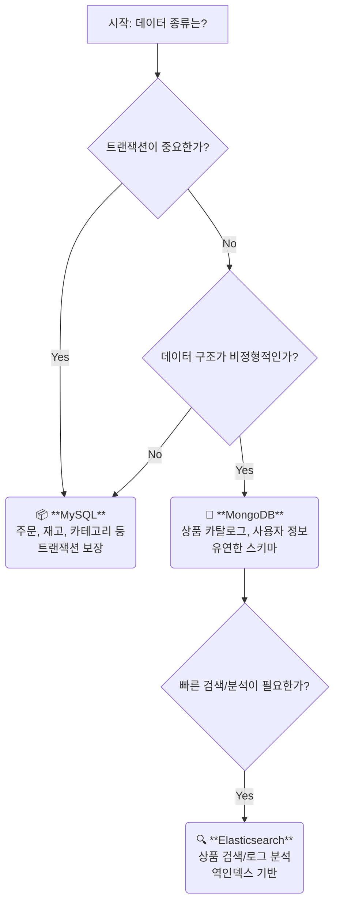
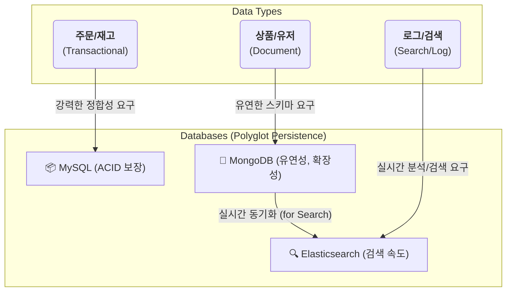

# A. 데이터 저장 전략

## a. 요구사항
- **다양한 상품군**: 정형화하기 어려운 비정형 상품 데이터 (MongoDB 선택)
- **대용량 트래픽**: 높은 Read 성능과 수평적 확장이 용이해야 함 (MongoDB, Elasticsearch)
- **정확성**: 주문, 재고 등 데이터 정합성이 중요한 데이터 (MySQL 선택)
- **고급 검색**: 한국어 형태소 분석, 자동완성 등 고품질 검색 기능 (Elasticsearch 선택)


## b. 데이터베이스 선택 과정
### b-1. DB 선택 알고리즘 



### b-2. RDB vs NOSQL

Q. 데이터가 어떨 때 RDB가 더 유리하고 NOSQL이 더 유리할까?

- case1) RDB이 더 유리한 경우
  - 데이터를 정형화 하고 싶은 경우
  - transaction 걸어서 정확도 맞춰야 하는 데이터
- case2) NOSQL이 더 유리한 경우
  - 데이터가 비정형 데이터인 경우
    - 사실 일상생활 속에는 정형화된 데이터보다 비정형화인 데이터가 많다.
    - ex. 추천시스템에서 고객의 행동패턴이 인풋으로 들어가는데, 고객의 행동패턴이 워낙 다양해서 몇가지 RDB table의 attribute로 정형화 하기 매우 어렵다.
  - 앱 특성상 트래픽이 갑자기 몰려서 다운타임 없이 무중단으로 스케일 업 or 아웃 해야하는 경우
    - ecommerce는 서비스 중지되는 순간 깨지는 돈이 어마어마해서 무중단인게 매우 중요하다. (잘못해서 서버 꺼져서 판매자들의 매출 타격오면 소송 맞을 수도 있다.)
    - RDB는 read replica는 aws-RDS기준, 6개까지 무중단으로 추가 가능한데, 이 이상은 끄고 스케일업 해야 한다.
    - 유저가 갑자기 몰려서 회원가입이 폭주해 write heavy가 되는 경우엔, write node(master node)가 1개뿐이기에, 무중단으로 scale out이 불가능하다.
    - 그래서 기존에 RDB 쓰는 곳들은 트래픽 몰릴걸 미리 예측해서 미리 과도하게 스케일 업 해놓고 끝나면 다시 내리는 식으로 대응했는데, nosql을 쓰면 무중단으로 스케일 아웃 가능하다.
  - 대규모 데이터인 경우, sharding을 해야할 때가 오는데, 이 때, nosql이 RDB보다 더 유리하다.

### b-3. if NOSQL, mongodb vs elastic search 성능 비교

| **기준**             | **Elasticsearch**                            | **MongoDB**                          |
| -------------------- | -------------------------------------------- | ------------------------------------ |
| **검색 유형**        | 전문 검색(Full-Text), 유사도 검색, 다중 필터 | 단순 키-값, 범위 쿼리                |
| **평균 응답 시간**   | 10~50ms (100만 건 기준)                      | 50~200ms (동일 데이터)               |
| **고급 기능**        | 오타 보정, 동의어 확장, 유사도 순위 결정     | 기본 텍스트 검색 (Atlas Search 제외) |
| **인덱스 구조**      | 역인덱스(Inverted Index)                     | B-Tree 인덱스                        |
| **동시 검색 처리량** | 초당 10,000+ 쿼리                            | 초당 1,000~5,000 쿼리                |

Q. elastic search가 더 빠르면 왜 굳이 mongodb에 상품데이터 저장할까? 그냥 elastic search에 하지.

A. elastic search는 transaction 지원을 안함. 따라서 메인 DB로는 부적합하다.

### b-4. mongodb & elastic search를 어떻게 써야할까?

read:write가 9:1 이상인 ecommerce 도메인의 상품데이터는,\
원본데이터는 mongodb에 저장하고,\
검색용 or 추천용 필드만 뽑아서 elatic search에 sync 맞추자. (eventual consistency)

## c. DB를 도메인 별로 쪼개서 저장해야 할까?

데이터 규모에 따라 달라진다.

1. 소규모 데이터면 DB하나로 쓴다.
2. 중규모 데이터면 상황에 따라 다르다.
  1. DB scale up을 할 수록 점점 더 비용 대비 효과가 비효율적인 시점이 온다,
  2. 따라서 비싸고 좋은 DB 1개 vs 저렴한 DB N개의 비용대비 효과를 측정해야 한다.
3. 대용량 데이터라면 RDB scale up에는 한계가 있으니까 쪼개야 하는게 유리한 경우가 많다.
  1. 그러나 order & user 처럼 join 필요한 경우라면 왠만하면 하나의 DB에서 쓰는게 유리할 수 있다.


## d. update 즉시 적용 vs eventual consistency

정보가 모든 모듈에 대하여 consistent 해야하고, up-to-date해야 하는 경우가 있다. (예를들면, 돈과 관련된 정보들)\
쪼개진 여러 backend-server들이 같은 db에 같은 테이블을 참조하게 하거나,\
로직 내부에 grpc통신으로 즉시 다른 도메인 모듈을 통해 update하고, 실패하면 로직 전체를 실패 처리 해버리는 방식이 있다.\
성능을 약간 포기하고서라도, 정확도가 필요하면 이 방법을 쓴다.

정보 업테이트가 반드시 up-to-date 안해도 되고, 좀 나중에 여유날 때 업데이트 되도 되는 데이터가 있다.\
이런 데이터들은 consistency를 약간 포기하고 응답성(availability)를 확보할 수 있다.\
예를들어 ecommerce에서 상품 카탈로그의 원본 정보는 mongodb에 저장하고, elastic search에 캐싱하는 경우,\
데이터를 2곳에 나눠서 저장하기 때문에, 두 데이터의 정합성이 안맞을 때도 있을 수 있지만,\
elastic search 서버가 다운되도 mongodb에서 가져올 수 있기 때문에, consistency가 떨어져도 availability을 높힐 수 있다.


## e. 상품 데이터는 어느 DB에 어느 데이터 구조로 저장하지?

보통 RDB에 상품데이터를 넣고 관리한다고 생각하는데,\
파는 상품 종류가 몇개 안되면, 테이블 컬럼 정의하기가 용이하지만,\
쿠팡같이 상품종류가 매우 다양하면 nosql에 밀어넣고 파싱해서 쓰는게 낫다.

예를들어, 신발 전문 쇼핑몰의 경우 테이블 컬럼 종류가 아무리 다양해봤자 몇십개 이내로 특정지을 수 있다.

하지만 쇼핑몰에서 신발, 스마트폰, 채소를 판다고 할 경우,\
이 3종류 상품에 모두 해당되는 컬럼을 만들면,\
null값이 들어가는 컬럼이 너무 많이 생겨서,\
메모리 용량 낭비가 너무 심해진다.

이럴 때 도메인을 잘 나누는 노하우가 필요해지고,\
어설프게 나누면 ecommerce에서 다뤄지는 모든 상품을 정확히 분류할 때 문제가 생긴다.

---

상품을 추가할 때, 새로운 필드를 하나 추가해야 하는 상황이라 치자.

RDB면 스키마 변경해야 하고 migration 해야하는게 부담스러울 수 있는 반면,\
Nosql은 비교적 자유롭다.

---

쿠팡같은 대규모 쇼핑몰은 등록된 상품 갯수만 100만개 이상이라고 하면,\
데이터를 쪼개서 여러 DB에 나눠서 저장하는 샤딩을 선택하는 경우가 있는데,\
RDB보다 nosql이 샤딩에 더 유리하다.

## f. 계층화된 상품 카테고리 정보는 어디에 저장하는게 좋을까?
계층화된 카테고리는 이런 뜻이다.

path 컬럼의 예시)
- "전자제품" -> ID: 1, path: "1"
- "컴퓨터" -> ID: 4, path: "1/4"
- "노트북" -> ID: 28, path: "1/4/28"
- "게이밍 노트북" -> ID: 56, path: "1/4/28/56"

이렇게 하면 "path LIKE '1/4/%'" 같은 쿼리로 컴퓨터 카테고리 아래 모든 하위 카테고리를 한방에 가져올 수 있다. 재귀 쿼리 안 써도 된다.

또 "노트북"의 모든 상위 카테고리 찾으려면 path("1/4/28")를 '/'로 쪼개서 ID 1, 4를 바로 알 수 있다.

nosql에 계층화된 상품 카테고리 정보는 이런식으로 저장된다.
```sql
// 카테고리 컬렉션
db.categories.insertMany([
  { _id: 1, name: "전자제품", path: "1", level: 0 },
  { _id: 4, name: "컴퓨터", path: "1/4", level: 1 },
  { _id: 28, name: "노트북", path: "1/4/28", level: 2 }
]);

// 상품 컬렉션
db.products.insertOne({
  _id: "P123",
  name: "게이밍 노트북",
  category_ids: [1, 4, 28],  // 모든 상위 카테고리 ID 배열
  category_paths: ["1", "1/4", "1/4/28"] // 계층 경로 저장
});

// 인덱스 생성
db.products.createIndex({ "category_paths": 1 });

// 쿼리
// '컴퓨터(4)'와 모든 하위 카테고리 상품 조회
db.products.find({
  category_paths: { $regex: /^1\/4/ }
});
```

주의할 점은, regex 패턴이 고정이냐, 부분고정이냐, 비고정이냐에 따라서 인덱스를 타고 안타고가 정해진다는 것이다.

1. `/^1\/4/` 은 고정 패턴이라 인덱스 탄다.
  - `1/4`로 시작하는 모든 경로를 범위스캔 한다. (IXSCAN)
  - 추가 필터링 없이 1/4 시작점을 찾고, 거기에 연결된 모든 leaf node들을 반환한다.
  - 예: 1/4, 1/4/28, 1/4/28/56 등
  - MySQL의 LIKE '1/4%'와 유사
2. `/^1\/4(\/|$)/` 은 부분 고정 패턴이라 인덱스를 부분적으로만 탄다.
  - 1/4까지 고정이었다가 그 이후로는 조건식이 붙은 부분 고정 패턴은 인덱스를 부분적으로만 활용해서 효율이 떨어진다고 한다.
  - 인덱스에서 1/4로 시작하는 모든 경로 검색 (IXSCAN)한 후, 메모리에서 `(\/|$)` 조건을 추가로 필터링.
  - 따라서 regex짤 때 조금 신경써야 한다.
3. `/1\/4/` 은 비고정 패턴이라 인덱스를 안타서 느리다.
  - 1/4가 문자열 중간에 위치할 수 있음
  - 따라서 앞에 ^을 붙여서 왼쪽부터 시작한다는걸 고정시켜놔야 인덱스를 탄다.


그러면 실제 데이터는 어떻게 보일까?

```sql
// 카테고리 컬렉션 예시
[
  {
    "_id": 1,
    "name": "전자제품",
    "parent_id": null,
    "path": "1",
    "level": 0
  },
  {
    "_id": 2,
    "name": "컴퓨터",
    "parent_id": 1,
    "path": "1/2",
    "level": 1
  },
  {
    "_id": 4,
    "name": "노트북",
    "parent_id": 2,
    "path": "1/2/4",
    "level": 2
  },
  {
    "_id": 56,
    "name": "게이밍 노트북",
    "parent_id": 4,
    "path": "1/2/4/56",
    "level": 3
  }
]

// categories 컬렉션 인덱스
db.categories.createIndex({ "path": 1 });
db.categories.createIndex({ "level": 1 });
db.categories.createIndex({ "parent_id": 1 });
```

```sql
// 상품 컬렉션 예시
{
  "_id": ObjectId("65c3e7a1d8f5e11a2b3c4d5e"),
  "title": "Apple 2025 MacBook Pro",
  "description": "최신 Apple MacBook Pro, M3 Max 칩, 16인치 Liquid Retina XDR 디스플레이",
  "brand": "Apple",
  "model": "MUW73LL/A",
  "sku": "MBP-16-M3-MAX",
  "upc": "195949185694",
  "color": "Space Gray",

  "category_ids": [1, 2, 4],
  "primary_category_id": 4,
  "category_breadcrumbs": ["전자제품", "컴퓨터", "노트북"],
  "category_path", "1/4/7",
  "category_level" 3,

  "price": {
    "amount": 3499.99,
    "currency": "USD"
  },
  "stock": 100,
  "stock_reserved": 0,  // SAGA rollback을 위한 예약 재고량
  "weight": {
    "value": 4.8,
    "unit": "POUND"
  },
  "dimensions": {
    "length": 14.01,
    "width": 9.77,
    "height": 0.66,
    "unit": "INCH"
  },
  "attributes": {
    "processor": "M3 Max",
    "ram": "32GB",
    "storage": "1TB SSD",
    "screen_size": "16 inch",
    "resolution": "3456 x 2234"
  },
  "variants": [
    {
      "id": "variant1",
      "sku": "MBP-16-M3-MAX-SG-32GB-1TB",
      "color": "Space Gray",
      "storage": "1TB",
      "price": {
        "amount": 3499.99,
        "currency": "USD"
      },
      "attributes": {
        "processor": "M3 Max",
        "ram": "32GB"
      },
      "inventory": 50
    },
    {
      "id": "variant2",
      "sku": "MBP-16-M3-MAX-SIL-32GB-1TB",
      "color": "Silver",
      "storage": "1TB",
      "price": {
        "amount": 3499.99,
        "currency": "USD"
      },
      "attributes": {
        "processor": "M3 Max",
        "ram": "32GB"
      },
      "inventory": 35
    }
  ],
  "images": [
    {
      "url": "https://example.com/macbook-pro-1.jpg",
      "main": true
    },
    {
      "url": "https://example.com/macbook-pro-2.jpg",
      "main": false
    }
  ],
  "created_at": "2025-04-30T10:15:30.123Z",
  "updated_at": "2025-04-30T10:15:30.123Z"
}

// 상품 컬렉션 인덱스
db.products.createIndex({ "category_ids": 1 });  // 카테고리 ID로 조회
db.products.createIndex({ "primary_category_id": 1 });  // 주 카테고리로 조회
db.products.createIndex({ "category_path": 1 });  // 계층 구조 쿼리 ("1/2/%" 형태)
db.products.createIndex({ "category_level": 1 });  // 특정 깊이 카테고리 조회


// 특정 카테고리에 속한 상품 찾기
db.products.find({ category_ids: 4 });

// 주 카테고리가 노트북인 상품
db.products.find({ primary_category_id: 4 });

// 컴퓨터 카테고리와 그 하위 모든 카테고리 상품
db.products.find({ category_path: /^1\/2/ });

// 깊이가 2인 카테고리 상품 (예: 노트북, 데스크탑 등)
db.products.find({ category_level: 2 });
```

## g. architecture 



