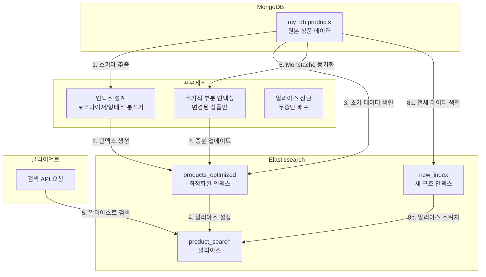

# H. ecommerce에서 상품의 read optimization

## h-1. mongodb랑 mysql 모두 b+tree인데 무슨 차이지?

그러니까 mysql은 pk로 정렬한 clustered index(b+Tree이고 leaf node에 pk id 뿐만 아니라 실제 데이터도 있음) + non clustered index(개발자가 임의로 인덱스 부여한 컬럼들이 들어있는 b+tree)라, pk로 검색했다고 치면, leaf node에서 바로 데이터 가져와서 빠른데,

mongodb는 pk(_id)를 인덱싱하는 b+tree에 실제 데이터가 leaf node에 있는게 아니라, 별도 공간에 있기 때문에, 먼저 _id들이 들어있는 b+tree에서 먼저 찾은 후, 다시 실제 데이터를 또 찾아야 해서 조금 느릴 수 있음.

mysql이 clustered index b+tree의 leaf node에 원본 데이터를 넣을 수 있는 이유는, table에 스키마를 짠 후에, 그 규격에 맞게 데이터를 넣기 때문.

반면 mongodb는 nosql이고 schema-less라 pk(_id)를 관리하는 b+tree의 leaf node에 원본 데이터를 넣을 수 없음. 데이터 사이즈가 들쭉날쭉 하기 때문.

예: { _id: 1, name: "A" }와 { _id: 2, title: "B", content: "..." }가 동일한 인덱스 구조로 관리됨.

인덱스 리프 노드에는 _id와 **문서 위치(포인터)**만 저장되므로, 문서의 내부 구조와 무관하게 작동

또한 schema-less라 필드 추가/삭제시 인덱스가 들은 b+tree를 업데이트할 필요가 없다.


---
2. 쓰기 성능 최적화
(1) 쓰기 작업 분리
문서 저장과 인덱스 업데이트가 독립적으로 이루어집니다.

문서 저장: WiredTiger 스토리지 엔진이 데이터를 압축 및 블록 단위로 순차 저장.

인덱스 업데이트: _id B+ Tree에만 포인터 추가 (작은 크기의 연산).

이로 인해 쓰기 병렬화가 용이하며, 특히 대량 삽입(Bulk Insert) 시 성능이 향상됩니다.

(2) 이동(Move) 작업 최소화
문서 크기가 증가해 저장 위치가 변경되더라도:

문서 저장소 내에서만 재배치 발생.

인덱스는 포인터만 업데이트하면 되므로 오버헤드 감소.

반면, 클러스터드 인덱스(MySQL)에서는 데이터 이동 시 B+ Tree 재구성이 필요해 더 큰 비용이 발생합니다.

---

구분	MySQL (InnoDB)	MongoDB (WiredTiger)
쓰기 작업	클러스터드 인덱스 갱신 + 데이터 삽입	데이터 삽입 + 인덱스 갱신 (분리 작업)
문서/레코드 이동	B+ Tree 재구성 필요 (고비용)	저장소 내 블록 이동 (저비용)
병렬 처리	제한적 (행 단위 잠금)	문서/인덱스 별도 처리로 병렬화 용이

---

예를들어 mysql은
```sql
SELECT * FROM users WHERE id = 5;
```
동작 과정:
id PK 인덱스 B+Tree 탐색 → 리프 노드에서 직접 데이터 획득
→ 추가 I/O 없이 즉시 결과 반환

mongodb는
```sql
db.users.find({ _id: ObjectId("507f191e810c19729de860ea") });
```
동작 과정:

_id 인덱스 B+Tree 탐색 → 리프 노드에서 문서의 Record-ID(논리적 주소) 획득

별도 저장소(WiredTiger의 B+Tree/LSM 트리)에서 Record-ID로 문서 조회
→ 총 2회의 트리 탐색 발생


mysql은 read시 pk기준이면 바로 가져오는 대신에, write시 인덱스 업데이트가 부담이고,

mongodb는 인덱스 관리하는 b+tree랑 데이터 관리하는 곳이랑 분리되어서 read시 2번 읽어야 하지만,


## h-2. mongodb의 b+tree와 elastic search에 역인덱스 방식
mysql는 clutered index라 pk기준으로 정렬된 b+tree에 leaf node에 데이터가 저장되어있어서, 인덱스 찾은 후에 별도로 또 찾을 필요가 없는데,
mongodb는 pk 인덱스가 정렬된 b+tree의 leaf node에 원본데이터가 없어서 pk 인덱스 b+tree에서 원본 데이터의 주소를 찾은 다음, 또 찾아야 해서 read에 좀 더 불리하다고 한다.
b+tree의 시간복잡도는 O(logN)인데, 데이터가 100만개면 log(1,000,000) = 20이니까, 20번 비교해야 한다.

근데 이게 RAM에 다 안올라가면 swap memory 쓰면서 느려진다. <--- 이 부분 진짜야? 검증해줘

"MongoDB는 그냥 도큐먼트 기반이라 각 도큐먼트 통째로 가져와야 돼서 대용량일 때 메모리 캐시 효율이 떨어질 수 있음." <-- 잘 이해 안가

elastic search는 역인덱스 방식으로 단어 별로 어느 document에 매핑되어있는지 hash함수 돌리기 때문에 O(1)이고 빠르다.

이 hash함수가 적용되려면 메모리를 오히려 elastic cache가 더 많이 잡아먹지 않아? b+tree보다? 그러면 swap 메모리 때문에 느려지는건 elatic cache 아냐?


---------
Q. 근데 elastic search가 데이터 저장할 때, 키워드 바탕으로 역인덱스를 만든다던데,
어짜피 mongodb나 elastic search나 disk i/o 할 떄 성능은 비슷할거고,\
차이점은 데이터 인덱싱을 어떻게 다르게 해서 인덱스 자료구조의 time complexity에 따라서 read, query 성능이 달라질텐데,
그러면 mongodb에서 키워드 필드 따로 뽑아서, 그 필드를 인덱스 걸어놓으면, 사실상 똑같은거 아닌가?


1. mysql, mongodb, elastic search에서 read & write할 때 자료구조 레벨에서 어떤식으로 작동해서 어떤 database가 어떤 상황에서 상대적으로 유리하고 불리한지 설명
2. mongodb vs elastic search에서 상품 데이터가 100만개 있을 때, keyword 기반 query가 아닌, pid로 검색하는 성능 측정하고 비교 (단일 쿼리의 latency와 stress test 상황에서 쿼리 latency)
3. mongodb에 쿼리 튜닝한 다음 튜닝 전과 쿼리 latency 비교
  1. 다양한 인덱스 전략 구현 및 테스트
  2. 프로젝션 최적화 (필요한 필드만 반환)
  3. 읽기 선호도 최적화(레플리카 셋)
  4. 쿼리 성능 개선 전/후 비교
4. elastic search에 성능 듀닝한 다음, 튜닝 전과 쿼리 latency 비교
  1. 샤드 및 레플리카 구성 최적화
  2. 필드 데이터 캐싱 구성
  3. 쿼리 결과 캐싱 구성
  4. 분석기 최적화


## h-3. mongodb와 elastic search와 sync는 어떻게 하지?
monstache라는 라이브러리를 쓰면 mongodb와 elastic search를 실시간으로 sync해준다고 한다.

monstache는 MongoDB의 **Change Streams** 또는 **Oplog**를 실시간으로 추적, 모니터링해 elastic search에 즉시 반영한다. (밀리초 단위 실시간 동기화)

참고로 Mongodb를 standalone으로 만들면 change streams 기능을 지원 안하니까, 반드시 replica set으로 만들어야 한다.(어짜피 HA하려면 필요)


## h-4. 100만건의 상품을 mongodb에서 stress test

```bash
cd stress_test

docker run -i --network host --volume $(pwd):/app -w /app grafana/k6 run product_load_test_mongodb.js
```

```bash
█ THRESHOLDS

  http_req_duration
  ✓ 'p(95)<5000' p(95)=4.45s
  ✓ 'p(99)<10000' p(99)=

  http_req_failed
  ✓ 'rate<0.05' rate=0.00%


█ TOTAL RESULTS

  checks_total.......................: 137756 229.272599/s
  checks_succeeded...................: 79.84% 109998 out of 137756
  checks_failed......................: 20.15% 27758 out of 137756

  ✓ status is 200
  ✗ response time < 1s
    ↳  20% — ✓ 6915 / ✗ 27524
  ✗ response time < 5s
    ↳  99% — ✓ 34205 / ✗ 234
  ✓ response time < 10s

  HTTP
  http_req_duration.......................................................: avg=2.39s min=13.77ms  med=2.5s  max=7.68s p(90)=4.15s p(95)=4.45s
    { expected_response:true }............................................: avg=2.39s min=13.77ms  med=2.5s  max=7.68s p(90)=4.15s p(95)=4.45s
  http_req_failed.........................................................: 0.00%  0 out of 34439
  http_reqs...............................................................: 34439  57.31815/s

  EXECUTION
  iteration_duration......................................................: avg=3.14s min=517.05ms med=3.26s max=8.28s p(90)=4.91s p(95)=5.22s
  iterations..............................................................: 34439  57.31815/s
  vus.....................................................................: 2      min=2          max=300
  vus_max.................................................................: 300    min=300        max=300

  NETWORK
  data_received...........................................................: 49 MB  82 kB/s
  data_sent...............................................................: 4.8 MB 8.0 kB/s
```
- 동시요청 최대 300개
- 일단 404, 500 에러는 없었다.
- 근데 latency가 1초 미만인데 20%였고, 나머지 80%는 1초 이상 걸렸다.
- 평균 latency는 2.39초가 걸렸고, 90% percentile 이상은 4초 이상 걸렸다.
- 부하를 거는 pc와 받는 pc가 같고, k8s container에 여러 서비스가 동시에 돌아가는 상황인데 pc 스펙이 별로기 때문에 저 측정치 자체를 보진 말고, 다른 측정치와 비교해서 해석하는게 맞다.
- 나중에 보니까 get_product() 할 때마다 log.info() 남기는 코드가 있는데, 이것도 latency가 늘어난 원인 중 하나다. ES stress test시에 똑같이 log.info() 할거라 상황은 비슷하다고 가정한다.

일단 query by pid로 한거고, pid로 이미 인덱스 된 상태이기 때문에, 인덱싱으로 뭔가 성능최적화를 할건 없다.
projection을 사용해서 모든 필드를 가져오는게 아닌, 필요한 필드만 가져온다던가,\
서버설정에 캐시 사이즈를 늘린다던가 등의 optimization 할 순 있지만,\
단순 mongodb와 elatic search에 100만건일 때의 read 성능이 궁금하니까, elastic search도 동일조건에서 테스트 해보자.


## h-5. 100만건의 상품을 elastic search에서 stress test
```bash
# bulk insert를 위한 pip lib 설치
pip install requests ijson tqdm

#먼저 포트를 열고
kubectl port-forward svc/elasticsearch-service 9201:9200

# local에서 컨테이너로 보내기
python faker.js/local_bulk_convert.py
```


```bash
minikube service kibana-service

http://127.0.0.1:62668/app/discover#/

click discover tap -> create data view
없으면 stack management -> data views -> create data view

1. name: product
2. index pattern: my_db.products*
3. timestamp field: 적용 안한다 선택 (왜냐면 faker.js에서 가데이터 생성시 created_at 필드 없어서 인식을 못함)
click save data to kibana

우상단에 refresh 버튼 누르면, 실시간으로 데이터 몇개 들어와있는지 알려줌
```


```bash
cd stress_test

docker run -i --network host --volume $(pwd):/app -w /app grafana/k6 run product_load_test_es.js
```

```bash
█ THRESHOLDS

  http_req_duration
  ✓ 'p(95)<5000' p(95)=187.68ms
  ✓ 'p(99)<10000' p(99)=

  http_req_failed
  ✓ 'rate<0.05' rate=0.00%


█ TOTAL RESULTS

  checks_total.......................: 543052  904.932183/s
  checks_succeeded...................: 100.00% 543052 out of 543052
  checks_failed......................: 0.00%   0 out of 543052

  ✓ status is 200
  ✓ response time < 1s
  ✓ response time < 5s
  ✓ response time < 10s

  HTTP
  http_req_duration.......................................................: avg=45.35ms  min=3.34ms   med=13.41ms  max=943.57ms p(90)=111.6ms p(95)=187.68ms
    { expected_response:true }............................................: avg=45.35ms  min=3.34ms   med=13.41ms  max=943.57ms p(90)=111.6ms p(95)=187.68ms
  http_req_failed.........................................................: 0.00%  0 out of 135763
  http_reqs...............................................................: 135763 226.233046/s

  EXECUTION
  iteration_duration......................................................: avg=796.09ms min=505.77ms med=789.38ms max=1.89s    p(90)=995ms   p(95)=1.04s
  iterations..............................................................: 135763 226.233046/s
  vus.....................................................................: 2      min=2           max=300
  vus_max.................................................................: 300    min=300         max=300

  NETWORK
  data_received...........................................................: 194 MB 324 kB/s
  data_sent...............................................................: 17 MB  29 kB/s
```
- 일단 404, 500에러 0%
- 평균 latency 45ms, 90% percentile은 111ms, 95%는 187로 성능이 꽤 좋다...!


생각보다 elastic search가 mongodb보다 read 성능이 훨씬 좋다.


좀 의심가는 정황이 있다.\
latency가 거의 50배 차이나는데 이게 대규모 데이터 다룰 때 성능 차이 때문에 그런건지,\
아니면 mongodb만들 때 시스템 자원을 최소사양으로 줘서 메모리 스왑이 일어나서 느려진건지 재검증 하긴 해야한다.

근데 어찌됬든 elatic search에 100만개나 데이터가 있는데 latency가 평균적으로 45ms밖에 안걸렸다는건\
read heavy ecommerce app에 상품데이터 읽기 데이터베이스로 손색없는 듯 하다.


# I. 상품 검색 방법

## i-1. 전체 순서



1. mongodb에 원본 상품 데이터가 100만개 있다. 이 상품데이터의 스키마를 따자.
2. 이 상품데이터 스키마를 기반으로, elastic search에 인덱싱, 토크나이저, 형태소 분석기 설계를 해서 create_index()를 한다.
3. 인덱스가 마련됬으니 reindexProducts()로 기존에 `my_db.products`에 있던걸 재인덱싱해서 `products_optimized`로 옮긴다. 이 때 monstache는 여전히 `my_db.products`로 mongodb에 상품데이터를 sync한다.
4. elastic search에 alias기능을 이용하여 `product_search` alias를 `products_optimized`에 매핑하고, 검색 요청은 `product_search`로 요청한다.
5. 기존에 `my_db.products`는 백업용 & 데이터 쌓아두기 용으로 남겨둔다. (추후 이걸 기반으로 부분 & 전체 re-indexing을 한다.)
  1. aliase를 쓰는 이유는, 나중에 인덱스를 새로 만들어서, `my_db.products` 를 `new_index`로 re-indexing을 한 후에, 단순히 alias를 `product_optimized`에서 `new_index`로 바꾸기만 해도 무중단 배포처럼 스무스하게 갈아낄 수 있기 때문.
  2. 그러다 `new_index`가 문제 있어서 롤백해야 하면 손쉽게 다시 `product_search`를 `product_optimized`를 가르키게 하면 된다.
6. 아직도 mustache는 mongodb에서 `my_db.products`로 데이터를 보내는 중이다.
7. n시간에 1번씩 부분 인덱싱을 한다.
  1. 부분 인덱싱은 마지막 인덱싱 시간 저장 후,`my_db.products`에서 created_at, updated_at를 보고 그 후에 저장된 상품만 골라서 백그라운드 작업으로 reindex()한다.
8. 필요에 따라 전체 `my_db.products`를 reindex()를 실행시켜서 `products_optimized`에 새롭게 인덱싱된 정보를 덮어씌운다.
  1. 인덱스 구조 변경이나 동의어, 유의어 사전 업데이트 시 전체 reindexing 해야한다.

## i-2. ES tokenizers 비교
이런 종류의 tokenizer 들이 있다.

1. **Standard 토크나이저**
    - 가장 기본적인 토크나이저
    - 공백과 특수문자로 텍스트를 분리함
    - 예: "삼성전자 갤럭시 S21" → ["삼성전자", "갤럭시", "S21"]
2. **N-gram 토크나이저**
    - 텍스트를 n개 길이의 연속된 문자 조각으로 나눔
    - 부분 일치 검색에 좋음
    - 예: "삼성전자" (bi-gram) → ["삼성", "성전", "전자"]
3. **Edge N-gram 토크나이저**
    - 텍스트 앞부분부터 n개씩 증가하는 조각으로 분리
    - 자동완성에 주로 사용됨
    - 예: "삼성전자" → ["삼", "삼성", "삼성전", "삼성전자"]
4. **Nori 토크나이저 (한국어 전용)**
    - 한국어에 특화된 토크나이저
    - 형태소 분석을 통해 더 정확한 토큰화
    - 예: "삼성전자의 새로운 스마트폰" → ["삼성전자", "새롭다", "스마트폰"]


---
아래 목적으로 사용한다.

1. **기본 검색용**: Nori 토크나이저 (한국어 검색)
    - 한국어 상품명이나 설명에 필수적
    - `"analyzer": "nori"` 이렇게 설정하면 됨
2. **자동완성용**: Edge N-gram 토크나이저
    - 사용자가 "삼성" 까지만 입력해도 "삼성전자" 검색결과 보여줌
3. **유사 검색용**: N-gram 토크나이저
    - 오타가 있어도 검색 가능하게 해줌
    - "갤럭시" 대신 "겔럭시" 라고 쳐도 결과 나오게 함

## i-3. 개별 필드 인덱싱 방법
### case1) brand
```json
"brand": {
"type": "text",
"analyzer": "korean_analyzer",
"fields": {
  "autocomplete": {
      "type": "text",
      "analyzer": "autocomplete_analyzer"
  },
  "keyword": {
      "type": "keyword"
  }
}
},
```
상품의 브랜드는 다양한 방식으로 검색했을 때 걸리게 하는 것이다.
1. `type: text`는 단어가 딱 맞지 않아도 쿼리해준다는 것이다.
2. `type: keyword`는 단어가 딱 맞아야 검색된다는 것이다.
3. `autocomplete` 부분은 타이핑 중에 자동완성을 제공한다는 것이다.

보통 일반적인 검색은 `text`로 하고, 집계나 정렬 목적은 `keyword` 검색으로 쓴다.


### case2) description
```json
"description": {
"type": "text",
"analyzer": "korean_analyzer",
"fields": {
  "ngram": {
      "type": "text",
      "analyzer": "ngram_analyzer"
  }
}
},
```
`ngram`은 부분검색을 가능하게 한다.\
상품 설명의 경우엔 대부분 단어가 필터링 되어야 하기 때문에, 보통 가중치 검색에서 가중치 낮게 부여해서 포함된다.\
아니면 키워드만 따로 빼서 description 대신 `all_text` 필드에 포함되기도 한다.


### case3) title
```json
"title": {
"type": "text",
"analyzer": "korean_analyzer",
"fields": {
  "ngram": {
      "type": "text",
      "analyzer": "ngram_analyzer"
  },
  "autocomplete": {
      "type": "text",
      "analyzer": "autocomplete_analyzer"
  },
  "keyword": {
      "type": "keyword"
  }
}
},
```
상품명은 가장 중요한 필드이기 때문에, `text`, `keyword`, `ngram`, `autocomplete` 전부 다 적용한다.


## i-4. 필드 중 검색에 걸릴만한 필드를 하나의 필드로 합쳐서 인덱싱한다.
기본적으로 데이터를 ES에 넣으면 _id 필드를 따로 부여해서 인덱싱 한다.

근데 검색할 때, pid로 검색하는게 아니라, 그 제품의 브랜드라던가, 특징이라던가를 검색어로 넣는데,\

스페이스바로 분리된 검색어 3개가 있으면, sql로 치면 where절로 3번 검색하는 것이기 때문에 비효율적이다.

검색어에 걸릴만한 필드들을 하나의 all_text 필드에 모으는게 query에 유리하다.

all_text에 모든 정보가 있다고, 다른 중복되는 필드를 버리지는 않는데,\
검색 방법중에 특정 필드 위주로 검색하거나, 필드마다 가중치 다르게 해서 검색할 때 쓰이기 때문.


## i-5. 한국어 text analyzer
4줄요약
- **공식 지원 + 정확도** → **Nori**
- **AWS 환경 + 문맥 분석** → **Seunjeon**
- **속도 최적화** → **Arirang** (정확도 희생)
- **레거시 시스템** → **Open Korean Text**

| 항목     | Nori                 | Seunjeon            | Arirang        | Open Korean Text     |
| ------ | -------------------- | ------------------- | -------------- | -------------------- |
| 공식 지원  | ✅ Elastic 공식         | ❌ (AWS 한정)          | ❌              | ❌                    |
| 설치 편의성 | bin/plugin install   | 수동 플러그인 빌드 필요       | 수동 플러그인 빌드 필요  | Elasticsearch 5.x 한정 |
| POS 태깅 | ✅ (기본 태그 세트)         | ✅ (상세 태그)           | ❌              | ✅                    |
| 복합어 처리 | ✅ (예: "빨간색→빨갛+ㄴ색")   | ✅ (활용어 원형 복원)       | ❌              | ✅ (일부)               |
| 사용자 사전 | ✅ (동적 추가 가능)         | ✅ (사전 커스터마이징 필요)    | ❌              | ✅                    |
| 성능     | 중간 (약 10ms/문서)       | 초기 로딩 후 빠름 (5ms/문서) | 매우 빠름 (3ms/문서) | 중간 (8ms/문서)          |
| 한계     | mecab-ko-dic 업데이트 필요 | JVM 메모리 사용량 높음      | 형태소 분석 정확도 낮음  | 5.x 이후 미지원           |


## i-6. nori - 동의어, 유의어 사전
index 만들 때 필터에서 생성한다.

### case1)유의어 사전
```json
"tokenizer": {
  //...
  "nori_user_dict": {
      "type": "nori_tokenizer",
      "decompound_mode": "mixed",
      "user_dictionary_rules": [
          "운동화",
          "축구화"
      ]
  }
},
```
남성 운동화 검색시, tokenizer가 남성 + 운동 + 화 로 쪼개서 운동화를 보여주는게 아니라 운동기구를 검색해주는 문제가 있다.

따라서 운동화는 운동 + 화가 아니라 그냥 운동화야~ 라고 인덱스 만들 때 사전에 입력해주면 검색 정확도를 올릴 수 있다.


### case2) 동의어 사전
```json
"filter": {
  "korean_synonym_filter": {
      "type": "synonym",
      "lenient": True,  # 토큰화 문제를 완화
      "synonyms": [
          "노트북, 랩탑 => 노트북",
          "휴대폰, 핸드폰, 스마트폰 => 스마트폰",
          "컴퓨터, PC, 피씨, 데스크탑 => 컴퓨터",
          "TV, 텔레비전, 티비 => TV"
      ],
      "ignore_case": True
  }
},
```

비슷한 동의어들을 하나의 단어로 치환해서 처리하는 것이다.\
쿼리 성능과 검색 정확도를 높혀준다.


## i-7. 검색의 방법론
- all_text에서 일반검색
- 가중치 검색
  - ex) brand + category + description 이 섞인 검색어가 있으면, 가중치를 brand 5, category 3, description 2를 부여해서 검색하는 방법도 있다.
- fuzzy search
  - 오타가 생겨도 검색해준다
  - ex. 빨갛ㄴ색 -> 빨간색
- autocomplete
  - 삼성 -> 삼성전자
