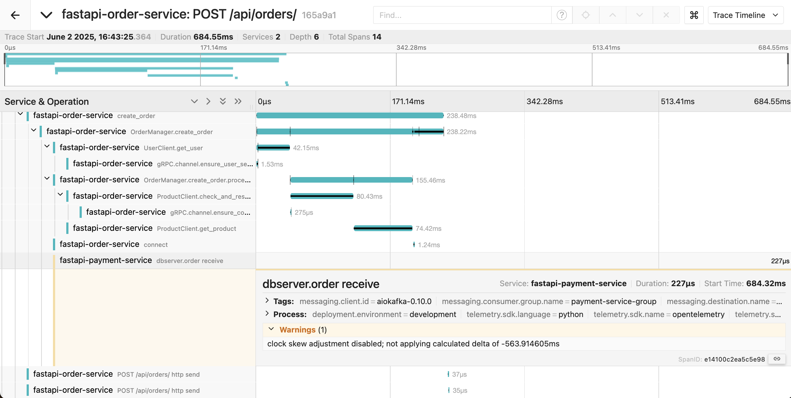

## a. clock skew warnings

### a-1. 로그 

```
Warnings (1)

clock skew adjustment disabled; not applying calculated delta of -4.625890669s
```

### a-2. 원인 
jaeger에서 분리된 모듈의 컨텍스트를 트래킹하기 위해서는, 모듈간 통신할 떄, 컨텍스트 넘겨주는 것도 중요한데, 넘겨준 시간의 sync가 맞는것도 중요하다.

컨텍스트가 맞아도, 넘겨준 시간이 수백 ms이상 차이나면, jaeger는 이게 다른 컨텍스트에서 발생한 백트레이스라고 판단할 수 있다. (아니면 back trace의 순서가 꼬이거나...)

근데 문제는 시스템 리소스가 부족해서, 시스템 시작할 때 RESTARTS만 적게는 5번에서 많게는 100번도 넘게하는데, 이때, VM안 컨테이너들의 sync가 좀 꼬인다고 한다.

```
minikube start --cpus=7 --memory=11500 --disk-size=40g
NAME                                          READY   STATUS             RESTARTS        AGE
debezium-connect-586dc9bc98-k4l8l             1/1     Running            6 (40s ago)     19h
jaeger-65c9d5cd7b-zxgrl                       1/1     Running            5 (40s ago)     12d
kafka-0                                       1/1     Running            5 (40s ago)     11d
mongodb-stateful-0                            1/1     Running            5 (40s ago)     12d
mongodb-stateful-1                            1/1     Running            5 (40s ago)     12d
mongodb-stateful-2                            1/1     Running            5 (40s ago)     12d
mycluster-0                                   0/2     Error              26              12d
mycluster-1                                   0/2     Error              29              12d
mycluster-2                                   0/2     Error              28              12d
mycluster-router-78d98d674-9zvm9              1/1     Running            101 (40s ago)   12d
myshell-router-test                           1/1     Running            1 (40s ago)     13h
order-service-deployment-9f596fb68-2r2gm      0/1     CrashLoopBackOff   16 (6s ago)     20h
order-service-deployment-9f596fb68-882xs      0/1     CrashLoopBackOff   16 (16s ago)    20h
otel-collector-b4f95b9c8-w99c7                1/1     Running            5 (40s ago)     12d
payment-service-deployment-86dcdf66c-9vlg8    0/1     CrashLoopBackOff   16 (12s ago)    18h
payment-service-deployment-86dcdf66c-rcx82    0/1     CrashLoopBackOff   18 (15s ago)    18h
product-service-deployment-589577bfb8-qngbm   0/1     Running            14 (40s ago)    21h
product-service-deployment-589577bfb8-r6jdh   0/1     Running            12 (40s ago)    21h
user-service-deployment-56dc4dbdc4-vnrnm      1/1     Running            13 (40s ago)    11d
user-service-deployment-56dc4dbdc4-z8r48      0/1     Running            15 (40s ago)    11d
zookeeper-0                                   1/1     Running            5 (40s ago)     12d
```

에러나고 크래쉬나고 난리났는데 restart 몇번 시도해서 겨우 다 RUNNING 상태로 만드는게 현 상태이다.

시스템 리소스 아낀다고 elastic search랑 monstache도 죽였는데도 모자라다.


### a-3. 해결책
컴퓨터 리소스 충분하면 해결되지만, 그게 현재 여건으로써는 불가능하므로, 

jaeger-depl.yaml에 clock skew 허용시간을 넉넉하게 잡아주는 설정을 추가한다. 
```bash
args:
- "--query.max-clock-skew-adjustment=5s"
```

이러면 분리된 모듈에서 캡쳐된 backtrace의 시차가 5초 안이면 같은 context라고 간주하고 jaeger가 보정해준다.